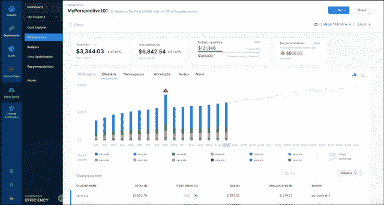
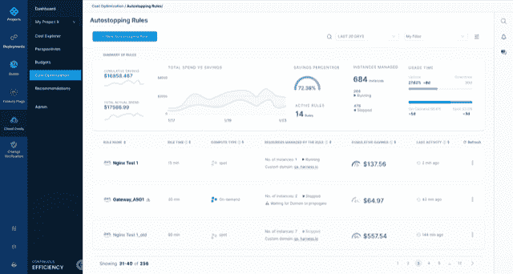

# 利用成本透明度可以大幅削减失控的云账单

> 原文：<https://thenewstack.io/harness-cost-transparency-could-slash-runaway-cloud-bills/>

将资源转移到云的热潮可能会带来许多坏消息:首先是许多组织收到了来自云和其他服务提供商的高于预期的账单。与此同时，DevOps 业务的利益相关者也在为如何在不妨碍开发人员和运营生产力的情况下以成本控制的名义保持成本效益而努力。

[Harness](https://harness.io/products/continuous-integration?utm_content=inline-mention) 表示，其 [Harness 云成本管理](https://harness.io/blog/product-updates/intelligent-cloud-cost-management/)平台通过在软件生产和管理周期中实现成本透明来充当商业智能解决方案。据 Harness 称，该平台凭借其智能云自动停止和机器学习(ML)功能，可以将“浪费”的云成本降低高达 75%。

在云服务上的低效支出也与采用云的公司的快速创新同步发生，Kubernetes“作为首选的容器编排平台，在容器世界掀起了风暴”， [Harish Doddala](https://www.linkedin.com/in/harishdh) ，Harness 产品管理高级总监告诉 New Stack。

“引领创新的工程师和 DevOps 团队主要关注速度和质量。这导致许多公司、初创公司和大型企业背负着飙升的云成本，而效率或成本管理尚未紧密融入工程实践，”Doddala 说。“在最新的版本中，Harness 继续投资，将开发人员和 DevOps 实践者引入云成本管理的核心，以便与关键的财务利益相关方有效协作，从而使成本管理变得简单而‘枯燥’。”"

Doddala 说，传统上，成本管理一直属于财务团队或首席执行官的权限范围，“他们需要对云支出有一个高层次的汇总视图”。“开发人员和 DevOps 团队没有所需的背景和可见性来查看和管理与其应用程序和微服务相关的云成本，”Doddala 说。

多达拉说，现状是这样的:

*   DevOps 团队依赖于财务团队提供的成本报告，缺乏完整的上下文和粒度。
*   过去和现在都非常依赖标记云资源来确定成本和优化支出。
*   识别和管理闲置云资源是手动的，并且基于静态计划。几乎没有智能和自动化。
*   知道优化什么，在什么时候，“以及精确地说，优化到什么程度，过去和现在都是一个挑战。”

相反，通过智能云自动停止，DevOps 团队可以“通过动态关闭空闲虚拟机和容器化工作负载，并在完全协调的 spot 实例上运行它们，将云成本降低高达 75%，”Doddala 说。

Doddala 说，利用云成本管理平台有助于消除这些限制，其优势包括:

*   改进了开发人员对成本数据的访问，并通过“零标记”与 CI/CD 集成
*   可视性和“可操作的”建议，能够为集装箱成本管理运行假设分析。
*   使用自定义 BI 体验和成本视角将成本归因于特定团队、产品和业务部门的能力。

[企业管理协会](https://www.enterprisemanagement.com/)的分析师[托尔斯滕·沃尔克](https://www.linkedin.com/in/torstenvolk)告诉新堆栈，该解决方案显示出了希望，因为开发运维团队可能希望专注于提高软件发布节奏、改善部署失败率或其他相关目标，而不是花时间监控他们的云支出。

“开发运维团队倾向于通过为所有相关的人物角色提供他们需要的资源来消除他们的渠道瓶颈，从而自动忽略了优化布局规模，最重要的是，忽略了所述资源的终止。沃尔克说:“他们的主要目标是获取这些难以捉摸的‘另外 50%’目前尚未开发的开发人员生产力，只要根据需要，让所需的基础设施资源神奇地出现在开发人员的脚下。”这些组织最不希望的就是工程师现在开始浪费时间担心资源成本优化，而这种优化应该内置到 DevOps 平台中。这就是为什么这种以 DevOps 为中心的云成本管理会吸引许多已经拥有成熟的 DevOps 自动化的组织，这些组织现在希望在不损失灵活性和效率的情况下尽可能多地挤出成本。"

然而，Volk 指出，该平台必须证明它可以大规模降低成本，而不会成为云上软件部署和管理的又一个潜在障碍。沃尔克说，这是因为传统云成本管理平台的垮台一直是最初的实施工作，以及说服所有利益相关者系统中数字准确性的能力。

“亚马逊、GCP 和 Azure 联合提供大约 800 种不同的云服务，附带 1000 多个 API，每个月我们都会观察到大约 250 个 API 变化，每年我们都会看到每个云推出至少 12 种新服务，”Volk 说。

然而，“与此同时，我们看到未利用或未充分利用的数据中心基础架构可以用于以非常低的成本放置 DevOps 资源，因为这些系统已经付费，并且通常已经由企业 IT 管理。所有这些都显示了开发运维及其他领域云成本优化的巨大潜力和巨大复杂性。”

在 2019 年的[再发明](https://reinvent.awsevents.com/)大会上，亚马逊网络服务 (AWS)“承认”道达拉说，“云上 35%的支出可以被认为是‘浪费’。”我们认为这个数字比我们所看到的还要高，”他说。

然而，如上所述，DevOps 团队成员可能希望实现他们的 IT 相关目标，而不必猜测他们是否在云成本上花费过多，这就是为什么自动化云支出监控流程会很有用。

“成本管理需要神奇地围绕开发人员和 DevOps 工程师的日常任务，”Volk 说。“这些是‘昂贵的家伙’，我们的组织希望看到他们创造商业价值，而不是担心每个云的成本优化的细节。”

<svg xmlns:xlink="http://www.w3.org/1999/xlink" viewBox="0 0 68 31" version="1.1"><title>Group</title> <desc>Created with Sketch.</desc></svg>