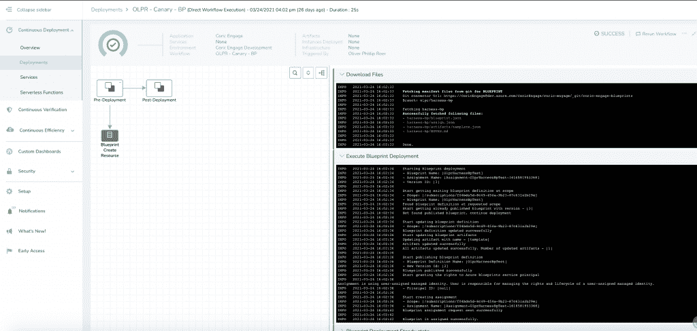

# Harness 扩展了无人机在多个云上的 CI/CD 功能奇偶校验

> 原文：<https://thenewstack.io/harness-extends-drone-to-offer-feature-parity-for-ci-cd-across-multiple-clouds/>

持续集成/持续交付(CI/CD)对于许多(如果不是大多数的话)DevOps 团队来说仍然是一个众所周知的复杂过程，尽管许多平台支持者承诺相反。根据 Gartner Research 的研究，当组织在两个或更多云环境供应商上部署时，这种情况在 81%的情况下会增加 CI/CD 的复杂性。开发运维团队通常必须为他们部署应用和更新的不同云环境分别配置脚本。

[Harness](https://harness.io/products/continuous-integration?utm_content=inline-mention) 去年收购了 Drone，通过将 Drone 转变为 [Harness CI 社区版](https://harness.io/platform/continuous-integration/)开源项目，寻求简化其 CI 产品。Harness 表示，其平台现在同时扩展和扩大了对跨[微软 Azure](https://azure.microsoft.com/) 、[亚马逊网络服务](https://aws.amazon.com/?utm_content=inline-mention) (AWS)和[谷歌云平台(GCP)](https://cloud.google.com/) 部署的支持，而不必为每个云环境单独编写脚本或执行其他任务。

[Harness 高级产品经理 Rohan Gupta](https://www.linkedin.com/in/swarnendurohan-gupta/) 描述了在公司启用多云功能之前，Harness CI 平台主要面向 Kubernetes 部署，因此规模有限。

古普塔告诉新的堆栈:“这一点很好，因为 Kubernetes 可以在任何公共云上运行，但直接在 AWS、GCP 和 Azure 上执行原生云部署的用户不具备全部功能。”

“通过在公共云提供商之间提供功能对等，Harness 为开发人员提供了一条摆脱无尽辛劳的途径。Gupta 说:“开发人员可以在几分钟内建立一个管道，并将该管道抽象到他们的所有环境中，而不是花费数小时来编写和维护每个云上的部署脚本。" Harness 正在消除 CD 过程中的脚本编写."

换句话说，该平台已经过改进，因此一旦代码被上传到 Git 上用于跨多个云的部署，开发人员或专注于运营的 DevOps 团队成员就可以花更少的时间来编写脚本和进行其他修改。

Harness 说，通过允许开发人员在不同的云提供商之间更加一致地定义和执行 CD 流程，DevOps 团队成员在多云部署中需要的人力资源就更少了。Gupta 说，他们还可以更少地担心必须了解与独立云环境相关的 CD 的特质。

“这不仅意味着每个云提供商需要更少的脚本，还意味着每个公共云提供商需要更少的内部工作细节知识，”Gupta 说。“这为每项服务节省了开发人员数小时的时间，并完全消除了应用环境发生变化时进行脚本维护的繁琐过程。”

作为该平台的一个典型使用场景，Gupta 给出了一个开发团队的例子，该团队在 AWS 弹性计算(EC2)实例上为 AWS 配置了基于虚拟机(VM)的部署，工件来自诸如 [Artifactory](https://jfrog.com/artifactory/) 等存储库，秘密来自[亚马逊秘密管理器](https://aws.amazon.com/fr/secrets-manager/)。以前，Harness 可以协调部署，以“确保所有这些集成都满足您的持续部署需求”，他说，平台的扩展现在意味着相同的配置可以应用于不同的 Azure 和 GCP 环境。

“如果要求同一个开发团队在 Azure 中执行相同的过程，他们可以复制 AWS 管道，为基于 VM 的部署将配置切换到 Azure 虚拟机规模集，并为他们的秘密连接 Azure Key Vault 以从 Artifactory 获取工件，所有这些都无需编写新的管道，”Gupta 说。“整个过程只需几分钟，节省了开发人员数小时或数天的时间，这取决于开发人员对编写脚本所需的 Azure APIs 的熟悉程度。”

通过扩展，Harness 以前的集成现在可以与 AWS、Azure 和 GCP 之间的单一管道代码命令互换。其中包括:

**AWS**

弹性容器服务部署
Lambda
弹性容器注册(工件提取)
基于 EC2/AMI 的部署
AWS 秘密管理器、AWS 密钥管理存储

**Azure**
Azure 虚拟机集
AKS
Azure 密钥库
Azure 容器注册表

**GKE** 谷歌容器注册表
谷歌密钥管理商店

<svg xmlns:xlink="http://www.w3.org/1999/xlink" viewBox="0 0 68 31" version="1.1"><title>Group</title> <desc>Created with Sketch.</desc></svg>