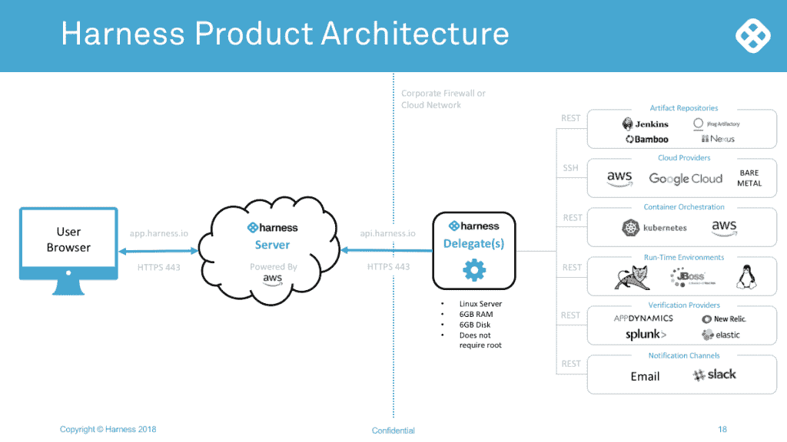

# Harness.io:用于快速移动和不损坏东西

> 原文：<https://thenewstack.io/harness-io-moving-fast-not-breaking-things/>

一年前，AppDynamics 创始人 [Jyoti Bansal](https://www.linkedin.com/in/jyotibansal/) 将自己的公司以 37 亿美元的价格出售给思科[后，几乎没有浪费时间去解决客户说他们面临的其他问题。](https://techcrunch.com/2017/01/24/cisco-snaps-up-appdynamics-for-3-7b-right-before-its-ipo/)

他在 10 月份推出了一家名为 [Harness.io](https://harness.io/) 的新公司，旨在应对持续交付的挑战。

“脸书和其他人说，‘快速行动，打破常规。’但是，如果你走进一家银行，说他们能做得更好、行动更快的唯一方法是打碎东西，这是行不通的。我们想快速行动，而不是打破东西，”班萨尔说，他解释说这个名字暗指这项技术提供的安全网。

他说，大多数组织都有持续集成，但是持续交付是一个不太成熟的领域。

他谈过的一家银行有 700 名 DevOps 工程师编写自动化脚本，此外还有 6000 或 7000 名开发人员。DevOps 工程师的工资约为 200，000 美元，它每年在自动化脚本上花费 1 . 4 亿美元，但仍然跟不上连续交付。

“他们担心谷歌、脸书和硅谷会蚕食他们的空间，因为他们行动不够快，”他说。

许多大公司从 DevOps 会议回来后，都很想在内部实现这些实践，但却对其复杂性感到沮丧。

“问题是许多人试图用 CI 来做 CD，这不是一回事，”他说。在一篇关于新堆栈的客座[帖子](https://thenewstack.io/many-problems-jenkins-continuous-delivery/)中， [Wercker](http://www.wercker.com/) 首席执行官 Micha“密斯”Hernandez van Leuffen 对此表示赞同。

Bansal 解释说:“有这么多不同的部分:您如何配置您的基础架构？您如何自动化部署？您如何规划部署，是淡黄色还是蓝色/绿色？您如何验证可用性、性能和日志方面的情况？如果出现问题，您如何回滚？你如何管理管道？所有不同系统的密码，您如何跟踪所有这些？”他说。

Forrester 分析师 Robert Stroud 称连续交付和发布自动化(CDRA)工具是业务转型中缺失的一环。

他解释道:

“具有前瞻性思维的[基础设施和运营]专业人士正在使用 CDRA 工具来超越繁琐、复杂且往往容易出错的脚本。这些专业人员使用这些工具来建模完整的应用程序生态系统，包括基础架构、中间件、应用程序和所有依赖项。然后，他们使用这种模型，在结构化的发布流程中协调发布，无论是金丝雀、蓝绿色、A/B 测试还是黑暗部署。”

班萨尔与为苹果公司持续送货的[里什·辛格](https://www.linkedin.com/in/rishi-singh-2b2a4110/)合作。它已经筹集了 4000 万美元。

该技术由两部分组成:智能自动化和持续验证。

现在，你用 Chef，Puppet，Ansible 写脚本，你用 Amazon 或者 Kubernetes 写脚本调用 API。Harness 不使用脚本，而是使用一个模型来定义您想要实现的目标。强调易用性，用户界面允许开发人员通过在系统将自动化的任务之间画线来建模管道。你也可以用简单的 YAML 进行编码，然后在 Git 中检查，然后它会自动从 Git 中同步。

班萨尔是这样解释的:

如果你想说:我的开发者会用 Git 检查代码。然后有人会把代码取出来，在詹金斯运行一个构建。从构建开始，运行单元测试，如果通过，我们希望提供一个新的试运行环境，其中的基础设施具有特定的特征。然后在这个环境中，我们要部署这个新代码，对新东西运行这些测试，如果通过，我们要开始部署到生产环境中。

“假设我们想要一个金丝雀部署，1%的新代码。我们希望验证我们的监控和记录系统；如果一切顺利，我们希望进入下一个 5%。我们允许人们用那种英语具体说明，真的，”他说。

他说，这种情况可能需要两个月的脚本编写，但在 Harness 中建模可能需要大约五分钟，并且它会为它生成所有的自动化。

它提供了一个抽象框架和所有部分的库:你如何从 Git 获得东西；如何连接到詹金斯；如何在亚马逊提供资源；如何在 Kubernetes 中提供资源，如何对其运行 selenium 测试，如何从 AppDynamics 或 New Relic 或 Elk 获取数据。

对于智能自动化，客户在其环境中部署一个 6GB 的线束“代理”。它与运行在云中或内部的 Harness 服务器连接。代理连接到客户的工件存储库、云环境、编排系统、监控系统等中的 SSH 或 API，以编排一切。

第二部分，持续验证，涉及一个人工智能层，以确保没有任何东西被破坏，无论是从质量、安全还是性能的角度来看。

该系统从您所有的监控系统和日志记录系统中提取数据，以创建复杂的神经网络和人工智能模型，这些模型不仅涉及性能，还涉及用户和业务角度。例如，如果你购物车中的正常转换率是 70 %,但一旦你推出新代码，它是 65 %,这是不正常的。

如果有问题，可以自动回滚。

他将 [Spinnaker](https://www.spinnaker.io/) 、网飞内部开发的[连续交付平台](https://thenewstack.io/netflix-built-spinnaker-high-velocity-continuous-delivery-platform/)命名为 Harness 最接近的竞争对手，该平台帮助开发团队发布软件变更，并确信不会有任何问题发生。

像 Jobvite 和 Build.com 这样的客户报告了戏剧性的结果。

在线家得宝的竞争对手 Build.com 一直在使用六七名高级工程师进行验证，一旦部署上线，他们每个人每周花三个小时。回滚需要 32 分钟。现在，该公司使用一名资历较浅的工程师进行验证，这需要 10 分钟，回滚需要 90 秒。它最近概述了一个仅 32 秒的生产回滚。

工作现场 [Jobvite](https://www.jobvite.com/) 报告部署时间减少了 10 倍，减少到 27 分钟。回滚需要 2 分钟。开发人员现在构建、部署和修复他们自己的代码。该公司从其三人部署团队中抽调了两名工程师，负责更关键的业务项目。

预计在今年年初的某个时候会发布一个正式版本。

<svg xmlns:xlink="http://www.w3.org/1999/xlink" viewBox="0 0 68 31" version="1.1"><title>Group</title> <desc>Created with Sketch.</desc></svg>