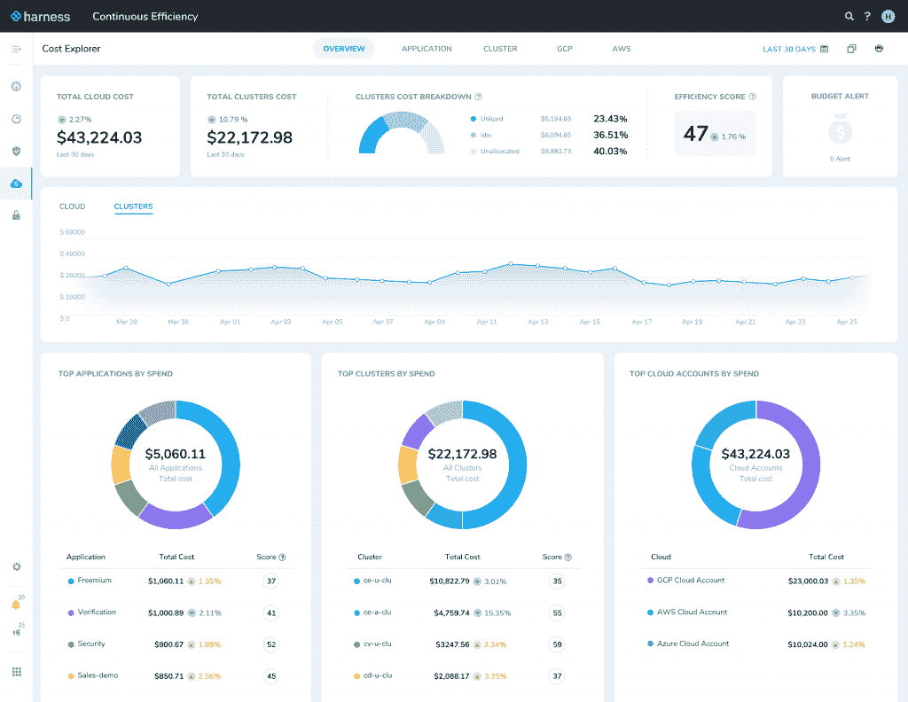

# Harness.io 将云成本转嫁给开发者

> 原文：<https://thenewstack.io/harness-io-translates-cloud-costs-to-developers/>

[创办的专注于提供连续交付(CD)的公司](https://thenewstack.io/harness-io-moving-fast-not-breaking-things/)将目光投向了一个新问题:浪费的云支出。该公司发布了一款被称为“持续效率”的产品，据称该产品使开发人员和 DevOps 团队能够管理他们在公共云中运行的容器化应用程序和微服务的成本，首席营销官[史蒂夫·伯顿](https://www.linkedin.com/in/burtonsays/)表示，该产品提供了对一个经常被掩盖的领域的可见性。

“开发人员正在不断向云部署，他们正在采用新的微服务，他们不了解这样做的成本，因为通常每 30 天就会有一个财务团队或云卓越中心来管理账单和成本。伯顿在一次采访中说:“如今，向云用户、向云用户、向云用户的反馈回路被打破了。“尤其是在像 Kubernetes 和 ECS 这样的容器化新技术中，开发人员正在请求资源，他们无法了解这些资源的利用率以及成本。”

对于许多人来说，Harness.io 随着从 monolith 到 microservices 的迁移而发展，提供了一种更快、更简单的方式来构建 CD 管道，而无需花费时间来扩展 Jenkins 脚本以手动执行任务。该公司提供了从向导到 YAML 到 GitOps 的各种方法来简化流程，并引入了“持续洞察”，以指标的形式提供可见性，如平均修复时间(MTTR)、交付时间和部署频率。

随着效率的不断提高，该公司已将可见性转移到业务的底线，有效地将管理云支出的责任“转移”给最有能力这样做的人，即开发人员和 DevOps 团队。Burton 说，这种转变的一个重要部分是在开发人员可以实际使用的水平上提供对成本的洞察，并将指标分解为反映应用程序架构的片段。

[https://www.youtube.com/embed/sXftHXhSlo0?feature=oembed](https://www.youtube.com/embed/sXftHXhSlo0?feature=oembed)

视频

“通常会发生的情况是，首席财务官或财务团队找到工程主管说，‘嘿，为什么我们的云账单逐月增加？’当开发人员审视账单时，是在基础设施和正在消费的服务的背景下，而不是在他们的应用程序、微服务或 Kubernetes 集群的背景下，”伯顿解释道对云法案的理解存在很大的分歧，因为这些法案本身就很复杂。我们正在努力为开发人员提供这种环境和可见性，以便他们能够像管理性能一样主动管理成本。"

目前，Harness 的持续效率提供了按云提供商、服务、应用、微服务和环境划分的成本明细，并按 Kubernetes 集群、命名空间、工作负载、节点和 pod 进行了划分。该工具显示闲置工作负载的成本，并精确定位对代码或基础架构所做的更改，以便开发人员可以根据所做的更改在成本上升时进行故障排除。伯顿说，该工具的一个重要特点是不需要标记。

“你看到的一切都是没有标记的。标签真的是痛点。如果你想到与连续交付的类比，脚本是 CD 中的痛点，标记与成本是一样的，”Burton 说。“这确实是团队目前唯一的解决方案，只需手动向所有计算节点添加元数据。显然，在云环境中，这是不断变化的。”

由[迈克尔·朗米尔](https://unsplash.com/@f7photo?utm_source=unsplash&utm_medium=referral&utm_content=creditCopyText)在 [Unsplash](https://unsplash.com/s/photos/money?utm_source=unsplash&utm_medium=referral&utm_content=creditCopyText) 上拍摄的特写图片。

*目前，新堆栈不允许在该网站上直接发表评论。我们邀请所有希望讨论某个故事的读者通过 [Twitter](https://twitter.com/thenewstack) 或[脸书](https://www.facebook.com/thenewstack/)访问我们。我们也欢迎您通过电子邮件发送新闻提示和反馈: [feedback@thenewstack.io](mailto:feedback@thenewstack.io) 。*

<svg xmlns:xlink="http://www.w3.org/1999/xlink" viewBox="0 0 68 31" version="1.1"><title>Group</title> <desc>Created with Sketch.</desc></svg>