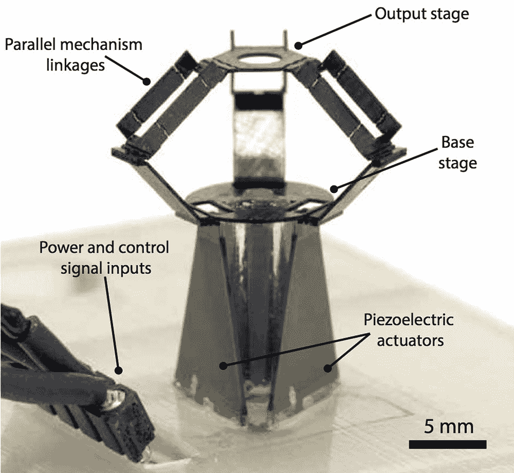

# 哈佛的微型机器人是一个高精度、高速的奇迹

> 原文：<https://thenewstack.io/harvards-micro-robot-high-precision-high-speed-wonder/>

人类外科医生的流行形象，穿着医用手术服，在精细的手术过程中弯腰驼背，是一个持久的形象。但是，在过去十年左右的时间里，人类控制的机器人助手已经在医疗领域崭露头角，在未来的外科手术室里，[自主机器人外科医生](https://thenewstack.io/autonomous-robot-surgical-cuts-better-human-surgeon/)很可能会激增，因为已经证明他们可以比人类同行进行更精确的切割。另一个可能的场景是微型机器人，它将帮助人类外科医生抵消在这种关键的医疗过程中可能发生的任何微小的手部颤抖。

至少，这是哈佛大学[工程与应用科学学院(SEAS)](http://micro.seas.harvard.edu/) 和 [Wyss Institute](https://wyss.harvard.edu/) 的研究人员对 milliDelta 的设想，这是一种微型、超精确、超快速的机器人，每秒可以执行 75 次以上的运动，同时经历大约 22g 的加速力(相比之下，美国宇航局的航天飞机在发射和再入过程中经历大约 3g 的加速力)。milliDelta 的速度如此之快，以至于在这些视频中它是一个移动的模糊物体:

[https://www.youtube.com/embed/djxsE6zo_tc?feature=oembed](https://www.youtube.com/embed/djxsE6zo_tc?feature=oembed)

视频

## 一个更小的三角洲机器人

该团队在 [*科学机器人*](http://robotics.sciencemag.org/content/3/14/eaar3018) 上发表的论文解释了 milliDelta 实际上是 [delta 机器人](https://en.wikipedia.org/wiki/Delta_robot)的毫米级适应，这是一种[并联机器人](https://en.wikipedia.org/wiki/Parallel_manipulator)，由瑞士机器人学家 [Reymond Clavel](https://en.wikipedia.org/wiki/Reymond_Clavel "Reymond Clavel") 在 20 世纪 80 年代中期发明，用于帮助巧克力制造商快速将果仁糖放入包装中。

台达机器人现在在医疗和制药行业以及包装应用或电子产品的高精度组装中相对常见。他们独特的设计使他们比其他工业机器人更有优势:delta 机器人的关节中没有沉重的致动器，而是将它们的致动器放在一个固定的基础平台上。这些致动器利用压电效应移动:当电流通过时弯曲。这些压电致动器控制一系列轻型臂，这些臂保持平行四边形的配置，进而保持称为末端执行器的附属组件的方向。这种巧妙的设计使 delta 机器人能够快速移动手臂，使它们特别擅长执行各种所谓的“取放”动作，以超过任何人类努力的速度和精度自动抓取和放置东西。

“德尔塔机器人速度很快，但我们的机器人基本上能把那些机器人打得落花流水，”哈佛研究人员、论文第一作者[海莉·麦克林托克](https://www.linkedin.com/in/hayley-mcclintock-247942b5/)T2 告诉美国科学促进会。“目前大多数可用的 delta 机器人都在几赫兹左右，所以每秒可以拾取几个，我们的 delta 机器人可以移动到 75 赫兹，所以它的频率比目前可用的任何机器人都高 15 到 25 倍。”

[https://www.youtube.com/embed/aKH_YM_YQR0?feature=oembed](https://www.youtube.com/embed/aKH_YM_YQR0?feature=oembed)

视频

milliDelta 是使用平板包装的微制造方法建造的，这种方法最初是由 Wyss 研究所的研究人员在 2011 年开发的。milliDelta 由带有柔性接头的复合层压结构组成，尺寸为 15 x 15 x 20 毫米(0.6 x 0.6 x 0.8 英寸)，重量为 430 毫克。尽管它的尺寸很小，但这个微型机器人能够携带 1.3 克的重量，它可以在 7 立方毫米的区域内灵活机动，精度范围约为 5 微米。

## 微装配、微制造和显微外科

这种明显的灵活性将使 milliDelta 成为要求高度精确的任务的完美候选。这些领域包括从科学研究中细胞等组件的显微操作，到微型电路板的大规模微组装，到改进 3D 打印和微制造技术，以及改进显微外科手术，如在眼睛或大脑上进行的手术。

麦克林托克说:“我们考虑的一个(可能的用例)是眼科手术。“当你在这么小的区域内手术时，你会有震颤的问题，所以 milliDelta 可以用作眼科手术的抗震颤末端执行器。”

为了证明这一点，milliDelta 的动作被定制来平衡任何给定的个人手中存在的自然但颤抖的动作的一般模式。

该研究的另一位第一作者、博士后研究员 [Fatma Zeynep Temel](https://scholar.harvard.edu/zeyneptemel/home) 说:“我们首先绘制了牙签尖端被个人握住时所限定的路径，计算了这些路径，并将其输入到 milliDelta 机器人中，该机器人能够匹配并抵消它们。”。

根据该团队的说法，milliDelta 和其他类似的机器人可以被附加到现有的设备上，在更小更精确的范围内增强它们的能力。这也是一个令人欣慰的想法，有了这样的机器，风险更高的手术，如在人体更脆弱的器官上进行的手术，可能会变得更安全。虽然体积小，但功能强大，这些微型的工业产品似乎准备在不久的将来冲出工厂，进入其他令人兴奋的应用领域。

图片:哈佛大学。

<svg xmlns:xlink="http://www.w3.org/1999/xlink" viewBox="0 0 68 31" version="1.1"><title>Group</title> <desc>Created with Sketch.</desc></svg>