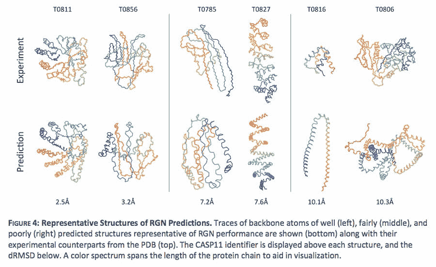

# 哈佛新的开源人工智能算法简化了蛋白质折叠难题

> 原文：<https://thenewstack.io/harvards-new-open-source-ai-algorithm-simplifies-protein-folding-puzzle/>

蛋白质可能很小，不起眼，但这些分子对于所有生物体内的各种生物功能都是必不可少的，包括消化、免疫反应甚至细胞内通讯。由称为氨基酸的较小有机化合物长链组成，各种蛋白质的不同功能由它们在三维空间中折叠的方式决定。毫不奇怪，这些蛋白质链的折叠结构会变得非常复杂，科学家们尚未完全弄清楚某些蛋白质如何折叠以及为什么会这样折叠，以及当它们错误折叠时，像阿尔茨海默氏病这样的疾病是如何引起的。

虽然使用冷冻电子显微镜、核磁共振和 X 射线晶体学等现代技术可以帮助我们更好地理解蛋白质折叠，但不幸的是，这是一个耗时且昂贵的过程。准确预测蛋白质的折叠结构可能是解开许多医学之谜的关键，由于最近在计算生物学领域整合人工智能的发展，这个缓慢的过程很可能会加快——让我们能够发现甚至设计出新的有用的蛋白质。

这种可能性最近随着谷歌 DeepMind 的 [AlphaFold](https://deepmind.com/blog/alphafold/) 而变得明显，这是一种人工智能，它证明了它可以[准确预测](https://thenewstack.io/deepmind-ai-makes-breakthrough-with-protein-folding-problem/)一种新蛋白质的三维结构，只要给出组成它的氨基酸列表。现在，哈佛大学的系统生物学家和研究人员开发了另一种新的计算技术，在预测折叠蛋白质的结构方面，可能比 AlphaFold 快一百万倍。

## 简化蛋白质折叠的复杂性

在一篇题为“蛋白质结构的端到端可区分学习”的论文中，哈佛研究人员 Mohammed AlQuraishi 详细介绍了他的方法如何使用一种被称为[深度学习](https://thenewstack.io/deep-learning-dissected-devops-teams-workflows/)的人工智能，通过模拟人脑处理信息的方式的人工神经网络。

这个新模型的不同之处在于，它使用了一种被称为端到端可区分学习的东西。虽然诸如 AlphaFold 所利用的技术能够根据蛋白质链的组成氨基酸以及它们之间的距离和角度来预测蛋白质链可能折叠的方式，但这些方法通常严重依赖于来自先前已知蛋白质的所谓共同进化数据，或者蛋白质折叠的预定义结构模板。因此，它们在确定未知蛋白质串的三维结构时并不那么有效，更不用说预测给定蛋白质结构中的变化或突变可能会发生什么了。此外，这些当前的方法通常使用现成的神经网络组件，这些组件不一定适合解决蛋白质折叠问题，并且它们没有明确地绘制出蛋白质序列与其结构在数学上的关系。

然而，AlQuraishi 的方法通过使用数学函数在一定程度上简化了这个过程。这种方法被称为递归几何网络(RGN)，它采用了一种更具背景的技术来确定蛋白质链可能折叠的各种方式。rgn 并不局限于蛋白质折叠构型或模板的先验数据，而是在某种意义上更灵活，因为它们使用“可区分的原语”，这类似于将单词放在句子中的上下文中——人们遵循某些规则，这样才有意义。虽然该模型确实需要花费数周时间使用蛋白质折叠的可用数据进行训练，但之后该模型能够一次又一次地进行微调，因为它分析并“学习”特定蛋白质序列与其结构之间的数学关系，使用折叠蛋白质的“基础事实”示例进行比较并检查准确性。然后，这种方法允许它翻译这些知识来分析未知序列，并在几毫秒内生成折叠预测，而不是其他模型所需的几个小时或几天。

“通过它们的循环结构，rgn 能够模拟长蛋白质序列片段，并发现这些片段之间的高阶关系，”AlQuraishi 解释道。“随着更多的结构和序列数据变得可用，以及新的循环架构的出现，这些架构能够捕捉更长范围的相互作用……rgn 可以自动学习以提高其性能，同时隐式捕捉序列-结构关系，这些关系可能会使用神经网络探测技术发现。”

在他的测试中，AlQuraishi 发现这种新算法要么优于类似的蛋白质折叠预测模型，要么与之竞争。此后，他在 GitHub 上发布了代码，希望其他研究人员和专家能够在此基础上进行构建和改进，他说:“深度学习方法，不仅仅是我的方法，将会在预测能力和受欢迎程度方面继续增长，因为它们代表了一种最小化的简单范式，可以比当前的复杂模型更容易地整合新的想法。”

在这里阅读论文，并通过下面的 Broad Institute 查看 AlQuraishi 最近的讲话。

[https://www.youtube.com/embed/HOVdHAnC8LI?feature=oembed](https://www.youtube.com/embed/HOVdHAnC8LI?feature=oembed)

视频

图片:Ousa Chea via Unsplash 哈佛大学

<svg xmlns:xlink="http://www.w3.org/1999/xlink" viewBox="0 0 68 31" version="1.1"><title>Group</title> <desc>Created with Sketch.</desc></svg>