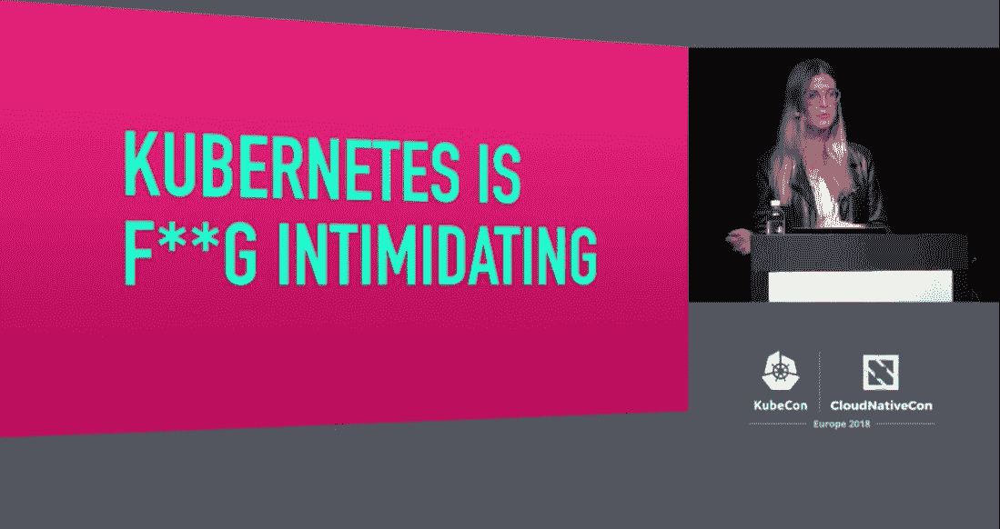

# Kubernetes 对于企业 IT 来说已经变得过于复杂了吗？

> 原文：<https://thenewstack.io/has-kubernetes-already-become-too-unnecessarily-complex-for-enterprise-it/>

随着软件工程师花时间——或者努力寻找——消化又一卡车的新想法、信息，也许还有来自哥本哈根最新 KubeCon + CloudNativeCon 的灵感，一场冷静、尊重和揭示 Kubernetes 及其生态系统状态的新对话正在出现。

这场讨论始于一条黑客新闻,公开质疑 Kubernetes 是否给组织带来了比它消除的更多的复杂性。事实上，并没有太多的回应，分享的大部分内容主要是保证由编排者引入或通过编排者引入的任何复杂性肯定会通过调度和执行的效率得到补偿。

对话随后转移到了 Twitter 上，谷歌计算引擎的联合创始人、现任[赫普蒂奥](https://heptio.com/)首席技术官[乔·贝达](https://twitter.com/jbeda)努力隔离并确定这位指挥者的痛点可能在哪里。Beda 断言，这样一个有机构建的组件，以及围绕它的服务，很难介绍给新来者。然而，他确实延续了总的主题:Kubernetes 创造了一个新的舞台世界，起初可能令人困惑，但最终是有益的。

“Kubernetes 提供了一套解决一系列常见问题的抽象概念，” [Beda 写道](https://twitter.com/jbeda/status/993978918196531200)。“随着人们围绕这些问题建立理解和技能，他们在更多情况下会更有效率。还有一个陡峭的学习曲线！但是这种技能现在很有价值，可以在不同的环境、项目和工作之间移植……计算的故事就是创造抽象。起初觉得尴尬的事情成为新的常态。更高层不是更简单，而是更适合不同的任务。

“我认为，作为工程师，”贝达继续说，“我们倾向于低估我们自己构建的复杂性和我们需要学习的复杂性。”

## 我很想，但是我不能，Hokay

在那之前，这个话题并不完全是一场对话。但随后，软件工程师杰森·莫伊伦(Jason Moiron)也加入了这个团队，他将这个团队引向了自己的个人博客，并发表了一篇帖子，提出了一个非常相关的问题:Kubernetes 是否通过其对明确性的需求来创造复杂性，主要是为了让事情变得更简单？在这种情况下，it 部门管理的应用程序的*环境*是否会变得远不如其部署的可扩展性？换句话说，你是否坚持你已经建立的？

Moiron 写道:“我们将服务发现与健康检查和自我诊断结合使用，以便能够在停机期间，更重要的是在速度变慢时，做一些相当有趣的事情。“这些都是难题，我们已经在一些地方相当粗糙地解决了它们，但这些解决方案仍然为我们提供了系统稳定性所必需的成熟水平。

“不幸的是，我们的方法与 Kubernetes 的集中式方法有些不兼容。通常，当这种情况发生时，您的需求过于复杂，但在这种情况下，Kubernetes 的方法已经非常复杂，以便尝试在适当的复杂程度上进行处理。这是一种深思熟虑且成熟的方法，但它的结构与我们的正好相反。它以不相容的方式变得复杂，是两个世界中最糟糕的。”

服务发现本质上是这样一种系统，应用程序或系统可以通过该系统利用其他服务(如 DNS)来连接到它需要的特定服务，而这些服务不是直接构建到系统中的。微软 Windows 总是随着时间的推移而变慢的原因是它对服务发现问题的解决方案简单却庞大:一个庞大的系统注册数据库，就像一个人口众多的城市的黄页。

当两个相隔很远的 Windows 应用程序需要共享功能时，它们必须在各自的注册表本地版本中安装相同的“类型库”，即从同一电话簿中提取的相同页面。这将保证发送方引用的函数与接收方查找的函数是同一个函数。危险在于应用程序的新版本可能无法对同一应用程序的旧版本进行远程过程调用(RPC)。简而言之，唯一的扩展方式就是一起扩展。

Windows 的旧解决方案使分布式系统的问题变得显而易见:当被分布的系统被尽可能精确地复制时，它们工作得最好。改变系统，当应用程序安装在你自己的系统之外的某个地方时，谁知道你是否能找到你正在寻找的服务。

DNS 为 Web 服务提供了一种方法，使包含所请求服务的接收系统变得动态和灵活，并使它自己的应用程序能够根据自己的时间伸缩。也许 RPC 会工作，也许不会，但结果永远不会是灾难性的。t 可以处理；有很多选择。

Moiron 的投诉——它可能会被称为——提出了一个问题，即 Kubernetes(以及谷歌)对服务发现问题的解决方案是否只适用于谷歌环境。这是一个黄页交换的问题，只是在另一个层面上:通过围绕自己的上下文集中服务，Kubernetes 是否能确保——就像 Windows 和 Windows Server 确保的那样——被编排的系统不会进化？当然，它们可以变大或变小，但这不是重点:它们能变大吗？

Moiron 在短信中写道，“我想运行另一个进程，哦，我不能，除非我把它放在一边，并通过 yaml hokay 密切描述它与父环境的每一种关系。”

## 威吓

“Kubernetes 是由系统工程师设计的*，为*系统工程师设计的*，”Heptio 的工程师 [Kate Kuchin](https://twitter.com/exkuchme) 在最近的 KubeCon 上说。“如果你是一名系统工程师，这很好。对于我们其他人来说，Kubernetes 真的真的很吓人。除了那些创建 Kubernetes 的人在最开始的时候在场之外，这个房间里的每个人都可能在某个时候是新的 Kubernetes 用户，或者现在是新的 Kubernetes 用户，或者下周将是新的 Kubernetes 用户。所以你们都已经知道，这可能会非常令人生畏。”*

库欣告诉她的听众，她从她的老板乔·贝达那里学到了管弦乐队的工作原理。虽然他的存在和经验激励她追求自己对系统的掌握，但她承认，她很快就有足够的能力彻底解释 Kubernetes 的基本概念，而没有太多的线索了解它们的意思或作用。(如果我承认我同情她的处境，我会透露太多关于我作为一名科技记者的工作。)

Kuchin 指出，在介绍新用户环境(UX)如何使整个 Kubernetes 体验对日常企业来说更简单的想法的背景下进行观察。可以说，库伯内特斯坚硬的概念是围绕它的生态系统的支柱。从一开始，几乎每一个提供 Kubernetes 服务的供应商都将自己定位为 orchestrator 的简化者。如果它很容易理解，我们不仅不会有这样的对话，而且也不会有我们现在拥有的生态系统。

## 好的，坏的，未消化的

奇怪的是，Jason Moiron 最尖锐的不满之一是关于使用 YAML 来表达配置意图。他借用了一点短信，在博客中问道，“我怎么能知道这是怎么回事？”

引用耶鲁大学教授艾伦·J·佩利在编程中的一句著名的警句，“当程序需要关注不相关的东西时，编程语言就是低级的，”Moiron 承认 [Kubernetes 著名的“固执己见”的方法](https://thenewstack.io/pipelines-run-dry-thriving-post-jenkins-world/)部署分布式系统确实与系统分析师的预期一致，并帮助非分布式系统分析师的人在那个方向上做出第一个决定。从这个意义上来说，orchestrator 对于一些与 Google 处于分布式系统规模相反一端的人来说可能不会太低级。

但是，对于已经为自己的系统做出服务发现决策的工程师来说，Moiron 说，orchestrator 自己做出的决策往往在体系结构上与这些决策不兼容。

“通常，当这种情况发生时，”Moiron 写道，“你的需求太复杂了，但在这种情况下，Kubernetes 的方法已经显着复杂，以试图处理适当的复杂程度。这是一种深思熟虑且成熟的方法，但它的结构与我们的正好相反。它以不相容的方式变得复杂，是两个世界中最糟糕的。"

赫普提欧提出了几乎完全相同的论点。其首要工具 ksonnet 是[一种中间解释器](https://thenewstack.io/heptio-comes-stealth-mode-ksonnet/)，它使用一种叫做 Jsonnet 的 JSON 形式来实现一组更具声明性的配置文件——通常不止一个组合在一起。这种组合的产品是一个可被 Kubernetes 消化的单一 YAML 文件，尽管中介允许一定程度的灵活性和可扩展性，而 YAML 自己可能不允许。

“我并不是说我这里有这个神奇的工具，它实际上可以用发电机解决你所有的问题，”Heptio 的 Bryan Liles 解释道，在另一次 KubeCon 会议上解释如何使用 ksonnet，“因为那很傻。我希望简单的事情变得简单，困难的事情变得可能。我们在这里所做的是，我们试图从你的日常生活中消除对 YAML 的需求。不是去掉它，而是去掉一些需要。”

在 Twitter 上回复 Moiron 帖子的新帖子中，Heptio 的 Joe Beda 基本上证实了 Jason Moiron 的每一个投诉。“当我们开始使用 YAML 时，我们从未打算让它成为面向用户的解决方案，”贝达写道。“我们把它看作‘汇编代码’令我震惊的是，我们仍然在与它直接互动。这是一个失败。这不是一个简单的问题，我不认为有什么灵丹妙药。通过有一个原始的形式，我们可以实现一个解决方案的生态系统。这些仍然是早期的，是原始混乱的原始汤的一部分，是库伯内特在当前阶段的一部分。

“我们冒着通过引入更多复杂性来解决问题的风险，”Heptio CTO 继续说道。“我担心像 Istio 这样的努力。它可以做令人惊讶的事情，但它仍然处于早期阶段，而且更加复杂。我们吸收这些东西的能力有限，k8s 还没有被消化。”

<svg xmlns:xlink="http://www.w3.org/1999/xlink" viewBox="0 0 68 31" version="1.1"><title>Group</title> <desc>Created with Sketch.</desc></svg>