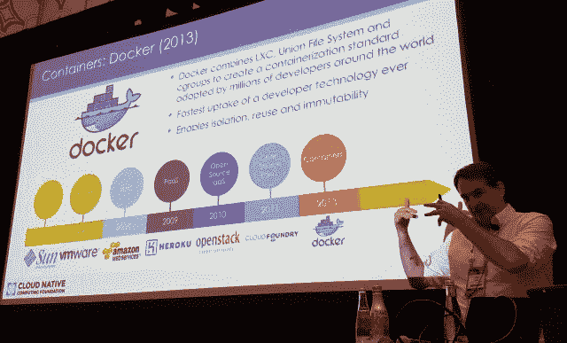
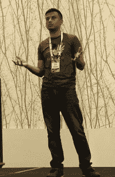

# 单体架构受到了不好的指责吗？

> 原文：<https://thenewstack.io/has-monolithic-architecture-gotten-a-bad-rap/>

我们倾向于将微服务和 monolith 描述为软件架构的两种截然相反的风格——原生分解与自包含，流体与固体，水银与积分。因为“新”是我们标题中的第二个词，当我们讨论全面容器化的优点时，我们倾向于画一个从古代到现代的平行向量，包括微服务、无服务器暂存、异步信号和无状态。

软件架构师 Vivek Juneja 在 2016 年为新的堆栈写道，微服务能够实现“一个新的、更加敏捷的世界，在这个世界中，开发人员和运营团队携手合作，快速安全地交付小型、松散耦合的软件包。功能不是由一个单一的整体系统完成，而是由一组较小的服务来协调它们的操作。”

这经常听起来像乌托邦，就像一个平等的共和国推翻了一个极权主义政权。正如人们常说的那样，微服务不仅支持可扩展性，还支持应用管理方式的灵活性。

但是，我们对这一切是否不切实际？

“我个人认为，我从未见过工程团队从第一步就使用微服务设计出一个应用，并取得成功。百分之百的失败率，”[劳拉·弗兰克](https://www.linkedin.com/in/laurafrank/)说道，她是[商业詹金斯平台生产商 CloudBees](https://www.cloudbees.com/) 的工程总监。

## 重新审视自我束缚

“这种自我束缚是有价值的，因为随着时间的推移，抽象概念和它们的分解点会向你展现出来，”弗兰克继续说道，他指的是一种说明性的形象，类似于大理石雕刻家在她头脑中看到她需要凿掉的大块。“如果你仔细想想，每个整体都是从微服务开始的。随着你不断添加和定位，它就变成了一块巨石。巨石柱的坏名声来自于它没有被重新审视，那些抽象概念没有被执行。”

因为大多数应用程序从里到外都像泥塑半身像一样构建，正如她对这两个概念的理解，微服务是一个原始的整体。她的观点得到了行业观察家[马丁·福勒](https://martinfowler.com/)的支持，新堆栈[引用](https://thenewstack.io/microservices-terribly-named-ambiguously-defined/)首先创造了微服务概念。

在 2015 年的一篇文章中，[福勒写道](https://martinfowler.com/bliki/MonolithFirst.html)，“服务之间的任何功能重构都比在一个整体中更难。但是，即使是在熟悉领域工作的有经验的架构师，在开始时也很难确定界限。通过首先构建一个整体，你可以在微服务设计覆盖一层糖浆之前，找出正确的界限。”

在同一篇文章中，Fowler 建议实现微服务系统的一个合理方法是从一个整体开始，一个一个小心地剥离微服务。CloudBees 的 Frank 将这一断言推进到了下一步，他指出这种剥离实际上可能是任何组织(至少在网飞之外)获得可伸缩性和跨云可移植性的唯一合理方法。

“我们经常把代码行和业务逻辑搞混，”Frank 说。“非常有可能有一个非常小的整体，其中有许多业务逻辑，但可能没有多少代码行，或者可能没有使用那么多基础设施资源。同样，我认为拥有一个又大又胖的微服务很容易，它有一大堆代码，可能只负责一个业务决策。这是一个滑动的尺度。就业务逻辑而言,“微服务”处于一个极端,“整体服务”处于另一个极端。我们再也不谈中间的部分了。我不知道这是为什么，但我发现这中间部分对于许多不同行业的许多工程团队来说都非常成功。我想，这中间部分实际上是典型的面向服务的架构。"

## 孩子不承认父母

弗兰克的主张是，这一尺度是由一对彼此对立的模型决定的，这两个模型都不能准确描述任何企业的状况。正如我告诉她的那样，我所遇到的大多数面向服务架构(SOA，微服务的“父母”)的实践者都支持这种模型作为组织的理想状态——实际上是一个完全注释的业务，它敏锐地意识到它执行的每个离散功能，并围绕每个功能构建了软件代码。

一些软件架构师提到了这种 SOA 模型，他们认为微服务，更简单地说，就是服务。但是在去年 11 月的一次网络研讨会上，事件存储架构师 [James Nugent 指出了这两个概念之间的一个关键区别](https://www.youtube.com/watch?v=jRmpYprh3aE):父 SOA 提倡创建一个单一的组织域模型来代表所有代码的业务模型(类似于模式如何代表数据库的业务元素)。但是这个孩子，微服务，会避开这样一个全球模型。

如果你想一想(对于这个深奥的话题，很难不去想)，微服务会寻求做一些不可思议的事情:对业务建模，同时放弃使用模型。我们以前见过，南美蚂蚁在没有蓝图的情况下用自己互锁的身体建造桥梁。太神奇了。但也许这并不明智。

“已经有一个非常丰富的业务逻辑景观，需要构建一些东西，”她向新的堆栈解释道。“我认为业务逻辑的组合本身就是一个整体。它已经到了有清晰的抽象层的地步，可以决定说，‘我们需要这个组件，我们需要以这种方式*构建它，因为我们了解我们周围的世界。’我认为不成功的是完全的绿地项目，背后没有丰富的业务包袱，决策就像是为了微服务而微服务。我认为人们会掉进那个洞里。"*

## 第二个系统效应

去年九月，在洛杉机[开源峰会](https://thenewstack.io/open-source-summit-kubernetes-new-linux/)上，一些云原生应用开发的主要从业者似乎倾向于 Frank 的方向。在一次会议上，[Cloud Native Computing Foundation](https://www.cncf.io/)执行董事 [Dan Kohn](https://www.dankohn.com/) 公开表示支持一种提升、转移和调整方法，将单一应用程序转变为云居民。

“这是一个非常古老的应用程序，在许多情况下，它管理着数十亿美元的商业活动。你会说，‘那么，我该如何进化呢？’”科恩解释道显而易见的答案是，‘好吧，我重写一遍。"

但是 Kohn 引用了 1975 年 Frederick Brooks 的一卷关于软件工程的论文，题目是“神话中的人月”，其中提到了一个叫做“第二系统效应”的概念。在一篇文章中，Brooks 教授提出，系统架构的第一次尝试是“简单而干净的”，主要是因为架构师是边做边学。但是后来，不可避免的后果很可能被过度考虑，成为“一大堆”功能，其中只有一半会被经常使用。

Kohn 引用 Brooks 的工作解释道:“现有的系统必须不断进化，以适应新的需求和对它的新要求，并修复错误和其他各种事情。而且它的发展速度通常比第二个系统要快得多。因此，如果重写不起作用，而你有这个庞然大物，它是云原生的对立面——它不灵活、紧密耦合、脆弱——那么你如何进入这个新世界？”

科恩建议的第一步是“停止挖掘”——停止给整块巨石增加新的功能。接下来，开始在现有系统周围添加 API，并将其“提升并转移”到单个容器中。“实际上，你可以把任何一个已经编写好的软件放入一个容器中。”

当天晚些时候，在会议上，Tibco 软件产品管理和战略总监 Rahul Kamdar 特别提到 Kohn 的“提升和转移”方法，将其列为“[过渡到云原生集成的 10 个陷阱](http://schd.ws/hosted_files/ossna2017/4e/Death%20of%20the%20ESB%20-%2010%20Pitfalls%20in%20the%20Transition%20to%20Cloud-Native%20Integration.pdf)”中的第 4 个。

Kamdar 承认升降移位确实有加快项目进度的优势。“但从中长期来看，它有很大的风险和成本，”他说，“很大的运营开销。”他补充称，Tibco 从直接经历中学到了这一教训。“如果您的应用程序已经可以横向扩展，如果它们的启动时间非常快，如果它们有大量的服务在运行，那么当然，您可以进行提升和转移。但对于大多数传统的 ESB(企业服务总线)应用来说，这并不是现实。”

Kamdar 继续说，设计为使用 ESB 作为跨组件信号机制的应用程序，根本不能被提升和转移到一个容器中，并从那里进行分解。按照设计，这样的应用程序维护自己的会话状态——这就是 ESB 的用途。从他的角度来看，将这样一个应用程序分解成与有状态会话并行运行的无状态服务，使得通过设计持续地、有意地维护二分法变得不可能，至少是荒谬的。

CloudBees 的 Laura Frank(他的 [Codeship CI/CD 平台](http://codeship.com/)现在是 CloudBees 的服务)看到的恰恰是相反的开发模式。Frank 认为，在分解生命支持系统的过程中，通过留下这个庞然大物，组织不需要在过渡过程中制定新的部署策略。

“例如，我们有一个新的 API，我们希望它是一个独立的微服务，”Frank 描述道，“但是你猜怎么着？这个 API 所依赖的所有业务逻辑都在这个整体的 Rails 应用程序中。在这个层次上进行抽象需要更多的开销，因为没有足够的投资回报。所以把它放在同一个地方是合理的。它使部署变得更加容易；这使得测试变得更加容易。肯定有优势和坚实的商业理由，公司发现自己要么追逐云原生和微服务的前景，要么继续做他们正在做的事情，采取更务实的方法，并让这成为更好的商业决策。”

在我们关于技术和架构的辩论中，我们经常以一种专业的方式结束，即最终的解决方案是介于两者之间的。这一次，我们可能没有这种奢侈。这是一种处于两者之间的状态，一种永恒的流动状态，其价值正在被争论。争论的双方似乎都有证据、历史和经验支持他们。

特色图片:[一座活跃在开阔绿地中央的白蚁丘](https://commons.wikimedia.org/wiki/File:Termite_hill_NT.jpg)，作者 Paulgotoo，获得知识共享 4.0 许可。

<svg xmlns:xlink="http://www.w3.org/1999/xlink" viewBox="0 0 68 31" version="1.1"><title>Group</title> <desc>Created with Sketch.</desc></svg>