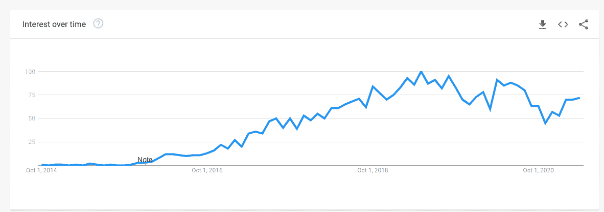
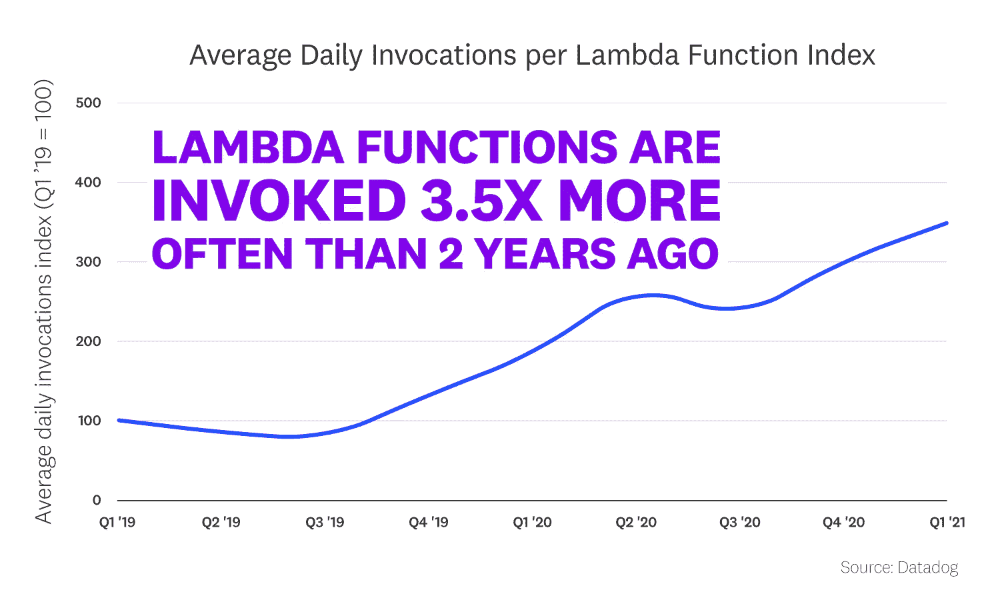
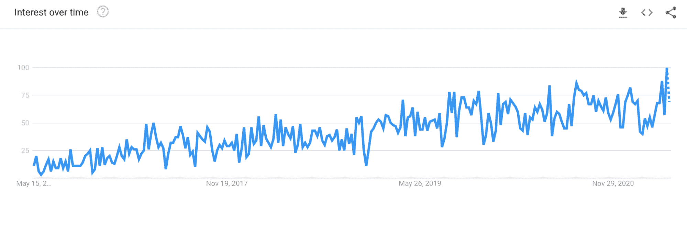
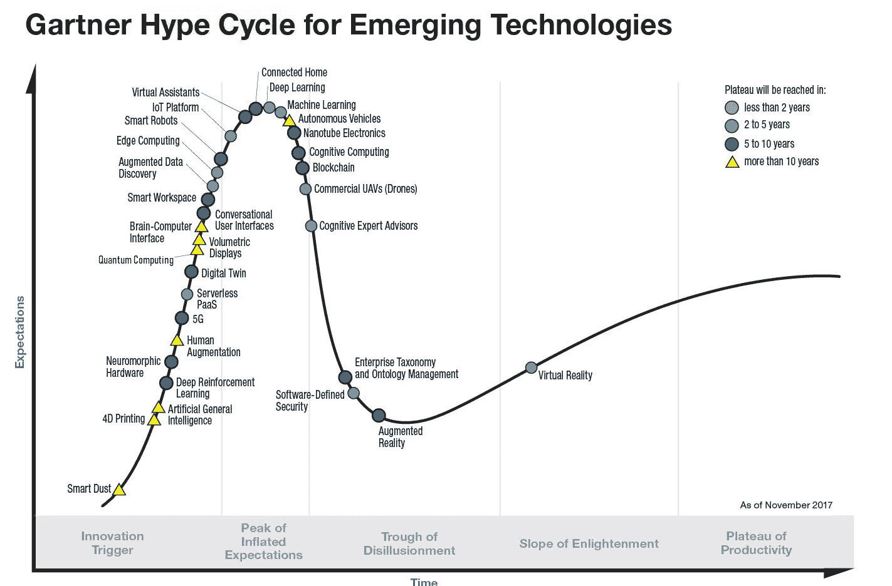

# 无服务器是否跳过了鲨鱼？

> 原文：<https://thenewstack.io/has-serverless-jumped-the-shark/>

[Mark Hinkle](https://www.linkedin.com/in/markrhinkle/)

[Mark 在新兴技术和开源领域有着悠久的历史。在共同创立 TriggerMesh 之前，他是 Node.js 基金会的执行董事，也是 Citrix、Cloud.com 和 Zenoss 的高管，在那里他领导了他们的开源工作。](https://www.linkedin.com/in/markrhinkle/)

谈到新的创新或趋势，科技行业与众不同。这些年来，我们已经看到了各种技术的兴起，以及技术专家寻求加入的狂热。在 20 世纪 90 年代末，围绕 Linux 出现了前所未有的热潮，最终，它成为了业界领先的服务器操作系统。在 21 世纪初，是 VMware 和 Xen 引领的虚拟化，最终是 KVM(基于内核的虚拟机)——所有这些都提高了服务器利用率，为云计算铺平了道路。今天，Linux 和虚拟化支撑着云，并且比以往任何时候都占有更大的份额。然而，它们的无处不在几乎让人看不见。这或多或少被认为是理所当然的，它们为我们在云计算中所做的事情提供了基础。

今天大肆宣传的技术对话围绕着容器、Kubernetes 和无服务器。就像 Linux 和服务器虚拟化一样，这些东西中的一些将淡出人们的讨论，但它们仍将是我们日常使用的云基础设施的一部分。在某些情况下，今天的新技术只是已经存在多年的架构模式的表现。无服务器使用[事件驱动架构(EDA)](https://www.triggermesh.com/faq/what-is-event-driven-architecture) ，已经有几十年的历史了。类似地，容器是应用程序级的虚拟化，这在大型机早期就已经存在了。

在我职业生涯的某个阶段，我管理过 Node.js 基金会，这是一个促进和指导流行的服务器端 JavaScript 框架的贸易组织。当时，Node 是亚马逊无服务器产品 Amazon Lambda 上部署最多的工作负载。这引发了我对无服务器的兴趣。AWS Lambda 的优势在于它提供了一个托管服务，允许开发人员轻松部署 Node.js(服务器端 JavaScript 应用程序)。具有讽刺意味的是，尽管无服务器对于交付工作负载至关重要，但这并不是重点。这是真正有价值的技术的标志。

## **无服务器使用量增加，嗡嗡声在下降**

今天，我们通过谷歌趋势看到，无服务器的提及率正在下降。

谷歌趋势:随着时间的推移对无服务器的兴趣(2021 年 4 月 23 日检索)

根据行业报告，围绕无服务器的宣传正在减少，但使用率正在上升。根据 Datadog 最近的[报告](https://www.datadoghq.com/state-of-serverless/)，平均来说，在 2021 年初，Lambda 函数每天被调用的频率是两年前的 3.5 倍。因此，无服务器的使用正在增加，即使宣传没有增加。

【T2

与此同时，我们看到围绕数字化转型的讨论明显增多。正如无服务器的功能即服务方面有助于在 Node.js 应用程序中实现交付一样，它也使数字技术能够集成到业务的所有领域，从根本上改变了公司构建技术的方式。

谷歌趋势:对 DevOps 的兴趣(2021 年 4 月 23 日检索)

## **基础设施即代码，集成即代码**

像 serverless 和 Kubernetes 一样，DevOps 方法也受到了大肆宣传。除此之外，DevOps 为我们提供了基础设施自动化，即可以像管理软件一样管理基础设施，方法是自动创建并在版本控制中保留配置数据。这种方法被称为代码基础设施。我们认为，这种方法的下一次发展实际上是代码集成，服务和应用通过声明性 API 集成，成为部署基础设施的自动化流程的一部分。

## **无服务器今天和下一步**

如今被大肆宣传的技术——如 Amazon Lambda 等功能即服务产品、Knative 等 Kubernetes 的无服务器框架以及数据库即服务(DBaaS)等其他非 FaaS 无服务器解决方案——是更先进的数字业务交付系统的基础。

基础设施交付和消费的新方法，如云计算，既是一种技术创新，也是一种文化创新，在 DevOps 中最为明显。即使有这些技术创新，公司仍将使用传统应用程序数据、现代云服务和其他无服务器架构的组合来完成数字化转型。关键不是大规模转向新技术，而是以一种简化数字体验交付并且对最终用户不可见的方式集成这些技术的能力。

无服务器没有跳过鲨鱼。相反，它正在成熟。Gartner [炒作周期](https://en.wikipedia.org/wiki/Hype_cycle)，一个技术和应用的成熟度和采用率的图形表示，在 2017 年预测，无服务器将需要两到五年的时间从一个膨胀的期望点转移到生产力的平台期。

【T2

这就是我认为无服务器今天的情况，生产力的高原，使用增加，讨论减少。我认为下一站是无服务器和其他云服务和应用程序之间更好的集成。

<svg xmlns:xlink="http://www.w3.org/1999/xlink" viewBox="0 0 68 31" version="1.1"><title>Group</title> <desc>Created with Sketch.</desc></svg>