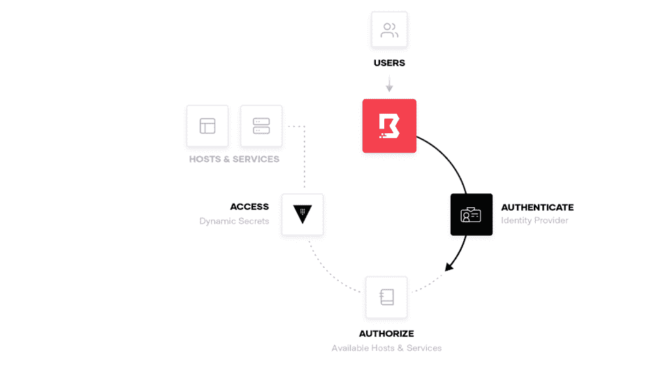

# HashiCorp 将 Vault 添加到其云平台，启动访问安全项目

> 原文：<https://thenewstack.io/hashicorp-adds-vault-to-its-cloud-platform-launches-access-security-project/>

基础设施软件和服务提供商 [HashiCorp](https://www.hashicorp.com/) 将其广受欢迎的 [Vault](https://www.hashicorp.com/products/vault) secrets 安全管理工具发布在 HashiCorp 云平台(HCP)上。该公司还推出了一个基于身份的访问管理开源项目 [Boundary](http://boundaryproject.io) 。

该公司没有公布边界何时或是否最终成为 HCP 云产品的一部分的时间表。然而，[在一次演讲](https://www.youtube.com/watch?v=YowP4xV2Jf0&feature=emb_title&ab_channel=HashiCorp)中，HashiCorp 联合创始人兼首席技术官 [Armon Dadgar](https://www.linkedin.com/in/armon-dadgar) 将 HashiCorp 的目标描述为“能够以托管服务的形式提供 HashiCorp 的所有核心产品，这样您就可以实现按钮式部署。”

“然后，运营、修补、安全等责任。是哈希公司的核心问题，而不是终端用户的问题。“实际上，重点是‘我们能多快获得产品的价值，我们能摆脱多少运营负担。您还可以在所有主要的公共云环境中使用它。"

## 云中的金库

该公司表示，有了 HCP 版的 Vault-as-a-service，用户将能够采用更灵活的定价模式，而不是直接下载、安装和管理 Vault，同时为使用其专有功能支付固定费用的传统方式。尽管 HashiCorp 表示，Vault 的云平台版本将可用于多云部署，但迄今为止，这一选项仅限于亚马逊网络服务(AWS)。

哈希公司的领事是 HCP 第一个可用的服务。最终，HCP 将用于 Azure 和 GCP，以及 AWS(具体时间表没有透露)。

HashiCorp 的产品营销总监 Chris Kent 告诉新的 Stack，Vault 在云平台上的可用性“使我们更接近于帮助那些按原样使用 Vault 的客户”。“它真正实现了更快速的按钮式部署，并改进了多云部署工作流，同时不必担心管理层本身[最终]更快的云采用、更高的工作效率和灵活性。”

最终，用户应该也能够依靠 HashiCorp 的 Terraform、Vault、Consul 和 Nomad 与 HCP 一起跨越多个云，[公司此前表示](https://thenewstack.io/hashicorp-cloud-platform-unifies-the-hashicorp-portfolio-for-seamless-multicloud-use/)。

## 新边界

HashiCorp Boundary 开源项目(如上所述，仅可下载)旨在帮助改善数据访问，同时更严格有效地限制访问。Boundary 并不要求运营团队成员为特定访问创建和管理防火墙规则，而是旨在为用户提供他们在入职过程中所需的所有数据和网络访问权限。在一篇博客文章中，HashiCorp 指出 [Boundary 0.1](https://github.com/hashicorp/boundary) 通过基于角色的访问控制(RBAC)为应用程序启用经过认证和授权的 TCP 会话来实现这一点。

虽然仍处于早期开发阶段，等待未来的提交和贡献，但哈希公司表示，它正在开发 OpenID Connect (OIDC)认证和来自哈希公司 Consul、AWS、Azure 和 GCP 的目标目录，用于边界。

在用户层面上，Boundary 将允许“从业者和操作员基本上基于身份从任何地方访问任何系统，”Kent 告诉新的 Stack。

同时，边界功能反映了 HashiCorp 的“零信任”方法及其访问安全功能。“你必须本能地认为你或你网络上的某个人会被攻破，”他说。他说:“我们发布的部分内容实际上是围绕这样一个理念，即我们将安全性视为一种不同的信任模式，正在进入这种多云现实。”

Boundary 补充了 HashiCorp 宣传的“多云安全的四大支柱”:

*   机器验证和授权(通过 Vault)。
*   机器对机器访问(通过咨询)。
*   人工身份验证和授权(通过可信的身份提供者)。
*   人机访问(通过边界)。

如上所述，HashiCorp 的工具转变为可以在云环境中直接消费的服务，这有助于组织“专注于 it 的采用方面并实际获得价值，而不是必须专注于工具的部署或操作功能，”Dadgar 说。

“我们从我们的用户和客户那里听到的是‘我们不一定要做所有这些工作，只是为了获得工具的功能，’”dad gar 说。“我们如何才能专注于 it 的采用方面并真正获得价值，而不是必须专注于部署或运营。”

<svg xmlns:xlink="http://www.w3.org/1999/xlink" viewBox="0 0 68 31" version="1.1"><title>Group</title> <desc>Created with Sketch.</desc></svg>