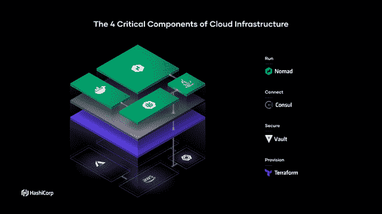

# 哈希公司首席执行官戴夫·麦克詹尼特:在云的世界里，服务名就是新的 IP 号码

> 原文：<https://thenewstack.io/hashicorp-ceo-dave-mcjannet-in-a-cloud-native-world-service-names-are-the-new-ip-numbers/>

[HashiCorp](https://www.hashicorp.com/?TheNewStack) 赞助本帖。

自从[戴夫·麦克詹尼特](https://twitter.com/davidmcj?lang=en)在 2016 年担任当时新兴的基础设施软件提供商[哈希公司](https://thenewstack.io/mitchell-hashimotos-move-from-cto-garners-r-e-s-p-e-c-t/)的角色以来，该公司及其服务的行业都发生了巨大的变化，因为越来越多的组织开始采用基于容器的云原生计算，并希望将新创建的基于微服务的工作负载分布在多个云上。

在执掌 HashiCorp 之前— [由](https://www.hashicorp.com/resources/what-is-the-hashicorp-origin-story) [Armon Dadgar](https://www.linkedin.com/in/armon-dadgar/) 和 [Mitchell Hashimoto](https://www.linkedin.com/in/mitchellh/) 于 2012 年创立——他从 2015 年开始担任 Greylock Partners 的常驻高管，为该公司提供建议。在此之前，他是 VMware 的高级营销总监，在创建和管理 Cloud Foundry 和 Spring Framework 方面发挥了重要作用。他的工作最终帮助 Pivotal 公司诞生。之后，他在 Hadoop 发行商 Hortonworks 担任营销副总裁。

我们在本月于西雅图举行的该公司 HashiConf 用户大会上采访了 McJannet，该公司在会上发布了其第一个托管服务[Consul Service mesh、](https://thenewstack.io/hashicorp-consul-service-on-azure-the-first-fully-managed-service-mesh/)[hashi corp Consul Service(HCS)on Azure](https://www.hashicorp.com/products/consul/service-on-azure/)，以及其托管基础设施供应工具 Terraform Cloud 的[附加协作层。](https://thenewstack.io/context-new-versions-of-hashicorps-terraform-cloud-for-teams-and-for-governance/)

当我想到 HashiCorp 时，我会想到一系列扎实的工程产品:Nomad、Consul、Vault、Terraform。但是它们是如何组合在一起的呢？公司的总体愿景是什么？

我们思考这个问题的方式是从市场转型的角度出发。基础设施市场正在经历某种程度上可预测的转变，从运行大量专用服务器的人转变为运行云基础设施的人。您必须分解这对参与者意味着什么的方式是通过他们在 IT 中的运营、安全、网络和开发人员。

在基础架构层，我们过去提供计算能力的方式是购买一台服务器，然后在其上运行 vSphere，并在其上调配虚拟机。在云世界，你不再拥有基础设施，你给亚马逊一套指令。运营挑战通过这种方式解决，而不是通过购买服务器。这就是为什么我们有了[地形](https://www.terraform.io/)。

在安全层，你从这个高度信任的网络到这个基于身份的安全模型，对吗？在网络层，您将从基于 IP 的网络世界转向基于服务名的网络。然后在运行时层，我认为 Kubernetes 有很多亮点，“哦，Kubernetes 是一个运行在基础设施安全网络之上的应用平台，用于提供新的应用。”

这些是基础设施的核心元素，我认为在云模式中基本上可以重做。基本上，它是基础设施、安全性、网络和开发人员的运行时平台，第五个实际上是 APM(应用程序性能监控)。我想你已经看到 Datadog 在这种新的[空间]中取得了巨大的成功，它可以监控高度分解的内置应用程序。

我认为这是基础设施的五个要素，我们的核心重点是前四个要素。其中包括用于基础设施供应的 Terraform、用于基于身份的安全性的 Vault、用于服务联网的 Consul 以及作为调度程序的 Nomad。但是我们认识到在运行时层存在异构性。这是我们对该公司的愿景，即成为基本上是云模型新堆栈的基础架构提供商。

**优秀，优秀。在你的主题演讲中，你提到 [Consul](https://www.consul.io/) 实际上是哈希公司应用最广泛的软件包，在昨天的主题演讲中，你说就这种新的基于云的模式而言，联网变得非常困难。你能谈谈这个吗？**

是的，所以领事的历史，领事实际上是艾蒙和米切尔建立的第一个主要产品，因为他们的观点是，在这个云模型中，你需要一个公共服务注册表，告诉你一切都在哪里。与自动化相关的一切都是了解一切在哪里及其状态的衍生物。Consul 最终被使用了——我的意思是，我们遇到的 90%的云原生公司使用开放服务 Consul 作为他们如何做到这一点的基础，你只是在某种程度上发现了它。由于它的部署方式，Consul 被用在每个计算节点上，所以基本上每个服务器上都有一个 Consul 客户机。这些数字是巨大的。想一想我们见过的人们拥有的舰队:单个集群中多达 35，000 个节点。这些是拥有庞大基础设施的 Alexa 前 50 大公司。他们的机群中可能有 100，000 个节点。它的规模是巨大的。

现在 Consul 的历史实际上是围绕服务发现和服务注册的。它允许您创建这个公共服务注册中心，告诉您一切都在哪里。当我将一个新工件放到环境中时，Consul 发现了它，它说，“哦，现在您有了应用服务器的两个实例。现在您有了三个应用服务器实例。”随着世界的发展，“现在你有了容器的三个实例。”

元素是什么并不重要，它是一个公共服务注册中心的概念。这就是为什么它是我们部署最广泛的产品:如果你看看 GitHub stars 的历史，你会发现，直到最近，[执政官](https://github.com/hashicorp/consul)是迄今为止最受欢迎的。 [Terraform](https://github.com/hashicorp/Terraform) 大概在六个月前通过，但它是最受欢迎的。

Consul 将为您解决的真正问题是所有东西都在哪里，以及您如何将流量路由到外面的东西。想象一下，当应用程序以 100 个容器的形式出现时，网络团队每次在该环境中部署应用程序时更新防火墙规则有多难？然后有人说，“哦，那个应用程序现在正在加载中，我还需要那个东西的 2000 个实例。去更新防火墙规则，让这种情况发生。”

人类几乎不可能做到这一点，因为这些东西一直在改变 IP 地址。这就是 Consul 的使用方式:它不是基于 IP 地址进行联网，而是基于服务名进行联网。“容器”可以与“数据库”对话，而不是 1.1.1.1 可以与 1.1.1.2 对话……你让一台机器维护那个东西在任何时间点的位置映射，所以它知道 IP 地址是什么……

围绕服务网格的构造有太多的炒作，它在我的容器世界中提供事物之间的直接加密连接的能力中被权衡。你忘了后退。你实际上试图解决的问题是事物是如何联系在一起的。你可能会说，在服务网的概念成为现实之前，领事就是一个服务网。

Consul 实际上最终有三个用例:第一个显然是一个公共服务注册中心。现在，让我对所有这些服务进行运行状况监控。像 [Datadog](https://www.datadoghq.com/) 和其他技术插入到 Consul 中来通知他们的应用程序的健康状况。

第二个用例是使用 Consul DNS 进行路由。只需更新 DNS 注册表，它会告诉我所有这些东西的位置，现在实际上，当一个新东西进入环境时，我可以真正实现路由过程的自动化。它立即被发现，领事知道它在那里，并路由流量给它。

那么，第三个用例实际上只是一个设置。"嘿，我想在每次这些东西相互对话时启用或强制加密."这就是服务网格用例。我们不是从那里开始的。我们从更广泛的问题开始。不仅仅是在容器之间路由流量和加密流量。它让我思考如何更广泛地建立关系网。服务网格用例是通过网络进行的，因此要加密两者之间的连接。

**很好，服务网格有点像是从 Kubernetes 诞生的，但看起来这是一系列无论如何都会产生的问题。**

实际上，我认为服务网格结构是从容器中诞生的。我曾经在本地主机中部署了一个整体应用程序，我在应用程序之间的所有调用都在一个地址库内。在这种情况下，网络实际上是很容易的。我可以更新我们的防火墙规则，让这个东西有流量。随着容器的出现，现在我的应用程序以一堆片段的形式出现。我不再在本地主机之间调用，这是一种更安全的方式。现在它实际上是在事物之间，而且，哦，顺便说一下，现在更糟了，因为当那个东西扩大时，你会给我更多的容器，你最终会有这种扩散。应用程序元素的分解需要不同的联网方式。

现在，谷歌，真正是 Istio 背后的唯一一家公司，提出了将这种能力嵌入[Kubernetes]的想法。这当然是一个有效的用例，但是当容器想要连接到一个不在 Kubernetes 中运行的数据库时会发生什么呢？

该公司为 [Terraform Cloud](https://www.hashicorp.com/resources/what-is-terraform-cloud) 引入了一些新的定价等级，介于“企业”和免费之间。 **中小型市场企业(SMB)是否正在向基于云的可编程基础设施应用这一理念转变，而不仅仅是网络和移动巨头？**

实际上，我觉得历史有点奇怪。Terraform 只是一个类似 Git 的命令行工具。Git 面向开发者，Terraform 面向运营。人们将它作为桌面客户端在他们的台式机或笔记本电脑上运行。然后他们(在更大的团队中)与 Amazon 或 Azure direct 接口。我们创建了这个名为 Terraform Enterprise 的成熟平台，它提供了一个围绕团队的协作工作流，并为使用开放服务的人们提供了治理和政策。

几年前，我们的商业客户找到我们，说你知道吗，我们真正的问题是围绕使用命令行工具的团队的协作。有点像从 Git 到 GitHub。我们了解到，实际上协作工作流需要成为 Terraform 核心的一部分。因为人们天生就在围绕基础设施协作，就像他们围绕 Git 协作一样。很少有人孤立地使用 Git。是的，你可以，真正的价值来自于在 it 方面的合作。我认为对我们来说，我们为企业市场开发的东西实际上非常适用于 Terraform 本身的一般工作流程要求。潜在的用户群可能包括构建基础设施的团队，但可能没有财富 500 强的规模？现在，我认为我们将会看到更多的小公司使用我们的付费版本。

所以很多小公司也在研究云计算？

是的，实际上我认为这非常有趣。许多小公司已经比大公司更多地使用云。他们只是在客户端使用 Terraform，除了自己动手之外，他们别无选择。我认为，在一些后来的发展中市场——我想到的一些亚洲地区——实际上正在完全跳过旧的本地世界，直接转向云。

【HashiCorp 如何确定哪些特性将会开源，哪些将会成为商业产品？

我们坚定地致力于开源模式，因为它为我们提供了一个工具，让我们召集一大群人与我们合作，解决如何提供基础设施、如何实现数据库安全等核心技术问题。这方面的集成要求非常高，而且您知道，您想要供应多少东西？我们会准备好的。开源对于解决个人问题非常有效。我们的标准非常简单，我们认为组织的复杂性是我们商业产品适合的客户需求。它们解决不同的问题，类似于从 Git 到 GitHub。如果你从一个人到一个团队再到一个组织，想想这个连续体。

当你从一个人到一个团队，那么，引入的问题是一个合作的问题。“当你供应东西而你不踩我时，我怎么不踩你？”当你去一个组织时，除了协作问题，还有治理和政策的问题。例如，任何人都不能在星期五下午 5:00 之后进行调配，此 ACL 组之外的任何人都不能更改网络规则，然后治理基本上是自动跟踪，搜索谁做了什么。你以这种方式展开，你开始认识到实际上那些是完全不同的问题，而不是正在解决的技术问题。这是 Git 对 GitHub。这就是我们对商业界限的看法。

今年早些时候，很多人对亚马逊网络服务的开源包商业化表示担忧。但是我对基于 Azure 的咨询服务[的推出感到惊讶，微软实际上帮了 T4 多少忙。与微软的合作如何？](/hashicorp-consul-service-on-azure-the-first-fully-managed-service-mesh/)

咨询服务作为一种第一层的体验非常深入地集成到 Azure 中。我认为这反映了我们与微软的密切关系，也反映了微软对此的看法。我觉得微软一直把自己看做一个平台。我认为，让关键合作伙伴在这个平台上建立业务是经过深思熟虑的。从这个意义上来说，正如你所看到的，[咨询服务]账单来自你的 Azure 账户。

这对微软、对我们、对客户都有好处。我认为这是随着市场的成熟而出现的，云提供商提供核心服务的想法。我认为微软非常清楚地认识到，它希望成为一个平台，而不是服务的聚合者。

<svg xmlns:xlink="http://www.w3.org/1999/xlink" viewBox="0 0 68 31" version="1.1"><title>Group</title> <desc>Created with Sketch.</desc></svg>