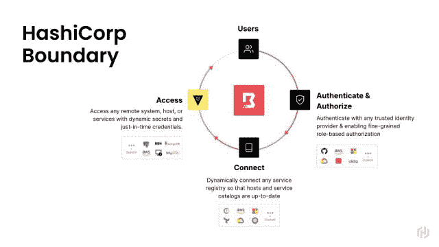
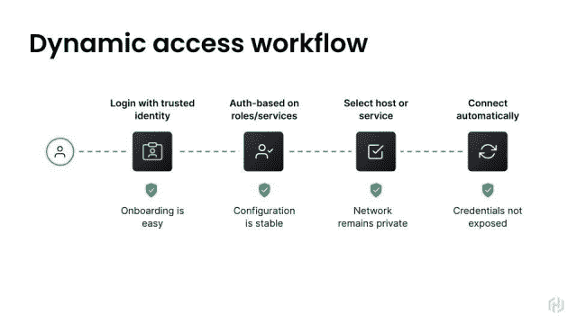

# 哈希公司的云现在可以建立一个单点登录的零信任网络

> 原文：<https://thenewstack.io/hashicorp-cloud-can-now-spin-up-a-single-sign-on-zero-trust-network/>

HashiCorp 云平台现在提供了单点登录的能力，减少了登录多个应用程序和服务的麻烦。也更安全，可以说。

这种方法可以“真正标准化开发人员对多云环境的访问，并自动化工作流，以便更容易地接纳用户和目标资源，更好地符合云运营模式，”产品营销总监[梅根·拉弗雷姆](https://www.linkedin.com/in/megan-laflamme-b6362315/)、[哈希公司](https://www.hashicorp.com/?utm_content=inline-mention)在接受新堆栈采访时解释道。

随着这一版本的发布，HashiCorp 正在[为一波企业浪潮](https://www.hashicorp.com/state-of-the-cloud)做准备，这些企业将使用多种云，并且必须开始思考如何跨云进行组织和标准化。

HashiCorp 云平台 (HCP)是一个完全托管的平台，提供 HashiCorp 软件，包括 Consul、Vault 和其他服务，所有这些都通过 HashiCorp 虚拟网络(HVN)连接。通过门户网站或平台，HCP 可以管理多个云资产的登录、访问控制和计费。

Boundary 是实现这种“安全远程访问”的客户端，现在平台用户一般都可以使用它。它是一个远程访问客户端，通过可信身份管理细粒度授权，[于 2020 年作为开源首次发布](https://thenewstack.io/primer-how-hashicorp-boundary-brings-cloud-native-computing-to-the-developer-desktop/)。它提供会话连接、建立以及凭证的颁发和撤销。

[HCP 边界](https://cloud.hashicorp.com/products/boundary)是运行在哈希公司云上的[哈希公司边界](https://www.boundaryproject.io/)的完全管理版本。

HashiCorp 在本周于洛杉矶举行的年度 HashiConf 全球会议上公布了这一产品。

## 零信任安全

使用[零信任安全](https://thenewstack.io/beyondcorp-google-ditched-virtual-private-networking-internal-applications/)，用户在服务级别进行认证，而不是通过集中式防火墙，这在多云设计中越来越不可行。

在行业中，有一种转变，“从更静态的数据中心和基础设施中基于 IP 的高信任授权，到云，再到低信任模型，在这种模型中，一切都基于[身份](https://thenewstack.io/what-do-authentication-and-authorization-mean-in-zero-trust/)，”Laflamme 解释道。

这种方法确实需要用户以某种形式登录每个单独的服务，这对于那些在日常工作中登录许多应用程序的人(即开发人员和系统工程师)来说是一个头疼的问题。

有了 Boundary，用户[只需登录一次](https://www.hashicorp.com/solutions/zero-trust-security)，可以说其他的一切都在地板下处理。应用程序、网络和人员的身份通过 HashiCorp Vault 和 HashiCorp Consul 处理。每项行动都经过授权并记录在案。

Boundary 通过利用 Okta、Azure Active Directory 和 GitHub 等现有的身份提供者(IDP)来认证和授权用户。Consul 认证和授权应用程序和服务之间的访问。这样，网络就不会暴露，也不需要颁发和分发凭证。[用户会话的动态凭据注入](https://developer.hashicorp.com/boundary/tutorials/hcp-administration/hcp-ssh-cred-injection?in=boundary%2Fhcp-administration)通过 HashiCorp Vault 完成，它将一次性凭据注入远程主机进行无密码身份验证。

在周三的 HashiConf 主题演讲中，HashiCorp 首席技术官 [Armon Dadgar](https://www.linkedin.com/in/armon-dadgar/) 解释了零信任安全的所有要素是如何结合在一起的。

在零信任网络中，网络上的用户本身并不表示他们应该对该网络上的任何应用程序拥有任何特权(这可能是当今遗留网络上的假设)。相反，每个用户、应用程序和设备都必须获得授权。“对我们来说，认证和授权的基础是身份，”他解释道。

哈希公司首席技术官艾蒙·达德加尔。

组织应该创建一个基于逻辑用户身份的规则，而不是添加防火墙规则，该规则确定用户可以访问哪些资源。“你必须从根本上改变控制，考虑管理身份，”Dadgar 说。

这在实践中意味着什么？首先，单点登录建立了用户的实体，要么通过 LDAP 的 Active Directory 等经典认证工具，要么通过 Azure AD 或 Okta 等云身份提供商。边界是有用的，因为它统一了许多不同的身份来源。

还必须识别应用程序和服务，然后允许围绕它们建立策略，例如允许数据库与 Web 服务器通信的规则。Vault 管理认证应用程序的证书，并且 Consul 可以通过使用这些策略来设置这些不同应用程序之间的路径。

假设 web 开发人员需要 SSH 来进入生产环境，或者数据库管理员需要访问数据库？在这种情况下，Consul 知道数据库的位置和身份，Boundary 可以为数据库管理员提供凭证。通过这种方式，HashiCorp 的组合工具可以用来建立一个统一的零信任系统，甚至可以跨越多个云提供商。

HashiCorp 提供了一个[HCP 边界](https://learn.hashicorp.com/tutorials/boundary/hcp-manage-intro?in=boundary/hcp-administration)入门指南。

<svg xmlns:xlink="http://www.w3.org/1999/xlink" viewBox="0 0 68 31" version="1.1"><title>Group</title> <desc>Created with Sketch.</desc></svg>