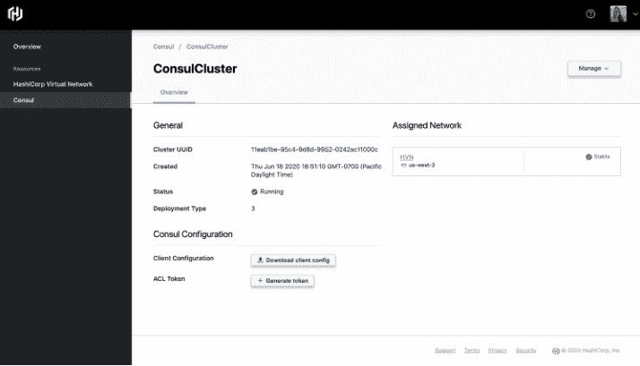

# HashiCorp 云平台统一了公司的产品组合以供多云使用

> 原文：<https://thenewstack.io/hashicorp-cloud-platform-unifies-the-hashicorp-portfolio-for-seamless-multicloud-use/>

随着周一在线会议的开始， [HashiCorp](https://www.hashicorp.com/) 推出了 HashiCorp 云平台(HCP)，该公司表示，可以说该平台可以自动从传统环境转移到多云环境。

通过将所有 API 组合在一个保护伞下，HCP 旨在通过自动将应用程序从内部环境移植到云，并在多云环境中进行后续管理，来减轻运营负担。访问控制策略集中用于管理不同的开发和运营团队。

该公司表示，最终，用户应该也能够依靠哈希公司的 [Terraform](https://www.terraform.io/) 、 [Vault](https://www.vaultproject.io/) 、[consult](https://www.consul.io/)和 [Nomad](https://www.nomadproject.io/) 跨越 HCP 的多个云。

HCP 领事将是亚马逊网络服务(AWS)新平台上的第一项服务，提供[私人测试访问](http://hashicorp.com/cloud-platform)。Vault 将是 HCP 支持的下一个服务，也是在 AWS 上。最终，HCP 将会出现在《蔚蓝》[、《GCP》](https://azure.microsoft.com/en-us/)、[、以及 AWS(确切的时间表没有透露)中。](https://cloud.google.com/)

作为一个“强大的服务网格平台”， [James Governor](https://redmonk.com/team/james-governor/) ，Redmonk 的分析师，告诉新的堆栈:“这个版本中我喜欢的一件事是 hosted Consul，”允许开发者“跨 AWS 服务和数据中心”使用单一平面 API 进行服务联网。

然而，“HashiCorp 仍有工作要做，在 HCP 上启用所有 HashiCorp 工具，提供单一一致的开发者体验，”Governor 说。“但这是实现这一目标的坚实开端，”他说。

该版本的一个关键部分是它如何解决依赖托管服务来自动迁移到云原生环境和管理多云环境的需求。“通过将一切整合到 HashiCorp 管理的云平台中，该公司应该能够大幅增加其潜在市场，”Governor 说，“仅出于这一原因，这些声明确实非常重要。”

## 哈希 Conf 2020 飞溅

在今天的会议主题演讲中，HashiCorp 的联合创始人兼联合首席技术官 Mitchell Hashimoto 表示，在创建虚拟网络后，HCP 提供了跨不同云提供商的“对等”服务，以及安全性和“通用连接”

“因此，如果你在一家云提供商推出一个集群，然后在另一家推出另一个集群，我们将能够将这些连接起来，为你提供全球基础设施，”Hashimoto 说。

桥本说，这也反映了他所说的“公司的愿景”，HCP 将“桥接多云基础设施，并使其无缝协作”。为了与 HCP 实现这一目标，我们在完全受管的硬件和完全受管的基础设施上提供了一键式体验，并有一个工作流来管理多个云提供商，”Hashimoto 说。

## 遗产股份

该版本的一个关键部分是满足许多(如果不是大多数)公司的需求，这些公司正处于开始或计划向云环境过渡的阶段。当然，一个关键的挑战是如何移植遗留的应用程序和基础设施。

哈希公司产品营销副总裁 [Amith Nair](https://www.linkedin.com/in/amith-nair-11b793) 说，在许多情况下，组织可能已经拥有分布在内部和不同公共云中的微服务，同时也在考虑将他们的遗留应用程序迁移到云原生环境。Nair 告诉 The New Stack，“他们意识到有基础设施可以从单片服务器转移到私有云与公共云，这种转变将在一夜之间发生的想法在过去并不存在。”

“HCP 向云的过渡速度要快得多，因为现在你可以花更少的时间去理解底层核心技术的可操作性，相反，你可以专注于解决方案的核心优势，”奈尔说。

“Hashicorp 几乎是唯一一个支持传统环境的本地云播放器，”Governor 说。“它看起来和感觉完全现代，但支持传统平台和端点，”总督说。“对于首席技术官和首席信息官来说，哈希公司是数字化转型的天然合作伙伴。”

亚马逊网络服务和 HashiCorp 是新堆栈的赞助商。

通过 Pixabay 的特征图像。

目前，新堆栈不允许直接在该网站上发表评论。我们邀请所有希望讨论一个故事的读者通过[推特](https://twitter.com/thenewstack)或[脸书](https://www.facebook.com/thenewstack/)访问我们。我们也欢迎您通过电子邮件发送新闻提示和反馈: [feedback@thenewstack.io](mailto:feedback@thenewstack.io) 。

<svg xmlns:xlink="http://www.w3.org/1999/xlink" viewBox="0 0 68 31" version="1.1"><title>Group</title> <desc>Created with Sketch.</desc></svg>