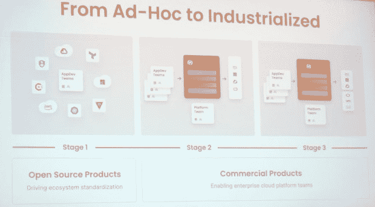
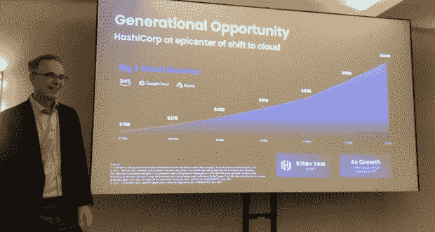

# 哈希公司正在实现云的标准化和产业化

> 原文：<https://thenewstack.io/hashicorp-is-standardizing-and-industrializing-the-cloud/>

2016 年，当首席执行官大卫·麦克詹尼特加入公司时，哈希公司有 20 名员工。如今，该公司拥有 2000 多名员工。这种增长有一些很好的原因。 [HashiCorp](https://www.hashicorp.com/?utm_content=inline-mention) 专注于基础设施即代码、身份和服务。

麦克詹尼特在 2015 年遇到了联合创始人[艾蒙·达德加尔](https://www.linkedin.com/in/armon-dadgar/)和[米切尔·桥本](https://www.linkedin.com/in/mitchellh/)。正如一位同事所说，现在上市的 HashiCorp 是“一个软件工厂”

哈希公司正在将云产业化。该公司专注于这一概念，因为在 2015 年左右，基础设施转型开始变得明显。与之前的基础设施转型非常相似——想想数据库、基础设施或应用程序层——出现了支出缺口。它导致了架构的变化，比如从物理机到虚拟机的转变。

McJannet 以数据库市场为例，展示了新的数据源如何扰乱市场。新技术的出现，重塑了人们对数据库和整个空间的看法。

对于 HashiCorp 来说，转型的核心是从虚拟化向云基础架构的转变。事实证明，云计算的计算基础设施和伸缩能力导致了一代人的变化，这导致了亚马逊网络服务的明显优势。

2016 年，三大云市场(AWS、Azure 和谷歌云平台)代表了 160 亿美元的收入；今天，这是一个 1600 亿美元的市场。这还不包括阿里巴巴，麦克詹尼特说，阿里巴巴可能会比谷歌云更大。市场现在正以 35%到 40%的速度增长。在麦克詹尼特看来，我们才刚刚开始。

## 震中

McJannet 说，处于转变中心的 HashiCorp 使向云的转变成为可能。与私有数据中心、物理机和企业软件平台相关联的传统类别将继续在云环境中被重新划分。

每个公司都面临着基本相同的挑战。他们都与多家云服务提供商合作。所有云服务提供商都建立在相同的前提上:基础设施即代码(IaC)、身份和服务。

每个云服务提供商都有自己的 IaC、身份和服务基础设施。对于一个企业来说，依赖每个服务提供商及其独特的环境来供应云、管理身份和运行服务是没有意义的。

使用多种云服务为客户提供服务。HashiCorp 建立在标准化的概念之上，类似于 HTML 的标准化。

> HashiCorp 首席执行官 David McJannet 表示，HashiCorp 应该成为云时代的 VMware。

"有人怀疑这是市场起飞的原因吗？"麦克詹尼特修辞性地谈到了 HTML。“我们对 Terraform 控制台做了同样的事情。我们在开源中设置它，使我们的项目开源。但要明确的是，他们 100%由哈希公司控制。因为我们认为好的软件设计是由一小群人完成的，但我们允许人们贡献插件，然后我们接受这些插件，让我们推动标准化。所以现在世界上有 2000 多个平台提供商，并且有数百个后端得到支持。”

2017 年，Azure 在 Terraform 上实现了标准化，其他主要的云服务提供商也紧随其后。标准化模式对他们有效。云服务提供商不想进入供应市场。他们想出售他们的核心服务。

“这些只是允许人们采用他们的技术的有利因素，所以市场上需要有人扮演这个角色，”麦克詹尼特说。“我们认为那就是我们。”

HashiCorp 的每个产品都使用相同的型号。Terraform、Vault、Boundary 和 Consul 都是开源的，但提交者都在 HashiCorp 内部工作。

“我们希望能够以一致的方式提供和保护互联基础设施，”McJannet 说。“我们知道你将会有不同种类的应用程序在上面运行。我们希望您考虑在哪里配置安全、连接—运行一切。”概括地说，你会看到我们围绕着实现云运营模式这一理念，这只是一个代码、安全身份以及零信任和网络服务的基础设施模式。"

McJannet 说，HashiCorp 的方法自 2015 年以来没有改变，在相当长的一段时间内也不会改变。

哈希公司控制着这种体验。它使用开源来标准化市场，采用三个主题:

*   推动用户激增。
*   支持生态系统使用其产品管理更多工作负载。
*   让客户能够在集中的平台团队下运行共享服务。

“这使得我们可以资助这个模型，让它变得越来越紧密，”麦克詹尼特说。“这一直是我们发展业务的核心策略。”

HashiCorp 对其开源项目保持着严格的控制。它的产品都不是基金会的一部分。

“我们雇佣所有的技术承诺者，”麦克詹尼特说。“这对生态系统非常非常重要。”

本质上，HashiCorp 控制了开发者的体验，他们可以自己赚钱。

## 将（行星）地球化（以适合人类居住）

Terraform core 建立在一个图形数据库上，解决了一个中间件问题。核心的 Terraform 平台与云服务、平台和软件供应商的 2000 多家提供商合作。

“例如，我想创建一个为亚马逊网络服务配置的模板，加上 Datadog 的配置，加上 Palo Alto Networks 的配置，再加上它上面的 Kubernetes 的配置，”McJannet 说。“现在我可以创建一个单独的 TerraForm 模板来支撑整个项目。所以它本质上是解决一个中间件问题。”'

HashiCorp 使用与安全平台 Vault 相同的方法。哈希公司的边界，执政官，游牧者，包裹和航路点也是如此。

旅程从地形开始。但这可能会很快失控。客户可能会与 AWS 签订企业协议，开发人员会很快采纳。六个月内，可能会有 400 个亚马逊账户投入使用，因为 Terraform 正在习惯于提供他们的服务。安全团队吓坏了，网络团队宣布，没有安全团队的批准，他们不会允许服务查看流量。

一个平台团队从所有要求开发人员使用预先批准的 Terraform 模板的最初体验中脱颖而出。这个平台团队看到了问题的出现，导致了对 Vault 的需求。Vault 的问题导致了对其基于身份的服务 Boundary 的需求。对于服务到服务网络，边界的使用会引发咨询，等等。

HashiCorp 云平台需要一段时间才能成长为该公司故事的重要组成部分。那是由于几个原因。基础设施软件工程师在很大程度上管理棕色地带环境。

“有些人喜欢相互比较市场，”麦克詹尼特说。“他们会说雪花在 100%增长，就像 MongoDB 在 100%增长一样。你肯定也能长得那么快吧？”

McJannet 说，基础设施市场的运行更像战舰。这些是人们正在做出的严肃决定。在某些情况下，采购需要 15 个月。

哈希公司是一家年轻的公司。在 2022 年第二季度，HashiCorp 的收入为 1.14 亿美元。但是他们的成功表明了一个标准化的开源模型是如何让它有能力说服全球 2000 强公司采用它的产品的。企业公司没有那么快完全采用云服务。他们仍然想控制他们的网络。公司会到达那里，当他们需要工业级工具的时候。

HashiCorp 的开源产品和企业软件级工具之间有一个重要的区别。客户从开源工具开始，但是随着规模的扩大，他们会购买 HashiCorp 堆栈。HashiCorp 的开源工具带来了标准化。HashiCorp 堆栈实现了规模化产业化。

HashiCorp 的方法以一种与云原生方式截然不同的方式展示了开源的可行性。云原生开源项目涉及多家公司通过一个基础结构来构建技术。可能会有一些赢家，但最终，往往是一个供应商成为主导。

HashiCorp 模式让公司完全掌控开发者体验，市场上没有分成。这是一个开源模型，更多的公司在对他们的云服务市场进行标准化和产业化时可能会考虑这个模型。

<svg xmlns:xlink="http://www.w3.org/1999/xlink" viewBox="0 0 68 31" version="1.1"><title>Group</title> <desc>Created with Sketch.</desc></svg>