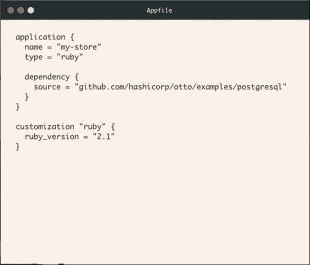

# 哈希公司为微服务改造了流浪者和装备

> 原文：<https://thenewstack.io/hashicorp-revamps-vagrant-and-retools-for-microservices/>

HashiCorp 首席执行官 Mitchell Hashimoto 周一在俄勒冈州波特兰市举行的他年轻公司的首次开发者大会上发表了坦率而富有启发性的主题演讲，他宣布他的公司赖以建立的基础产品已经过时，过时并且太难使用。承认他的 vagger 部署自动化工具在如何跨多个项目重复软件部署方面给用户带来了太多负担，并承认客户可能帮助他实现了这一启示，桥本大胆地宣布了 vagger 的替代品，[今天正式发布](https://ottoproject.io/)。

Otto 被称为“vagger 的继任者”，它将包含 vagger 的基本自动化引擎，但将在此基础上构建一个新的平台，根据每次部署的网络的状态、架构和容量，确定所需应用部署状态的最佳配置。这样，桥本告诉他的第一批与会者，配置文件不会很快成为在遥远的过去如何最好地部署应用程序的档案记录。

HashiCorp 首席执行官 Mitchell Hashimoto 在 2015 年 HashiConf 大会上致辞

“这就是奥托背后的美；这是一个关键的设计架构不同于流浪者，”首席执行官告诉他的观众。“这是编码和石化的概念。如果你有一个五年前写的文件，今天你运行`vagrant up`[它的关键部署命令]，它仍然可以工作，但是你要做的是调出五年前你是如何配置那个环境的…但是对于应用程序部署来说，它并不总是你想要的。

“奥托所做的是编纂，”他继续说道。“流浪者所做的被称为石化。这使它成为化石；它给它打上印记，拍下快照，它不会因为历史而改变。”

## 不像你死的时候想的那样

CircleCI 创始人保罗·比格(Paul Biggar)去年 6 月发表了一篇名为“[这是未来](http://blog.circleci.com/its-the-future/)”的博客文章，纪念开发技术如此古老，以至于以年而不是周来衡量其寿命的观点应该被宣布“死亡”在一个假设的对话中，作者向一位连续参加会议的专家咨询如何简单地部署一个应用程序。专家回答说，用 Docker，就像 LXC，除了 LXC 像 chroot，有点像 Docker。

“哦，太像流浪汉了，”作者说。“不，流浪者已经死了，”专家回答。“现在一切都将集装箱化，这是未来的趋势。”

如果游民的王位继承人已经被游民自己的创造者有效加冕，那么游民真的死了吗？“不尽然，”桥本在周一上台前给新书库的一份说明中说。

“流浪者是一项成熟的、久经沙场的技术，”桥本写道。“它已经被数百万用户使用了很多年。我们不想重新发明轮子，所以我们已经取得了最好的部分，并在 Otto 中使用它们来为用户自动管理开发环境。

“Otto 建立在 Vagrant 之上，使 SSH 等操作只需几毫秒，自动分配地址，等等，”这位首席执行官继续说道。“除了所有的开发环境特性之外，Otto 还做了很多工作来支持部署。这就是我们所说的 Otto 建立在流浪者之上的含义:它使用了工具的成熟和它在过去五年中获得的智慧。但是我们在它的基础上增加了很多。奥托的用户不需要知道如何使用流浪者，奥托为你做到了这一点。”

Otto 可以利用 appfile 来声明应用程序的期望配置状态，但这不是必须的。即使在没有 appfile 的情况下，Otto 也会根据当时运行应用程序的系统的约束条件，为正在部署的应用程序确定最佳配置。但是这种决心被有效地注入了继续在幕后工作的《流浪》。

桥本在他的就职演说中解释道:“编码是这样一种想法，即我们有足够高层次的知识集中在 Otto 中，而不是配置文件。我们把每个人和社区的知识集中起来。随着奥托的成长，奥托会学到更多。因此，如果你今天使用一个 appfile，五年后运行 Otto，它不会以同样的方式运行。它不会以同样的方式部署它。但从现在起的五年内，它将以正确的方式部署它。”

## 我是流浪者。我是完美的。

今天发布的 HashiCorp 产品线中的另一个新组件将增强 Otto 实时解释环境状态的能力，尽管这一次没有取得任何成功。Nomad 是该公司的新实时调度程序，其目标是找到支持任何给定工作负载的最佳基础架构。正如 HashiCorp 首席技术官兼联合创始人阿蒙·达德加尔(Armon Dadgar)周一早上告诉观众的那样，Nomad 将把来自数万台机器的多种资源汇集到一个更易于管理的虚拟集群中。(HashiCorp 当然不是在发明轮子，尽管有人可能会说 Nomad 的出现对 HashiCorp 保持竞争力至关重要。)

HashiCorp 首席技术官 Armon Dadgar 在 HashiConf 2015 大会上致辞

“随着我们的基础设施变得越来越大，随着我们的应用程序变得越来越多样化，在其上部署东西变得越来越具有挑战性，”Dadgar 解释道。“使用调度程序为我们提供了某种检查点，使我们能够说，‘有没有一种方法可以包装这种复杂性，包装这种多样性，并构建一个同质的层，以便我们可以继续构建更高级别的工具，并沿着抽象链向上移动？"

正如 Hashimoto 向新堆栈解释的那样，Nomad 对工作负载的理解是有意不可知的。“Nomad 有一个我们称之为任务驱动的独特功能，”他告诉我们。该领域中的其他调度器主要集中于调度码头集装箱。

“任务驱动给了 Nomad 一个支持其他执行类型的可插拔模型，”他继续说道。“这使得 Nomad 可以运行不在容器中或者不能从容器中获益的东西。例如，Nomad 可以直接调度静态二进制文件。静态二进制文件是完全自包含的应用程序，除了操作系统之外没有任何依赖关系。Nomad 运行这个程序，并自动将它放入一个容器中。Nomad 独有的另一个例子是它也可以调度虚拟机。对于具有高安全性要求的应用程序(如 Vault)，这允许 Nomad 在虚拟机中执行这些任务。这些虚拟机可以与 Docker 容器和其他执行类型并行运行。对于企业来说，这意味着如果他们有容器，我们可以部署它们。但如果他们不这样做，我们也有很多其他选择，让他们更容易接受。”

## 超越剪切和粘贴

在今年我们看到的最令人耳目一新的诚实的主题演讲中，桥本向他的观众展示了谷歌搜索“如何部署 Rails 应用程序”的结果。谷歌检索到的第二个结果是[一篇似乎符合要求的文章](https://www.digitalocean.com/community/tutorials/how-to-deploy-a-rails-app-with-passenger-and-apache-on-ubuntu-14-04)。digital ocean(hashi corp 的平台合作伙伴之一)发表的这篇文章指导读者如何将必要的指令一个接一个地剪切和粘贴到命令行中。

“这在十五年前可不是最佳做法！”首席执行官宣布。"那么，为什么它至今仍是热门歌曲呢？"

当然，剪切粘贴的过程很简单，因为它不需要大学学位或软件认证。这个简单的过程没有考虑开发人员如何首先实现他们自己的公共和私有子网。当然，Hashimoto 说，HashiCorp 已经生产了七种工具，帮助开发人员或 DevOps 专业人员应对这些特定需求。

但是他说，对这七个工具强加的学习曲线有多陡峭的认识，最终成为开发者首先诉诸使用谷歌搜索的原因，以及他们最终剪切和粘贴的原因。如果一个过程可以被剪切和粘贴，由于无数的原因，如果它是自动化的，那就更好了。

此外，桥本意识到，新的微服务架构在组件之间引入了巨大的依赖性，这很可能无法跟踪静态配置文件的使用。对于 Otto，一阶依赖关系可以在 appfile 中显式地声明，但是那些依赖关系本身所依赖的组件或者由那些二阶依赖关系的文件来声明，或者动态地确定。

桥本告诉我们，尽管 HashiCorp 的忠实贡献者是开源社区的成员，但 Otto 和 Nomad 都是内部开发的。他们的代码今天第一次向社区发布。

“我们喜欢发布完整的解决方案，以便我们的社区可以立即开始使用它，”这位首席执行官写道。“这对 HashiCorp 的‘粉丝’也有一个有趣的影响:他们知道我们正在研究一些东西，但在大揭露之前不会看到它。”

Docker 是新堆栈的赞助商。

专题图片:[侏罗纪蓝莓](https://www.flickr.com/photos/jurassicblueberries/)的《[热岩浆中的蓝宝石——2014](https://www.flickr.com/photos/jurassicblueberries/15600863879/in/photolist-pLAviH-3dtpqR-3dxRSL-eEnEVw-bvU75i-bvU2Jc-pRCCz2-uNAZwb-bvU4XB-pXdUD8-rywDFh-aiDCHb-aoBgrD-bxWdCn-sJeCev-btWmQz-bYwNHE-briV1M-brjUbD-bps7fj-bodSch-9jvcNG-9jrY1x-briVhv-bodUuW-9jv71G-brjUg2-brju4n-7MbXKY-bvsW8m-brjA5c-9jvaML-9js6Vi-x1Tu5F-9jv9j9-briVwK-brk89p-4kHHMY-ejhTvD-bqfias-4fxNdr-4kDGsD-pkhhYg-4kHJ9o-8qYBfQ-akaMzK-a6mSW5-6saBb9-akbryz-a6mT5m)》由[CC 2.0](https://creativecommons.org/licenses/by/2.0/)授权。

<svg xmlns:xlink="http://www.w3.org/1999/xlink" viewBox="0 0 68 31" version="1.1"><title>Group</title> <desc>Created with Sketch.</desc></svg>