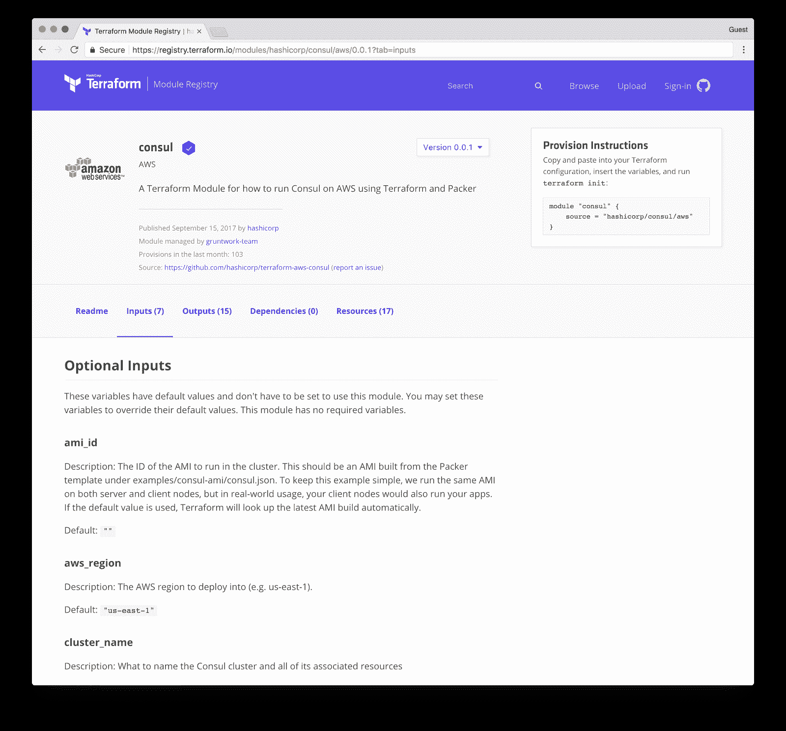

# HashiCorp 的 Terraform 模块注册中心在防火墙后提供自助服务模块

> 原文：<https://thenewstack.io/hashicorp-sends-terraform-registry-inside-firewall/>

去年，HashiCorp [发布了](https://registry.terraform.io/)它的 [Terraform 模块注册库](https://www.hashicorp.com/blog/hashicorp-terraform-module-registry)，这是一个公共可访问的存档，包含了对供应平台的有用的、现成的社区添加。现在，[公司推出了](https://www.hashicorp.com/blog/announcing-hashicorp-terraform-enterprise-module-registry)企业版的 Terraform 模块注册表，旨在防火墙内运行。这个内部可用的 Terraform 企业模块注册表将允许企业将 Terraform 的功能传播给可能没有接受过如何使用该平台的培训的员工。

[HashiCorp](https://www.hashicorp.com/) 的首席技术官 [Armon Dadgar](https://github.com/armon) 说:“通常有一小群 IT 运营者在运行【Terraform】，私有模块注册处缩小了公共模块注册处，将其引入内部，并将其包装在一个访问控制系统中。“你可以用它来提供一个 Java 应用程序、一个数据库，并将其连接到[亚马逊 SQS](https://aws.amazon.com/sqs/) ，你这样做的方式满足了企业所有的合规性法律和治理要求，”Dadgar 说。

使用 Terraform Enterprise Module Registry，少数内部发布者可以提供其他用户所需的工具，以供应他们所需的系统。这还包括一个向导，它将帮助用户找到他们需要的模块，并在一个易于使用的过程中启动和运行它们。Dadgar 称这是 HashiCorp 的第一款所见即所得的用户界面产品。

Dadgar 表示，企业版允许内部使用的模块，这意味着可以针对团队可用的模块实施治理和法规遵从性。“他们可以从公共模块注册表中导入所有内容，并使其可用。或者，他们可以白名单。很大程度上，我们发现公共模块不适用于企业。全球银行受到如此多的监管和控制，你不能只是启动一个虚拟机。该虚拟机只能是某个 AMI，拥有某些控制，属于某些组，而这些组中的大多数对每个资源拥有几十到几百个控制，”Dadgar 说。

这就允许那些开发团队脱离旧的模型，旧的模型要求他们向 IT 运营部门请求新的服务器。“相反，”Dadgar 说，“这里有一个 wiki 告诉你如何自己提供它。不要立案，不要等中央吧。这就是推动力:IT 部门想要的这种组织转变。”

terra form Enterprise Module Registry 的发布标志着 HashiCorp 去年对平台内部版本 2 进行大规模重写的第一个成果。Dadgar 表示，现在，内部重写已经完成，2018 年有望为 Terraform 提供许多新的更新。

“版本 2 是对版本 1 的彻底重写。我们很沮丧，因为从版本 1 开始，由于架构上的问题，我们不能发布新的特性。现在，今年，我们有了一个大而深的路线图。我们在架构上处于一个更好的位置，所以 Terraform Enterprise 有很多好东西要做，”Dadgar 说。

通过 Pixabay 的特征图像。

<svg xmlns:xlink="http://www.w3.org/1999/xlink" viewBox="0 0 68 31" version="1.1"><title>Group</title> <desc>Created with Sketch.</desc></svg>