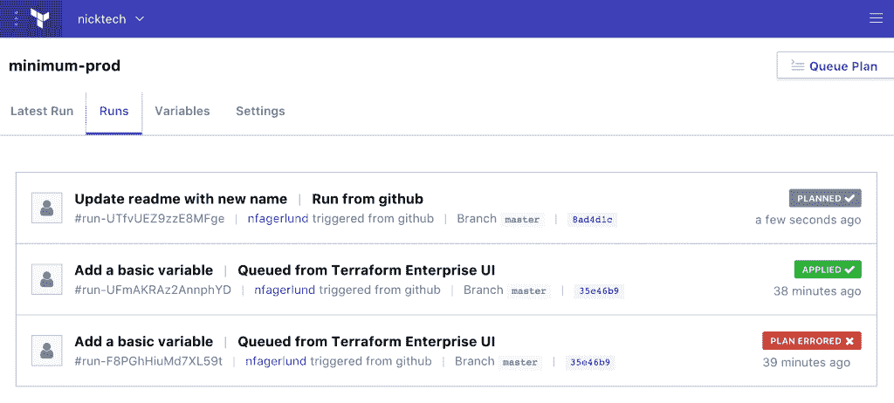
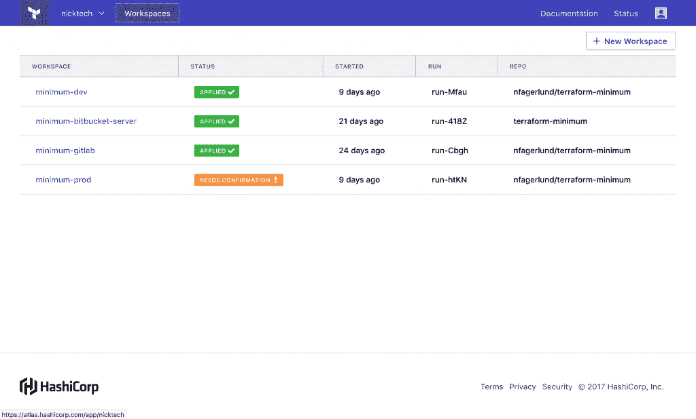
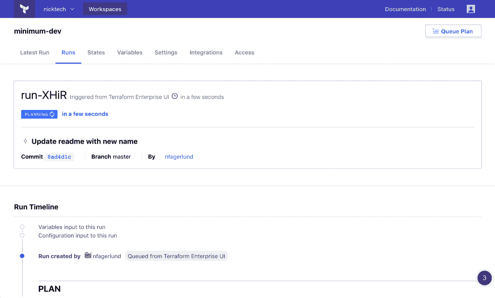

# HashiCorp 将 Terraform 基础设施供应引入企业

> 原文：<https://thenewstack.io/hashicorp-updates-terraform-enterprises/>

基础设施软件提供商 [HashiCorp](https://www.hashicorp.com/) 发布了一个供应包 [Terraform Enterprise](https://www.hashicorp.com/products/terraform/) ，该包承诺使用一致的工作流来简化跨不同云和内部环境的基础设施管理流程。

虽然 [Terraform](https://github.com/hashicorp/terraform) 作为一个独立的开源项目已经被广泛使用，但这个新版本专注于为商业生产用途打磨软件。它提供了一种自动化基础架构部署的方法，这种方法称为基础架构即服务，通过一组可编程的 API 来实现。

该软件于 9 月份首次发布测试版，既有云服务，也有可以在内部运行的软件。对于这一版本，该公司还集成了其 [Sentinel](https://www.hashicorp.com/sentinel) 可嵌入的策略即代码框架，该框架为允许多个管理员在其基础架构计划上进行协作奠定了基础。

“有了 Terraform，就有了这个缺口。我一个人工作很好，但是当你和一群人一起工作时，我如何解决协作的挑战呢？这个问题非常类似于使用 git，”HashiCorp 创始人兼联合首席技术官 Armon Dadgar 说。“当我们有两个或更多人的时候，我们如何拥有合作的中心点？”

虽然 [Terraform Enterprise](https://www.hashicorp.com/products/terraform) 提供了控制和策略描述来解决这个问题，但是哨兵个体代理在整个 HashiCorp 企业堆栈中执行策略。哨兵政策可以应用于每个平台计划，定义哪些行动是允许的和拒绝的。

Sentinel 还包含测试策略的功能，允许企业在部署到生产环境之前确保策略有效。

以前，HashiCorp 使用其 Atlas 应用交付工具来管理权限。Dadgar 说，Atlas 原来是一个太大的平台，企业无法一次全部采用，现在已经被放弃，取而代之的是更多的模块工具，这些工具可以有选择地集成在一起。

“Sentinel 集成到所有工具中。在 Terraform Enterprise 中，Sentinel 引擎无处不在，”Dadgar 说道，并指出该软件也已集成到[领事](https://www.hashicorp.com/products/consul)、[游牧者](https://www.hashicorp.com/products/nomad)和 [Vault Enterprise](https://www.hashicorp.com/products/vault) 中。

正式发布的其他功能包括:

*   **新的用户界面**:重新设计的 UX 集成了工作空间，这是一个可以匹配组织权限结构的开发环境。
*   **SAML 支持** : [安全声明标记语言](https://www.oasis-open.org/standards#samlv2.0)现在可以与 Terraform Enterprise 一起使用，取代了对密码的需求，支持标准加密和数字签名。
*   **服务帐户**:服务帐户将允许组织访问 API 端点，而无需对个人用户进行身份验证。

由[凯·奥伯豪瑟](https://unsplash.com/photos/3AdmnyguPxs?utm_source=unsplash&utm_medium=referral&utm_content=creditCopyText)在 [Unsplash 上拍摄的特写图片。](https://unsplash.com/?utm_source=unsplash&utm_medium=referral&utm_content=creditCopyText)

<svg xmlns:xlink="http://www.w3.org/1999/xlink" viewBox="0 0 68 31" version="1.1"><title>Group</title> <desc>Created with Sketch.</desc></svg>