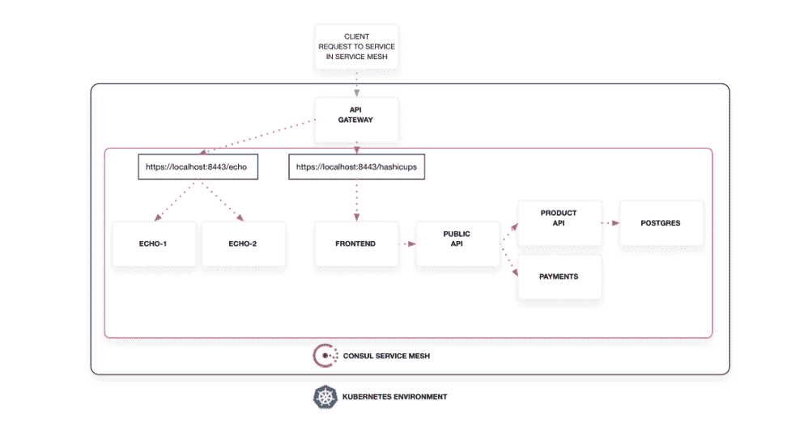
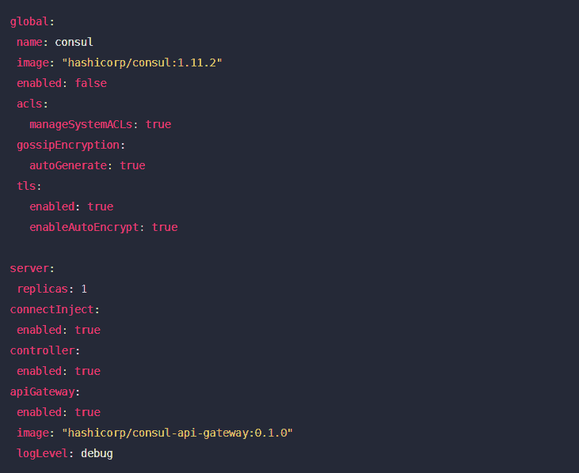

# HashiCorp 的 API 咨询网关有助于缓解南北交通问题

> 原文：<https://thenewstack.io/hashicorps-api-gateway-for-consul-helps-ease-north-south-traffic-pain/>

HashiCorp 的[consult API 网关](https://www.hashicorp.com/blog/announcing-hashicorp-consul-api-gateway)的正式发布旨在通过 HashiCorp Consul 服务网格简化和加强对流量和服务管理的控制。

DevOps 团队可能欢迎的主要特性有助于解决能够通过单一 API 管理南北和东西流量的问题。

事实上，以前，[hashi corp consult](https://www.consul.io/)服务网格在管理组织内部微服务连接和应用程序之间的通信方面非常有效。然而，必须有一个单独的控制平面来控制来自互联网的入口流量的外部请求的访问。

正如[Consul 的高级产品营销经理 Peter McCarron](https://www.linkedin.com/in/petercmccarron/) 告诉新堆栈的那样，ingress 网关更适合数据中心内部连接，而不是外部客户端流量。“问题是:我如何以一种比使用一些传统解决方案更可扩展、更动态的方式来控制接入点？”麦卡伦说。现在，您有了一个集中点，可以通过服务网格以更智能的方式控制流量

## 专用入口

IDC 的一位分析师告诉新堆栈，通过这种方式，Consul API 网关可以作为一个专用入口，智能地将流量路由到 HashiCorp Consul 服务网格上运行的应用程序。该网关旨在提供一种一致的方式来处理外部客户端对服务网格的入站请求，“从而消除了安装另一个专用 API 网关/入口的需要，”Casemore 说。Casemore 说，通过部署一体化解决方案和服务，DevOps 团队不会“被迫从服务网格中单独获取、部署和管理 API 网关/入口控制器。

Casemore 说，一般来说，服务网格在以东西方式自动化和保护服务之间的通信方面很棒，而 API 网关在保护和管理内部服务和外部客户端之间的南北流量方面更好。咨询 API 网关因此可以被认为是咨询服务网格扩展。“虽然两者是独立配置的，但它们使用相同的服务器来交流策略、验证和接收证书，以及检索服务目录数据，”Casemore 说。

Casemore 说，API Gateway for Consul 有助于“减轻潜在服务网格焦虑，即一些客户觉得服务基础设施过于复杂”。

运营团队尤其总是在寻找方法，通过单一控制台加强访问控制并简化管理应用程序和流量的复杂性，这实际上是服务网格的主要目的之一。McCarron 说:“组织正在投入大量精力来完善他们的服务网格功能，但在此过程中，他们希望以一致和智能的方式管理对服务网格的访问。“他们还不得不应对管理流量模式、控制入口点连接和识别外部客户端流量所增加的复杂性。”

## 附加功能

Consul API Gateway 提供的其他特性包括:

*   流量路由功能，使用户能够配置如何处理外部客户端的请求，检测客户端元数据并使用它来实施连接路径/路由。
*   如何将 Consul API gateway 部署到同一个环境中，并在 Consul 服务器中注册为服务。“配置是直接在网关上完成的，但 Consul 服务网格知道网关规定的策略和连接要求，”Casemore 说。

领事掌舵图也支持领事 API 网关的安装和配置。为了开始，用户需要将以下块添加到他们的舵值文件中以便开始:

“借助 Consul API Gateway，组织能够采用更加一致和可控的方法向外部客户公开基于服务网格的服务，从而降低潜在违规风险；通过创建一个单一的控制平面来管理所有流量，从而提高运营效率并降低复杂性。“它还通过确保在可用的服务实例之间平均分配请求，降低了计划外停机的风险。”

<svg xmlns:xlink="http://www.w3.org/1999/xlink" viewBox="0 0 68 31" version="1.1"><title>Group</title> <desc>Created with Sketch.</desc></svg>