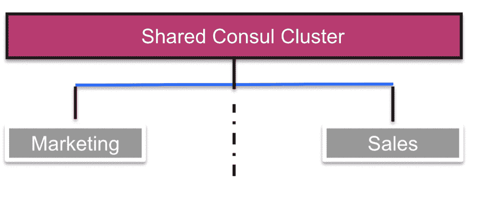
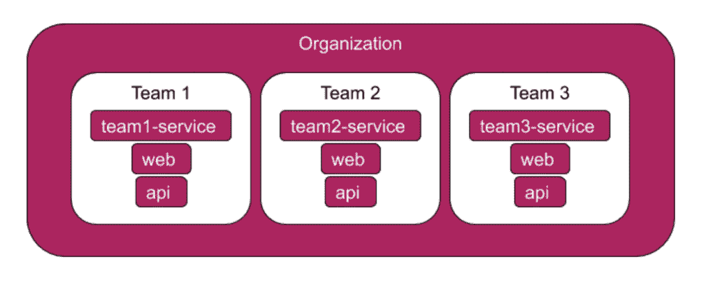

# HashiCorp 的 Consul 为服务网格带来了名称空间管理

> 原文：<https://thenewstack.io/hashicorps-consul-brings-namespace-management-to-the-service-mesh/>

[HashiCorp](https://www.hashicorp.com/) 更新了其[consult](https://www.hashicorp.com/products/consul/)服务网络平台，使其能够在组织范围内管理服务名称空间。

周二发布的 Consul 1.7 还附带了额外的插件，以支持许多应用程序监控和管理工具，包括 AppDynamics、Datadog 和 NGINX 代理。

HashiCorp 将 Consul 作为一种网络自动化工具，用于企业连接和保护跨多个云和本地环境的应用服务，将所有服务放在一个具有共享注册表的通信平面上。

Consul 产品营销副总裁 Amith Nair 指出，Consul 背后的[思想是“你需要一个新的动态环境的名称空间服务注册中心”。对于容器和微服务，单个服务可能会出现和消失，或者只是在不同的节点之间移动太快而无法分配永久的 IP 号码。相反，服务名可以充当唯一标识符。](/hashicorp-ceo-dave-mcjannet-in-a-cloud-native-world-service-names-are-the-new-ip-numbers/)

新版本包括更高级的名称空间管理工具，为服务名称和名称空间的自助服务、治理和操作控制做好了准备。

## 名称蔓延

HashiCorp 的企业核心客户群一直采用名称空间模型，在该模型中，每个服务在全局名称空间下被分配一个唯一的标识符或名称。到目前为止，在 Consul 中注册的每个资源都共享一个统一的作用域。

随着 Consul 在组织中的使用越来越多，不同的开发团队必须进行协调，以防止多个服务使用相同的名称。Nair 说，Consul 可以通过列出所有重复的名称来处理重复的名称，但它“产生了名称冲突的问题，这使得很难连接网格并确保正确的服务相互交谈”。它还限制了命名空间模型如何用于可编程计算，可编程计算要求每个资源具有唯一的标识符。或者，中央安全团队可以管理名称空间，并在需要时分发官方服务名称，但这将减慢开发速度，并且与良好的 DevOps 实践相反，devo PS 实践规定小团队应该管理他们自己的资源。

据该公司称，新技术“允许全球运营商在共享集群中创建隔离环境，并为认证用户应用任何所需的服务访问限制”。这样就不需要多个团队来协调资源名称，也不需要一个中央机构来逐个管理名称空间。它还提供了一种为单个团队委派子委派管理权限的方法，确保了基于访问的安全性的更细粒度的控制。

 在监控支持方面，Consul 拥有一组丰富的遥测数据，用于指示服务的健康状况。虽然普通 Consul 用户可以很容易地提取 Consul 数据，但插件使得第三方 APM 工具更容易开始消化这些信息。Nair 说，预计 HashiCorp 将来会与更多的 APM 和监测提供商建立更多的合作伙伴关系。

在 HashiCorp 博客上阅读更多[。](https://www.hashicorp.com/blog/simplifying-self-service-governance-and-operations-with-consul-namespaces/)

哈希公司是新堆栈的赞助商。

通过去毛刺的特征图像[。](https://unsplash.com/photos/566CgCRSNCk)

<svg xmlns:xlink="http://www.w3.org/1999/xlink" viewBox="0 0 68 31" version="1.1"><title>Group</title> <desc>Created with Sketch.</desc></svg>