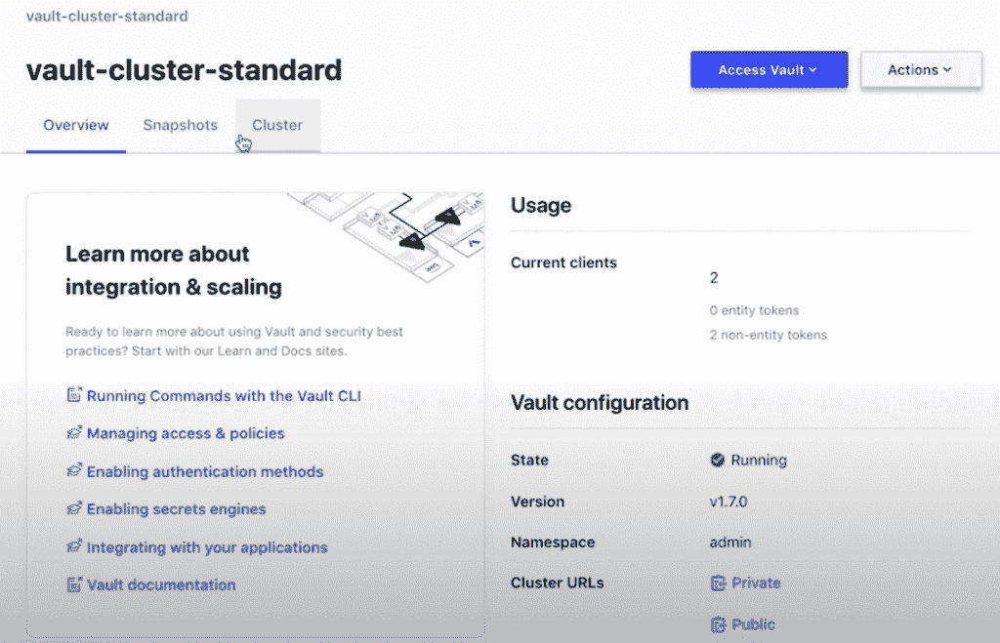

# HashiCorp 发布 HCP 金库以对抗“秘密管理”疲劳

> 原文：<https://thenewstack.io/hashicorps-releases-hcp-vault-to-combat-secrets-management-fatigue/>

Hashicorp 云平台(HCP) Vault 的发布代表了该公司通过单一平台满足云原生部署和管理要求的雄心的一部分，该工具是 HashiCorp 作为云服务的流行机密安全管理工具。为此，[哈希公司](https://www.hashicorp.com/?utm_content=inline-mention)的 [HCP 平台](https://www.hashicorp.com/cloud-platform)现在包括其领事服务网[地形](https://www.terraform.io/)，以及金库。

Vault 1.7 GA 版本充当“所有集群的基础”，产品营销总监 Chris Kent 告诉新堆栈。

HCP 保险库设计用于基于云的秘密管理，即访问系统和应用程序所需的数字认证凭证(密码、密钥、令牌等)。对于组织而言，管理谁有权访问什么以及何时访问一直是一项挑战。自疫情开始以来，为适应远程工作人员对网络访问的需求激增，这使得机密管理更加耗费资源。

“零信任”安全无疑是许多(如果不是大多数)组织的目标，但实现这一目标所涉及的机密管理可能会导致所谓的“机密疲劳”依靠手动流程维护机密访问显然会影响开发运维团队成员的工作效率，他们必须将时间用于机密管理，而不是开发或管理应用。

根据 HashiCorp 的说法，作为一种解决方案，HCP 保险库应该有助于减少为亚马逊网络服务部署分配机密访问权限的时间和复杂性(当被问及 HCP 保险库何时可以在 Azure 和谷歌云上使用时，Kent 说“敬请关注”)。因此，HCP 金库允许用户在一个基于云的平台内保护、存储和控制对令牌、密码、证书和加密密钥的访问，“从而减少可能存在于各种应用程序中的任何秘密蔓延，”肯特说。

“在 HCP 上运行的 Vault 完全由 HashiCorp 管理，并通过一个单一的界面来控制对所有敏感数据和系统的访问，从而保护您的基础设施，”肯特说。“通过提供按钮式部署、全面管理的升级、备份和监控，组织和开发人员可以专注于采用和集成，而不是运营开销。HCP Vault 集群可适应任何工作负载，并可随着集群自动扩展，只需几分钟即可完成部署。”

除了宣传 HCP 保险库的设置简单——包括创建哈希公司的虚拟网络(HVN)和保险库集群，然后将这些连接到该组织现有的 AWS 部署，HCP 保险库还提供了一种灵活的定价模式，该公司坚持认为。HashiCorp 表示，HCP 版本的 Vault 将允许组织采用更灵活的定价模式，而不是直接下载、安装和管理 Vault 的传统方式，同时支付固定的费用。

对于定价，哈希公司向 HCP 保险库传达了以下选项:

*   **开发集群**:在 AWS 环境中开始测试 HCP 保险库的“最佳方式”，这个选项是按小时计费的保险库的非生产、单节点部署，”[哈希公司营销经理贾斯汀·维斯格](https://twitter.com/jweissig_?lang=fr)在[博客文章](https://www.hashicorp.com/blog/vault-on-the-hashicorp-cloud-platform-ga)中写道。
*   **标准集群**:对于生产工作流，建议配置多节点高可用性集群。“这将启动一个三节点存储部署，准备好处理生产级工作负载，”Weissig 写道。
*   **标准集群**:面向计划在 HCP Vault 上运行大型生产部署的组织的年度定价计划。

HCP 领事和 HCP 金库现在都可以在 AWS 上使用，之前承诺让 HCP 可以在 Azure 和 GCP 上使用(没有透露确切的时间表)。HashiCorp 还计划最终在 HCP 上提供其所有 HashiCorp 产品，包括其最近宣布的 [Boundary](http://boundaryproject.io) ，这是一个基于身份的访问管理的开源项目。

<svg xmlns:xlink="http://www.w3.org/1999/xlink" viewBox="0 0 68 31" version="1.1"><title>Group</title> <desc>Created with Sketch.</desc></svg>