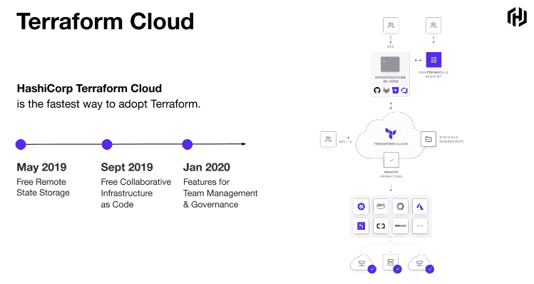
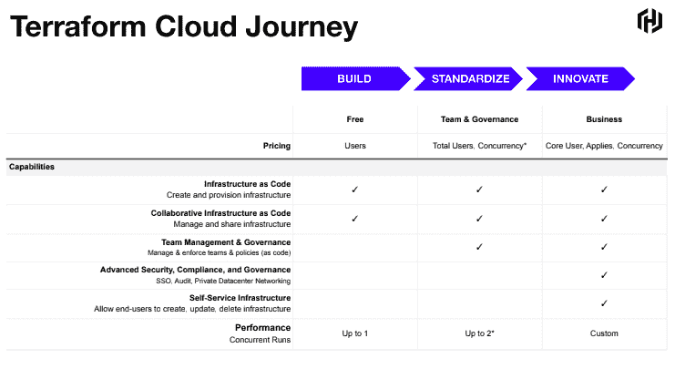

# HashiCorp 的 Terraform Cloud 现在提供作业并发、审计和现收现付定价

> 原文：<https://thenewstack.io/hashicorps-terraform-cloud-now-offers-job-concurrency-auditing-and-pay-as-you-go-pricing/>

Terraform [基础设施管理服务](https://www.terraform.io/docs/cloud/index.html)已经成为许多组织的云原生故事中的关键组件之一。然而，利用 HashiCorp Terraform Enterprise 的功能通常需要大量投资，因为采用意味着必须在本地安装和自托管平台，通常是在数据中心环境中。

监管 Terraform 的公司 [HashiCorp](https://www.hashicorp.com/) ，现在正通过一个新的业务层为 [HashiCorp](https://thenewstack.io/mitchell-hashimotos-move-from-cto-garners-r-e-s-p-e-c-t/) Terraform Cloud 提供企业功能，基本上允许组织放弃在服务器基础设施上的大量投资，以利用该平台。此外，HashiCorp 的新 Terraform 云业务层增加了新的共享、升级和治理选项。

以前，对于许多寻求将更多运营转移到云的大型企业来说，现状并不理想。与此同时，许多只进行云操作的中小型企业没有办法运行其内部数据中心，HashiCorp Terraform Enterprise 不是一个选项，因为它在云上不可用。小型组织可以运行和使用提供许多商业级功能的 [Terraform Cloud](https://www.terraform.io/docs/cloud/index.html) ，但同样，这些功能的范围远远达不到 Terraform Enterprise 可以提供的范围。例如，他们可能没有资金支持自己托管企业版的基础设施管理服务，但如果亚马逊网络服务(AWS)、Azure 或谷歌云上有这种服务，他们可能会这么做。

HashiCorp 的 Terraform 产品营销总监 Meghan Liese 说，在实践层面上，这个想法是为了帮助 [Terraform](https://www.terraform.io/) 用户从开源版本无缝地转移到企业版本，在企业版本中，他们大规模地创建、供应、共享和管理基础设施，他估计他们合作的组织中有多达 80%对使用 Terraform 云感兴趣。

Liese 解释说，许多可能一直在使用免费开源版本的 Terraform 的用户组织将能够注册访问 Terraform 云的业务层。

Liese 说:“有时，企业功能向托管版本的转移会减慢他们的速度，并在他们的过程中产生摩擦。“所以，我们的目标是‘嘿，我们不想成为他们的摩擦承担者，我们创造了更无缝的东西。"

Liese 说，例如，对于那些以前只运行 Terraform 的组织来说，他们通常会负责在我的本地机器上进行存储，或者在亚马逊 S3 建立一个[存储桶。“因此，第一步是我们将消除您在本地存储数据的需求。Terraform Cloud 将提供远程状态存储，并使团队成员能够就状态进行协作，执行远程运行，并将模块存储在私有模块注册表中，”Liese 说。“用户可以在 Terraform Cloud 上创建一个免费帐户，然后立即开始使用。”](https://aws.amazon.com/s3/)

## 功能

HashiCorp 正在向 Terraform Cloud 添加一系列新功能，作为业务层版本的一部分。在今天发布之前，一些客户已经对这些功能进行了采样和测试，该公司将这些功能描述为正式发布(GA)的一部分，并表示它们包括:

*   现收现付的定价模式。
*   改进的团队管理和治理选项。
*   作业并发性:在创建、更新和删除基础设施的同时，在 Terraform 上扩展并发作业的能力。
*   支持:根据不同组织的具体要求，提供服务级别协议和支持选项。
*   与 Okta 集成的单点登录(SSO)。
*   与 Splunk 集成的审计日志记录。
*   具有固定 IP 和自托管代理的专用网络，可跨不同环境和专用网络与其他管理平台进行交互。

使用上述新功能，组织可以决定，例如，在 Azure 上测试 Terraform 的开源版本后，将 Terraform 的使用扩展到 DevOps 团队的其他成员，同时选择在按需购买定价模式下使用云上的企业功能。例如，一个组织可能提供对五个 10 人团队的访问。Liese 说，该组织可以使用“超低摩擦升级到这个选项”。“他们已经构建了将继续存在的免费层。现在，他们有了额外的功能，如团队和策略管理功能。”

亚马逊网络服务公司(AWS)和 HashiCorp 是新堆栈的赞助商。

通过 Pixabay 的特征图像。

目前，新堆栈不允许直接在该网站上发表评论。我们邀请所有希望讨论某个故事的读者通过推特(Twitter)或脸书(T2)与我们联系。我们也欢迎您通过电子邮件发送新闻提示和反馈:[反馈@thenewstack.io](mailto:feedback@thenewstack.io) 。

<svg xmlns:xlink="http://www.w3.org/1999/xlink" viewBox="0 0 68 31" version="1.1"><title>Group</title> <desc>Created with Sketch.</desc></svg>