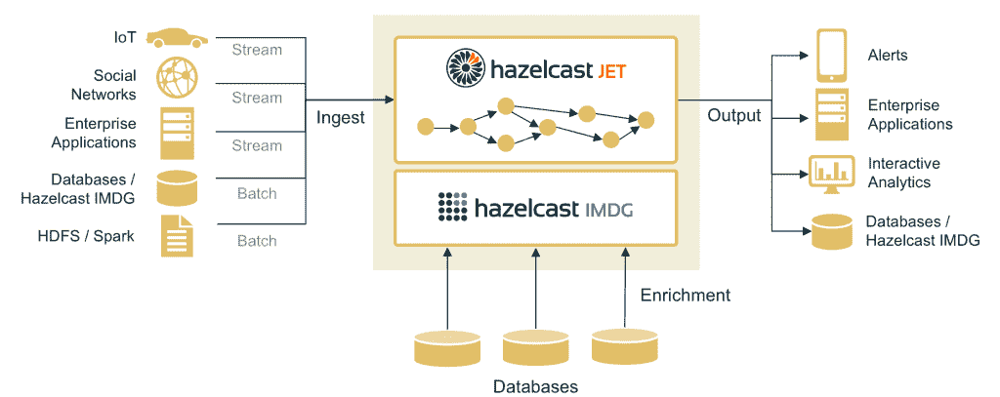

# Hazelcast 推出开源内存流处理引擎

> 原文：<https://thenewstack.io/hazelcast-addresses-need-speed-simplicity-data-processing-engine-jet/>

主要以其开源内存数据网格(IMDG)而闻名的 Hazelcast ，已经发布了一款开源轻量级分布式数据处理引擎，名为 [Hazelcast Jet](http://jet.hazelcast.org/) 。

这一新的 Apache 2 许可的开源项目旨在实现数据密集型应用的近实时处理，如智能家居传感器、店内电子商务系统、社交媒体平台、日志分析、监控和欺诈检测。

该公司还发布了 3.8 版本的 [Hazelcast IMDG](https://hazelcast.com/use-cases/imdg/) ，其中包括管理持久性和多数据中心部署的高级功能。据该公司称，Hazelcast IMDG 用于成千上万的已安装集群，每月超过 1700 万次服务器启动。

根据 Hazelcast 首席执行官 Greg Luck 的说法，使用 Hadoop 和 Spark 处理大数据已经变得非常复杂，这类似于过去的大型机时代，那时会有专门的人员在昂贵的专用技术上加载和运行您的作业，然后向您提供结果。

“我们认为我们是将大数据带回流处理问题的大转变的一部分，只是在您编写的应用程序中运行它——将它嵌入应用程序中，而不是需要在单独的基础架构上运行。我们认为这是一个深刻的转变，”他说。

“这使得选择大数据平台以及如何解决该问题成为开发人员和架构师控制范围内的应用问题。甚至连行动部都不需要参与到危险广播中来。只有当它是一个独立的集群时，才需要运营部门的参与。”

Jet 通过套接字、文件、HDFS 或 Kafka 接口高速接收数据，并处理业务逻辑或对传入数据的复杂计算。

“我们确实认为我们可以给这个领域带来新的东西。我们不想这样做，除非我们能比其他人更快。…在这个阶段，它给一个相对拥挤的市场带来了什么，Hazelcast 是出了名的简单和容易上手，”他说。

尽管 Hazelcast IMDG 公司支持六种语言，但 Jet 是针对使用 Java 8 的开发者推出的。它计划以后支持其他语言。

Hazelcast IMDG 使用 Java 5 中添加的一个名为[*Java . util . concurrent*](http://tutorials.jenkov.com/java-util-concurrent/index.html)的 Java 包。Jet 使用了一个类似的东西， [java.util.stream](http://www.ibm.com/developerworks/library/j-java-streams-1-brian-goetz/index.html) ，这是 Java 8 中添加的一个用于并行处理数据的 API。

不过，它是为在单个虚拟机中使用而设计的，而在 Jet 中，它是分布式的。

“你可以使用相同的 API 来表达你想做的事情，但它将在我们的 Jet 网格上执行。我们目前最大的计算网格是 600 台服务器，因此它可以扩展得非常非常高。但是，你仍然可以用这个非常简单的 API 来编程，如果你是一个 Java 开发人员，可能你已经知道了，”他说。

它是为速度和低延迟而构建的，使用一次一条记录的架构，因此它可以尽快处理传入的记录，而不是像 Spark 那样将记录累积到微批处理中。尽管这个过程听起来类似于 [Apache Flink](https://thenewstack.io/apache-flink-addresses-continuous-stream-processing/) ，但根据 Luck 的说法，它没有从 Flink、Spark 或 Hadoop 借鉴任何东西。

像其他大数据框架一样，Hazelcast Jet 使用[有向非循环图](http://ericsink.com/vcbe/html/directed_acyclic_graphs.html) (DAG)抽象来建模计算，但采用了一些新颖的方法来提高低延迟速度，包括数据局部性；分区映射关系；单生产者、单消费者(SP/SC)队列和绿色线程

他这样解释 Jet 的建筑方法:

*   它通过将 Hazelcast Jet 与相同服务器上的 Hazelcast 数据网格结合起来，将计算和数据存储在内存中。根据不同的用例，Jet 将处理的部分或全部数据将已经在与计算相同的机器上的 RAM 中。
*   Jet 允许您在每条边上定义任意的对象到分区的映射方案。这允许从每个分区和成员以及服务器并行读取许多线程。它可以利用这一点来协调和优化其他分布式数据系统的吞吐量，无论是 HDFS，火花或黑兹尔卡斯特。因此，当执行 DAG 处理时，可以在本地读取和写入本地边，而不会引起网络调用，也无需等待。
*   本地边缘是用最有效的并发队列实现的:SP/SC 有界队列。它在两端采用无等待算法，并通过使用 [lazySet](http://psy-lob-saw.blogspot.co.uk/2012/12/atomiclazyset-is-performance-win-for.html) 方法来避免易失性写入。
*   顶点由每个成员上的一个或多个“处理器”实例实现。每个顶点可以使用“localParallelism”属性指定每个集群成员将运行多少个处理器，这样即使在最大的机器上也可以使用所有的内核。由于有许多内核和执行线程，Hazelcast Jet 性能的关键是通过协作多线程来平稳地协调这些内核和执行线程，这大大降低了上下文切换成本，并精确了解了处理器的输入和输出缓冲区的状态，这决定了它取得进展的能力。
*   Hazelcast Jet 使用“[绿色线程](http://stackoverflow.com/questions/5713142/green-threads-vs-non-green-threads)”来允许非常高的吞吐量，其中协作处理器在由同一本地线程服务的循环中运行。

勒克说，在其内部字数基准中，从文件系统读取初始单词，Jet 比 Hadoop 快 20 倍，比 Spark 快 2 到 3 倍，比 Flink 快 50%。然而，应该指出的是，在 Jet 发布之前，Luck 去年与竞争对手 grid gain 在基准测试上发生了[纠纷。](http://www.networkworld.com/article/3035542/open-source-tools/in-memory-database-vendors-hazelcast-and-gridgain-trade-benchmarking-blows.html)

Hazelcast 成立于土耳其，现在总部设在加利福尼亚州的帕洛阿尔托，并在伊斯坦布尔和伦敦设有办事处。其数据网格客户包括美国运通、美国电话电报公司、通用动力、爱立信和达美乐比萨。

11 月，它宣布与提供实时数据集成和流分析平台的 Striim 合作，推出 Hazelcast Striim 热缓存，以确保缓存与其底层数据库之间的连续实时同步。

它在 1 月份宣布，网格现在可以作为 Pivotal Cloud Foundry network 上的[瓦片使用。](http://www.dbta.com/Editorial/News-Flashes/Hazelcast-Now-Live-Pivotal-Cloud-Foundry-115965.aspx)

特征图片: [pHotosHo0x](https://www.flickr.com/photos/cahayadalamkegelapan/) 的[街画](https://www.flickr.com/photos/cahayadalamkegelapan/5875471130/in/photolist-9XcjSo-nzb6KA-qpGDYP-8VABVJ-oZ1MQC-pBxLeb-ha1TW6-k3kFQ-h9YP4M-jwzhXx-pDyxuf-5Lzrnq-gSoSRb-5XRZao-nNHYmn-h9Zd8o-9eFcdp-h9YU2n-8oWrww-e49upX-h9Zx49-dvMPun-apsgcR-guc5Y2-gSpYEF-h9Zioc-jwzh4D-aDCM5h-p2Utiz-74wSW3-4TmddQ-7hC9DS-9xv5gJ-ood278-eZmYdw-6DJgj4-7orjv9-4nzUZf-6C9oXF-781e2F-eZmZ9d-hH97yK-8VFSBG-quA5Kk-eZmYs7-71aoRR-kgoYS5-5AnQcY-71emtq-apsghH)，授权于**下 [CC BY-SA 2.0](https://creativecommons.org/licenses/by/2.0/)** 。

<svg xmlns:xlink="http://www.w3.org/1999/xlink" viewBox="0 0 68 31" version="1.1"><title>Group</title> <desc>Created with Sketch.</desc></svg>