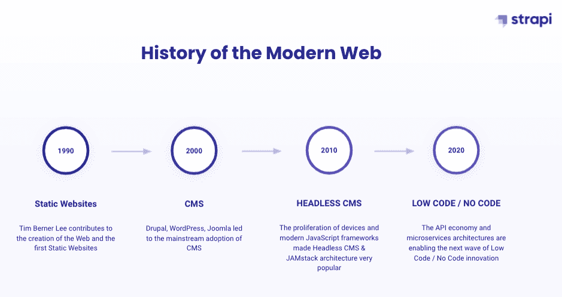

# 无头 CMS 与无代码网站构建者

> 原文：<https://thenewstack.io/headless-cms-vs-no-code-website-builders/>

[Victor cois ne](https://www.linkedin.com/in/victorcoisne)

[Victor cois ne 是流行的开源无头 CMS Strapi 的营销副总裁。作为一名开发者社区爱好者，Victor 已经为开源 B2B 公司工作了十多年，包括担任 Docker 社区负责人的 5 年多时间。闲暇时，Victor 喜欢和朋友在一起，品酒、下棋、打网球或踢足球。](https://www.linkedin.com/in/victorcoisne)

内容管理市场一点也不新鲜。可以说，它可以追溯到 20 世纪 80 年代，当时第一款专门用于管理内容的软件 [FileNet](https://en.wikipedia.org/wiki/FileNet) 首次发布。快进到 2021 年，这个市场已经成熟，根据锡安市场调查的数据，现在有望达到 1230 亿美元。在过去的几年里，传统的基于网络的内容管理系统(CMS)如 WordPress 和 Drupal 已经变得不那么流行了，两种类型的供应商已经成为强有力的挑战者:无代码网站建设者如[【Squarespace】](https://www.squarespace.com/)[Webflow](https://webflow.com/)和 [Bubble](https://bubble.io/) 和纯无头 CMS 如 Contentful 和 [Strapi](https://strapi.io/) 。

在本文中，我们将首先定义什么是无代码网站构建器和 headless CMS，然后讨论每种解决方案的优缺点，最重要的是如何选择一个。

## 什么是无代码网站建设者？

在过去的几个月里，围绕“无代码”工具有很多讨论。但是这到底意味着什么呢？简而言之，这意味着软件开发过程或代码通过一个用户界面被抽象出来，这个用户界面对所有人都是可访问的，不管他们的技术技能如何。换句话说，它是位、操作系统、编程语言和库之上的最高层次的抽象。

无代码工具往往是为特定的用例而构建的，并提供许多模板或构建块，用户可以拖放这些模板或构建块来构建他们的网站或应用程序。因此，大多数无代码工具都是软件即服务解决方案，不需要在本地安装，稍后再部署到生产环境中。

## 什么是无头 CMS？

无头内容管理系统由数据库和通过 API 的内容交付组成，将后端(内容创建和存储)与前端(设计和部署)完全分离。

随着联网设备数量的持续增长， [API 优先的“无头”CMS](https://strapi.io/what-is-headless-cms) 已经成为需要为客户构建全渠道数字体验的公司的解决方案。开发人员倾向于将 headless CMS 视为一种“低代码”解决方案，它在加速应用程序开发的同时抽象掉了一些复杂性。

## 无代码站点构建器的好处

炒作不是凭空而来的。无代码解决方案成为主流有几个原因。以下是三大理由:

### 上市时间

由于有了模板和现成的构建模块，从一个想法到一个最小可行产品(MVP)甚至是一个生产就绪的网站或应用程序通常会更快。上市速度非常重要，因为它允许公司比以往任何时候都更快地创新。

### 不依赖开发者

随着越来越多的公司投资于他们的数字化转型(流行语 alert，抱歉)，招聘软件开发人员正成为一个全面的严峻挑战。因此，让非技术团队能够自治的无代码工具对于那些希望构建简单的网站的公司来说非常有吸引力。

### 费用

除了开发时间更短之外，预构建的组件、模板和开箱即用的主机意味着公司利用无代码工具进行应用原型开发和简单项目通常更便宜。与 headless CMS 不同，您不必单独开发前端，并确保它与您的后端系统很好地集成。

## 无代码站点构建器的局限性

尽管无代码工具有很多好处，但是在为您的项目选择解决方案之前，还是有很多限制要考虑。让我们来看看三大限制。

### 固执己见的

无代码工具通常是专门构建的。从网站建设者到入职、项目管理和自动化工具，你会发现几乎所有用例都可以使用无代码工具。现在，一旦您的项目超出了跨越多个设备或系统的简单、标准化的用例，您可能会遇到严重的问题。您可能不得不并行使用几个不同的非代码工具，而不是在一个框架或平台上构建软件实践和专业知识，该框架或平台可以定制为适合您跨多个渠道的大多数用例。

### 技术债务

当开发团队选择速度而不是可伸缩的、面向未来的软件架构时，就会产生技术债务。如果您决定使用无代码工具，这正是可能发生的情况。因为无代码工具不遵循流行的或标准的开发实践，关于如何构建的文档很可能是有限的或完全缺失的。另一方面，headless CMS 不仅让开发人员可以灵活地选择他们喜欢的工具，而且还可以根据项目的规模或需求的变化来定制整个应用程序。

### 成本/锁定

随着 GDPR 等新法规变得越来越普遍，网络安全风险也越来越大，公司必须小心选择合作的 CMS 供应商。虽然使用基于 SaaS 的无代码工具可能很方便，但这也可能导致合规性挑战和数据治理风险。随着您的公司或内容项目数量的增加，基于 SaaS 的解决方案也可能变得价格昂贵，迁移到另一个平台几乎是不可能的。

## 无头 CMS 和无代码建站器如何选择？

为这项工作找到合适的工具并不简单，应该基于您的项目范围和需求。 **Headless CMS 并不与无代码工具直接竞争**，它更多的是快速入门工具与高度灵活和可定制工具之间的权衡。

如果您是一家中小型企业，需要构建一个 MVP 或一个范围、安全性和数据治理风险有限的简单 web 项目，那么您可能希望从无代码工具开始，然后切换到一个更具成本效益/可伸缩性的解决方案，如 headless CMS。

另一方面，如果您的公司正在跨第三方解决方案和各种利益相关方(开发人员、设计人员、品牌专家等)构建一个更具战略意义的应用程序，那么您最好从一个无头 CMS 开始，以避免以后的迁移成本。

这里有几个问题可以帮助你做出正确的决定:

1.  您有多大把握项目范围不会随着时间的推移而改变？
2.  项目中有开发人员参与吗？有机会使用他们喜欢的工具和框架对他们来说有多重要？
3.  您计划瞄准多个渠道和设备吗？
4.  品牌设计和整体用户体验对你来说有多重要？
5.  您需要在多大程度上控制您的安全和数据保护？

现在，如果您正在寻找适合您的用例的最佳无头 CMS 的建议，这里有一篇博文，涵盖了选择无头 CMS 时需要考虑的所有主要因素。

<svg xmlns:xlink="http://www.w3.org/1999/xlink" viewBox="0 0 68 31" version="1.1"><title>Group</title> <desc>Created with Sketch.</desc></svg>