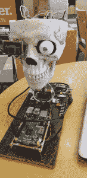
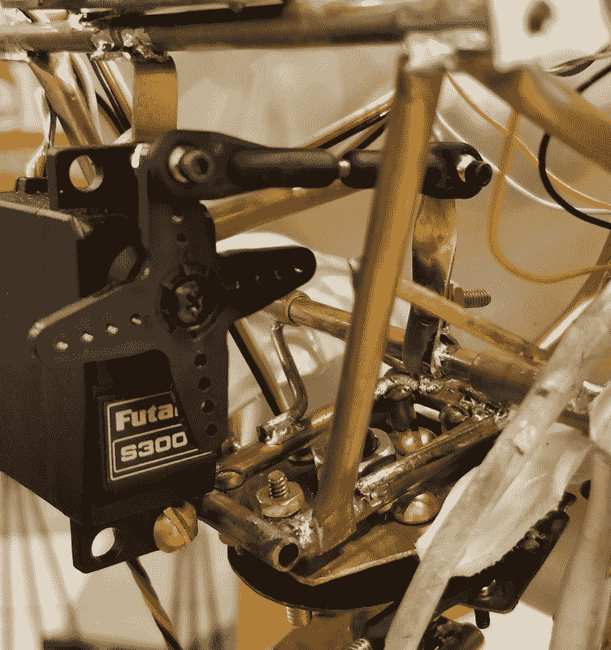
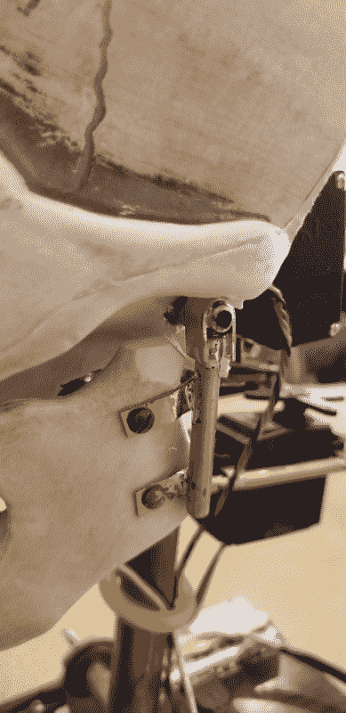
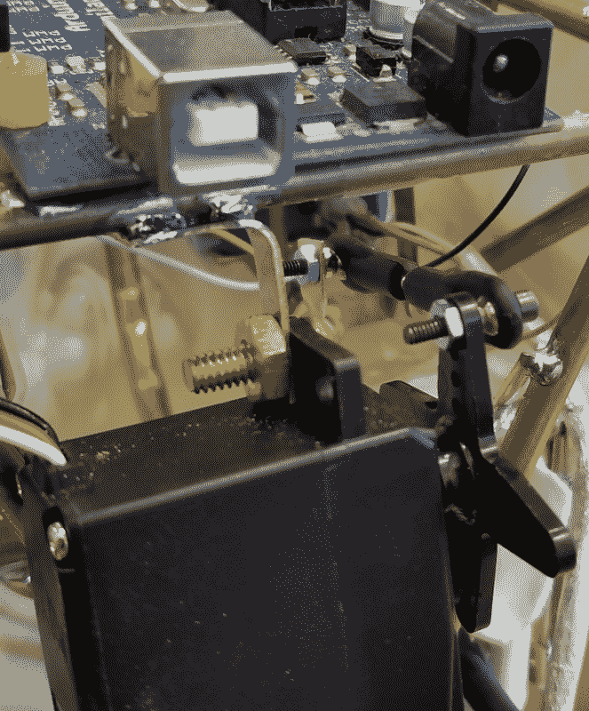

# 赫德利机器人头骨的正颌手术

> 原文：<https://thenewstack.io/hedley-the-robotic-skulls-orthognathic-surgery/>

我的最新项目，[机器人头骨赫德利，](https://thenewstack.io/off-shelf-hacker-hedleys-challenge-rise-occasion/)可以使用标准大小的业余爱好伺服来回平移。伺服系统连接在他头顶的 Arduino 大脑上。数据从位于右眼窝的 JeVois 机器视觉传感器输入 Arduino，从而跟踪他视野内的物体。[跟踪平移方案](https://thenewstack.io/off-shelf-hacker-hedley-robotic-skull-notices-creator/)已经相当成功，随着我对视觉传感器内置的人工智能(AI)算法的经验积累，它将变得更好。

如果赫德利能动动下巴说话，那不是很有趣吗？

也许他可以在我即将到来的 OSCON 科技演讲中介绍我。或者，如果我们将 Alexa 框架集成到头骨中，让他可以回答问题，会怎么样？有着 Alexa 嗓音的赫德利？那就太丰富了。我们能不能把声音换成威胁性的或者男性化的？如果赫德利能转头说话，他会更有个性。

修改下巴，使其枢轴转动(正颌手术部分)并连接一个伺服系统是开始让赫德利发牢骚的好地方。本周我们将介绍我是如何移植下颚枢轴的，做出了哪些设计决策，并查看练习平移和下颚伺服的测试代码。

## 颚枢轴

在股票形式，赫德利的下巴上下移动的一对 1/8 英寸直径的塑料针，穿过头骨的一侧的孔。我没有办法用伺服驱动塑料销，所以决定用一个黄铜枢轴管和几个轴承套筒来代替它们。枢轴管上有一个杠杆臂，带有一个连接杆，通过伺服臂移动夹钳。

我切开枢轴管，使其在两侧伸出头骨约 1/2 英寸。最后的测量结果约为 4-3/8 英寸长。我还削减了两个 1-1/2 英寸长的套管，作为枢轴轴承从稍大直径管。然后用一对 V 形支架将袖子固定在头骨的内部管道框架上。一根 10 号实心裸铜线非常适合做 V 型支架和额外的交叉支撑。为了让一切都整齐划一，在我将它们焊接到支架和框架之前，套筒被放置在管道上。

v 形支架、枢轴管、连杆和轴承套筒

这是 V 型支架、套管和枢轴管的内部特写视图。你还可以看出杠杆臂，连杆和它是如何连接到伺服。

颚尾托架

我最初用螺栓和螺母将杠杆臂夹在枢轴管上。我想能够把枢轴管组件拆开。可悲的是，这种特殊的夹具需要更多的扭矩，所以我最终将杠杆焊接到管子上。有时我们不得不在设计中做出妥协，以保持项目的进展。如果我们投入生产，一个好的计划是将枢轴管、套管和 V 型支架模块化在一起，使整个组件可拆卸。或者，也许 3d 打印的枢轴管支架会更好。可能是个想法。

夹爪端支架由直径为 3/16 英寸的铜管和一些 1/8×1/4 英寸的扁钢制成。它们被焊接在枢轴管的两端，并用螺栓固定在钳口的背面。

## 伺服和联动装置

我选择一个标准尺寸的业余爱好伺服来驱动下巴有几个原因，包括扭矩等级和价格。

事实上，这个决定很简单。业余爱好伺服通常有两种现成的尺寸，标准和微型。标准尺寸比微型产生更大的扭矩。我需要一个伺服系统，它可以将塑料颚旋转大约 15 度，速度足够快，看起来像是在跟随一个口语单词。

在过去的一个项目中，我曾使用微型伺服系统倾斜蒸汽朋克眼球装置。当时，扭矩需求非常小，因为伺服系统安装在眼睛内部，重量很轻。以下是 E-Flite S60 微伺服的规格。

|  | 

【Flite】【EFLRS60】【微型】

)(我)(们)(都)(不)(知)(道)(,)(我)(们)(还)(不)(知)(道)(,)(我)(们)(还)(不)(知)(道)(,)(我)(们)(还)(不)(知)(道)(,)(我)(们)(还)(不)(知)(道)(,)(我)(们)(还)(不)(知)(道)(,)(我)(们)(还)(不)(知)(道)(,)(我)(们)(们)(还)(不)(知)(道)(,)(我)(们)(还)(不)(知)(道)(,)(我)(们)(还)(不)(知)(道)(,)(我)(们)(们)(还)(不)(会)(不)(知)(道)(,)(我)(们)(还)(没)(见)(到)(你)(,)(我)(还)(没)(见)(到)(你)(,)(我)(们)(们)( 93 x 74 (T81) (T82) (T83) (T84) in (T85)(T86) (T87)

 |

12.5 盎司英寸的额定扭矩相当低。速度很好，10 秒就能转过 60 度。这些伺服系统是为小型轻型模型飞机设计的。它们移动小的操纵面，需要快速反应。

我用了一个非常常见的双叶模型 S3003 为赫德利的下巴。这个伺服系统在 E-Flite 速度一半的情况下有将近 4 倍的额定扭矩。它们是为遥控汽车和更大的模型飞机制造的。看看规格。

|  | 

双叶 S3003

。 23 秒/60度(at4.8伏

44.4盎司8x1.4中的。

 |

我测量过夹钳需要多大的扭矩了吗？不。虽然很容易装配一个测试台来找出需要多少实际扭矩来转动颚，但这真的没有必要。有了经验，你会对什么行得通，什么行不通有一种感觉。对于一次性原型，通常可以猜测。根据需要进行调整。

使用 S3003 的另一个原因是成本。它有塑料齿轮和塑料轴承，所以 16.99 美元的零售价是这种伺服的平均水平。爱好商店也有同样大小的带金属齿轮和金属轴承的伺服系统，售价 27 美元。我认为产生的负载不值得多付 10 美元。

伺服杠杆臂上的一个孔必须扩大，以适应飞机式连杆的 2 毫米直径的连接螺钉。

还有两种类型的连杆。这种飞机型号细长，使用小直径的连接螺钉。钢筋混凝土汽车连杆，(又名拉杆)更大，使用更大的螺钉。你可以考虑大型项目的钢筋混凝土汽车杆。

有足够的空间，在头骨内，在潘伺服安装下巴伺服。由 1/16 x 1/4 英寸黄铜扁材制成的一对 L 形支架被弯曲并焊接到内部头骨框架上，以固定伺服系统。

这里有一个下巴伺服支架和连杆的图片。

夹钳伺服支架(顶部)

最后，我启动了一个快速测试程序来运行颚和潘伺服通过他们的步伐。这只是股票伺服扫描 Arduino 的例子代码为两个伺服系统。头骨向一侧平移，下颚开合两次，然后向另一侧平移。然后循环重复。

伺服系统在 Arduino 上连接到+5 伏和地。下颚伺服数据线连接到 Arduino 上的 PWM 引脚 4，而摇动伺服数据线连接到 PWM 引脚 3。

| )(这)(就)(是)(这)(些)(事)(,)(我)(们)(在)(这)(些)(事)(上)(没)(有)(什)(么)(可)(能)(看)(到)(这)(么)(的)(情)(况)(,)(只)(是)(这)(些)(事)(,)(只)(是)(在)(这)(些)(事)(上)(才)(有)(一)(个)(实)(验)(验)(验)(验)(验)(验)(验)(验)(验)(验)(验)(验)(验)(验)(验)(验)(验)(验)(验)(验)(验)(验)(验)(验)(验)(验)(验)(验)(验)(验)(验)(验)(验)(验)(验)(验)(验)(验)(验)(验)(验)(验)(验)(验)(验)(验)(验)(验)(验)(验)(验)(验)(验)( )(我)(们)(都)(不)(知)(道)(,)(我)(们)(还)(不)(知)(道)(,)(我)(们)(还)(不)(知)(道)(,)(我)(们)(还)(不)(知)(道)(,)(我)(们)(还)(不)(知)(道)(,)(我)(们)(还)(不)(知)(道)(,)(我)(们)(还)(不)(知)(道)(,)(我)(们)(们)(还)(不)(知)(道)(,)(我)(们)(还)(不)(知)(道)(,)(我)(们)(还)(不)(知)(道)(,)(我)(们)(还)(有)(些)(什)(么)(好)(的)(情)(情)(。 | 

/* Sweep

by BARRAGAN  

This example code is in the public domain.

modified 8 Nov 2013

by Scott Fitzgerald

http://arduino.cc/en/Tutorial/Sweep

*/

#include  

Servo servojaw;  // create servo object to control a servo

Servo servopan;

                // twelve servo objects can be created on most boards

int posjaw  =  0;    // variable to store the servo position

int pospan  =  0;

void setup()

{

  servojaw.attach(4);  // attaches the servo on pin 9 to the servo object

  servopan.attach(3);

}

void loop()

{

// jaw movement -----------

  for(posjaw  =  124;  posjaw&gt;=100;  posjaw-=1) // goes from 180 degrees to 0 degrees  

  {                                  // in steps of 1 degree

    servojaw.write(posjaw);              // tell servo to go to position in variable 'pos'

    delay(10); // waits 15ms for the servo to reach the position

  }

  for(posjaw  =  100;  posjaw  =100;  posjaw-=1) // goes from 180 degrees to 0 degrees  

  {                                  // in steps of 1 degree

    servojaw.write(posjaw);              // tell servo to go to position in variable 'pos'

    delay(10); // waits 15ms for the servo to reach the position

  }

  for(posjaw  =  100;  posjaw  =50;  pospan-=1) // goes from 180 degrees to 0 degrees  

  {                                  // in steps of 1 degree

    servopan.write(pospan);              // tell servo to go to position in variable 'pos'

    delay(10); // waits 15ms for the servo to reach the position

  }

  delay(1000);

  for(pospan  =  50;  pospan  &lt;=  120;  pospan  +=  1)  // goes from 0 degrees to 180 degrees

  {                                

    servopan.write(pospan);              // tell servo to go to position in variable 'pos'

    delay(5); // waits 15ms for the servo to reach the position

  }

  delay(500);

}

 |

## 更进一步

建设赫德利很有趣。当设备移动并对周围环境做出“反应”时，人们开始认为它们有个性。我希望赫德利尽可能多地拥有机器人/人类的个性。

我设想我们将在 Raspberry Pi 上使用某种文本到语音的程序，将输出传送到扬声器，给赫德利一个声音。如何让音频移动下巴还有点悬而未决。我们可以用声音的振幅(响度/柔和度)来驱动伺服吗？大概吧。尝试保持颌伺服与各种语音频率同步会更现实吗？好问题。这是值得探索的。

敬请关注机器人头骨赫德利的最新进展。

<svg xmlns:xlink="http://www.w3.org/1999/xlink" viewBox="0 0 68 31" version="1.1"><title>Group</title> <desc>Created with Sketch.</desc></svg>