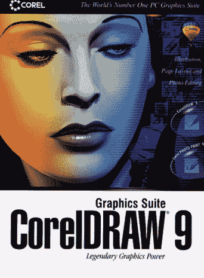

# 海迪·拉马尔:电影明星，无线先锋

> 原文：<https://thenewstack.io/hedy-lamarr-movie-star-wireless-pioneer/>

周一，谷歌提醒世界海迪·拉马尔惊人的生活和职业生涯，他不仅在好莱坞，而且对无线网络通信产生了影响。

谷歌通过展示一个精心制作的动画“涂鸦”引发了人们的讨论，这是庆祝这位好莱坞电影明星成为网络通信先驱的 101 岁生日。"今天令人惊叹的动画是迄今为止最伟大的谷歌涂鸦吗？"问 *[《华盛顿邮报》](https://www.washingtonpost.com/news/comic-riffs/wp/2015/11/09/actor-inventor-hedy-lamarr-is-todays-stunning-animation-the-greatest-google-doodle-yet/)*——网上的对话持续不断。超过 25，000 名脸书用户分享了一个名为“坚强的女孩”的帖子(帮助父母在电影和书籍中为他们的女儿树立积极的榜样)。

回到好莱坞， *Variety* 杂志甚至爆料女演员苏珊·萨拉登[正在准备一部关于拉玛尔生活的纪录片](http://variety.com/2015/film/news/hedy-lamarr-documentary-susan-sarandon-1201636562/)(将在 PBS 的“美国大师”系列中首播)。

她的真名是海德薇·伊娃·玛丽亚·基斯勒，她的生活读起来就像一个好莱坞故事。19 岁时，她嫁给了一个富有的军火销售商

《阴谋者》中的海迪·拉马尔(1944)

将她锁在他们城堡的家中(根据她在维基百科上的条目)。他补充说，他后来向纳粹出售武器，而“生为犹太人的拉马尔在半夜逃离了她的丈夫，登上了一艘去美国的船，除了一件名牌礼服，她一无所有。”

更广为人知的故事是她作为一名迷人的电影明星的晚年生活，在电影中，她经常被视为转移迷恋男人的注意力。但她也是一个终身的修补者，并决心在第二次世界大战期间帮助盟军，她共同创造了(并申请了专利)一种跳频技术，旨在阻止敌人干扰引导鱼雷的无线电信号。当[1974 年在*时代*杂志](http://time.com/vault/issue/1974-02-18/page/64/)上的一篇文章后来引用拉马尔的发明时，她回答说“改善事物对我来说是自然而然的事情。”(11 年前，她告诉《时代》杂志“任何女孩都可以变得迷人。你要做的就是站着不动，看起来傻傻的。”)

*时间*链接到他们周一的两篇存档文章，回忆起她在无线通信史上经常被忽视的角色。虽然 20 世纪 40 年代的技术无法实现拉马尔的愿景，但这项专利最终为我们现代的蓝牙、GPS 和 WiFi 系统奠定了基础。海迪·拉马尔 15 年前在佛罗里达州去世，享年 85 岁。但是当她 82 岁时，就在她去世前三年，她获得了电子自由基金会颁发的特别奖。

“具有讽刺意味的是，他们在半个世纪前开发的这个捍卫民主的工具承诺在 21 世纪扩展民主，”电子前沿基金会的工作人员顾问 Mike Godwin 指出。有一段时间，她的脸也出现在 Corel Draw 的包装上。据哥伦比亚广播公司新闻报道，83 岁的她起诉科雷尔使用数码制作的面部复制品[，“但双方和解金额未披露。”](http://www.cbsnews.com/pictures/hedy-lamarr-inventor-of-wifi/35/)

你仍然可以在 YouTube 上找到她的电影[的片段——从塞西尔·B·戴米尔的*参孙和黛利拉*到*我最喜欢的间谍*](https://www.youtube.com/watch?v=OgRd83e38hk) [和鲍勃·霍普](https://www.youtube.com/watch?v=wBQXzoS_cY8#t=2m02s)的一切。(“听一个知道自己想要什么的女人说话一定非常无聊，”她对一个潜在的追求者说。)这与她的现实生活有着奇怪的相似之处，在现实生活中，她结过六次婚。她嫁的最后一个男人是她的离婚律师——这段感情持续了两年，并于 1965 年以离婚告终。在接下来的 35 年里，她一直未婚，15 年前在佛罗里达州去世，享年 85 岁。

“我们感谢谷歌对她的支持，以及她的网站增加的流量……”拉马尔的官方网站宣布(嵌入谷歌的视频)。"海蒂申请了一个想法的专利，这个想法后来成为安全军事通信和移动电话技术的支柱."

他们自豪地把她的 T9 描述为“电影界最有趣、最聪明的女性”

特征图片:谷歌。

<svg xmlns:xlink="http://www.w3.org/1999/xlink" viewBox="0 0 68 31" version="1.1"><title>Group</title> <desc>Created with Sketch.</desc></svg>