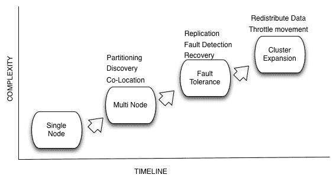

# Apache Helix: LinkedIn 的分布式系统开发框架

> 原文：<https://thenewstack.io/helix-a-linkedin-framework-for-distributed-systems-development/>

分布式数据系统用于各种场合，如在线服务、离线分析、数据传输和搜索等。这些从提供核心功能的单节点解决方案开始，例如，它可以是数据库、消息传递、搜索索引等。从单个节点构建，不仅需要分布式系统，还需要随之而来的不同需求。考虑到这些与伸缩相关的问题，我们构建了 [Helix](http://helix.apache.org/) ，这是一个用于开发分布式系统的通用框架。

## 为什么是螺旋

长期以来，单节点解决方案足以满足大多数使用情形，但随着大数据的出现，情况不再如此。大多数应用程序需要在分布式环境中运行，分布式计算带来了可伸缩性、分区和容错方面的挑战。这样一个系统的演化看起来如下。

 添加这些功能并不琐碎，容易出错且耗时。每个特征都成倍地增加了系统的复杂性，但是这些能力对于预期大规模运行的生产就绪系统是至关重要的。大多数系统试图经历这种演变，但很少最终达到正确的结果。事实上，许多系统在每次添加新功能时都会经历多次重写。

在 LinkedIn，我们即将开始构建许多这样的分布式系统的旅程，其中第一个是 Espresso，一个 NoSQL 存储系统。在设计系统时，我们观察到需要支持常见的模式，如对分区、硬件和软件故障的容错、引导等任务、操作问题、负载平衡和扩展。所有这些都是为开发分布式系统建立一个通用框架的动机，我们称之为 Helix。

### **分布式系统挑战**

让我们通过一个分布式系统的例子——搜索系统( [Solr](http://lucene.apache.org/solr/) 或 [Elasticsearch](http://www.elasticsearch.org) )来回顾一下构建分布式系统所面临的一些挑战。这些系统使用的核心索引技术是 [Apache Lucene](http://lucene.apache.org/core/) 。Apache Lucene 是全文搜索引擎库，它提供了高性能的索引和高效的搜索功能。让我们考虑下面的示例规范。

*   要索引的 10 亿个文档。
*   48gb 内存的服务器。
*   索引太大，无法放入单个框中。

#### 要求

为了使系统能够投入生产，除了处理搜索请求的核心功能之外，它还必须满足以下关键要求:

*   **分区管理:**一种常见的策略是将索引分成多个分区，并将它们分布在几个服务器上，以管理工作负载。随着分区的增长，管理它们的挑战也在增加。
*   **容错:**随着分区和服务器数量的增长，分区加载失败或软件和硬件故障的可能性也会增加，从而影响正常运行时间。构建一个容错的解决方案很快就成为一个关键需求。
*   **可伸缩性:**随着文档数量的增加，每个分区的索引大小也会增加。这意味着给定机器上可以容纳的分区数量会随着时间的推移而减少，这需要添加更多的服务器并重新分配索引。
*   虽然必须满足这些要求，但软件交付流程的另一个关键部分是配置管理、可操作性和多租户。

#### 结构管理

通常情况下，像使用静态配置文件这样的简单方法会导致手动且容易出错的方法。集中管理的配置的替代方案提供了一些喘息的机会，但是配置分布中的任何相互依赖性很快使该解决方案变得缺乏。

#### 可操作性

随着系统的扩展，需要协调这些服务器的启动和关闭，以减少争用，并实现服务器的受控启动和引导。任何手动操作都是一场噩梦，需要自动化管理。随着服务器协同工作，当它们扩展以处理请求时，识别并尽快修复任何故障硬件(磁盘故障)或软件(加载分区故障)以减少对容量和正常运行时间的影响变得至关重要。一个改善的 MTTR(平均恢复时间)可以是一个好的季度与一个坏的季度之间的差别。

#### 多重租赁

随着租户数量的增加，为每个客户端运行多个进程的开销会变得很大。多租户减少了这种开销，并通过在单个进程中运行多个租户来实现高效的资源利用。实现多租户的基本要求之一是能够动态配置和重新配置租户。

### **螺旋概念**

为了以通用的方式解决上述需求，Helix 引入了**增强有限状态机** (AFSM)的概念。通过状态和转换的有限状态机(FSM)提供了足够的表达能力来描述系统的行为。

我们为状态机增加了一个针对状态和转换的“约束”维度。可以在分区、资源、实例和集群的粒度上指定约束。

搜索系统需求可以用这个 AFSM 来描述。

*   ***状态***–这些是分区副本可以经历的一组状态
    *   离线–开始状态
    *   引导程序
    *   在线—结束状态，副本已准备好为请求提供服务
*   ***转换***–在服务请求之前，通过各种状态的有效转换的有序集合
    *   离线-引导-在这个转换中，服务器加载分区的索引
    *   引导–在线
*   ***约束***–回想一下，约束可以在状态和转换时定义
    *   *状态约束*(副本- >每个分区最大值:3) →表示对于每个分区，我们最多需要 3 个副本。
    *   *转换约束*(每节点离线最大值→引导:1) →限制在任何给定服务器上同时加载索引的分区数量。
    *   *转换约束*(每集群离线最大值→引导:10) →限制跨整个集群同时加载索引的分区数量。

**目标**用于控制资源分区在节点间的放置。目标可包括但不限于以下内容:

*   在节点之间均匀分布分区和副本。
*   不要将一个分区的多个副本放在同一节点上。

螺旋术语和概念的详细描述可以在[这里](https://blog.cloudera.com/blog/2013/09/distributed-systems-get-simpler-with-apache-helix/)和[这里](http://helix.apache.org/Concepts.html)找到。

### **螺旋架构**

Helix 将分布式系统组件划分为 3 个逻辑角色，如上图所示。值得注意的是，这些只是逻辑组件，可以在物理上位于同一个流程中。这些逻辑组件中的每一个都有一个嵌入式代理，通过 [Zookeeper](http://zookeeper.apache.org/) 与其他组件交互。

**控制器**:控制器是系统的大脑，托管状态机引擎，运行执行算法，并针对分布式系统发布转换。

**参与者**:当控制器发起状态转换时，参与者执行状态转换并触发分布式系统实现的回调。例如:在搜索系统的情况下，系统实现诸如 offlineToBootstrap、BootstrapToOnline 之类的回调，并在控制器触发相应的转换时被调用。

**旁观者:**旁观者是系统状态的观察者，并得到状态变化的通知。观众可以根据这样的通知与适当的参与者互动。例如，当路由表发生变化时，例如当集群扩展或节点出现故障时，可以通知路由/代理组件(旁观者)。

关于这些组件的更详细的讨论可以在[这里](http://gkishore.wordpress.com/2013/12/02/helix-internals/ "Apache Helix Internals")找到

### **Helix 在 LinkedIn 生态系统中的使用**

*   **Espresso** : Espresso 是一个[分布式的、时间轴一致的、可伸缩的文档存储库](http://data.linkedin.com/projects/espresso)，支持本地二级索引和本地事务。Espresso 运行在许多存储节点服务器上，这些服务器存储和索引数据并回答查询。Espresso 数据库被水平划分为多个分区，每个分区都有一定数量的副本分布在存储节点上。
*   **数据总线**:数据总线[提供了一个公共管道，用于将事件从 LinkedIn 的主数据库](http://data.linkedin.com/projects/databus) (Espresso 和 Oracle 数据库)传输到缓存和搜索系统等下游应用程序。数据总线在每个分区的基础上维护一个缓冲区。Databus 不断监视主数据库的拓扑变化，并在主数据库上创建新表时自动创建新的缓冲区。
*   **数据总线消费者:**每个数据总线分区被分配给一个消费者，使得分区均匀地分布在消费者之间，并且每个分区一次仅被分配给一个消费者。消费者的集合可能会随着时间的推移而增长，并且消费者可能会由于计划内或计划外的停机而离开该组。在这些情况下，必须重新分配分区，同时保持平衡和每个分区一个消费者不变。将数据复制到另一个数据中心数据复制器和生成搜索索引的搜索索引器节点就是遵循这种模式的一些应用程序。
*   Seas :(搜索即服务):LinkedIn 的 Seas 让内部客户在选择的数据集上定义自定义索引，然后通过服务 API 使这些索引可以被搜索。索引服务在群集上运行。该索引被分成多个分区，每个分区都有配置数量的副本。
*   **Pinot** (分析平台):Pinot 是一个[在线分析引擎](http://engineering.linkedin.com/analytics/real-time-analytics-massive-scale-pinot)，用于任意汇总和下钻。
*   **ETL** :我们在 Helix 的基础上构建了多个任务执行框架。这些是根据用例定制的。例如，快照生成服务将 Espresso 数据转换为 Avro 格式，并将其加载到 Hadoop 中以供进一步分析。

### **在 LinkedIn 之外使用 Helix】**

自从开源螺旋以来，LinkedIn 之外的一些公司正在使用它

*   IGDM 中的 insta gram(insta gram 直接消息)
*   [框中的框注释](http://tech.blog.box.com/2014/06/the-technology-behind-box-notes-2/)。
*   转内部存储。
*   jBPM:在 [jBPM](http://planet.jboss.org/post/clustering_in_jbpm_v6) 中使用 Helix 实现集群。

### **下一部戏**

我们一直在研究一些关键特性，这些特性将允许 Helix 用于资源管理之外的系统。

*   **任务框架**:调度特定任务和监控进度的能力。
*   **供应**:与 YARN/Mesos 等其他资源管理器集成，以支持自动供应。
*   **Helix-IPC:** 分区之间相互通信的能力。这可以形成构建各种复制方案的基础，例如同步/异步复制、链式复制和共识(raft)。

## **总结**

从零开始构建分布式系统，不简单，容易出错且耗时。构建可以跨各种系统利用的正确的构造块集非常重要。在 LinkedIn，Helix 的开发始于 Espresso，随着我们不断构建各种分布式系统，这种投资不断获得回报，使我们能够构建可靠的可操作系统，例如 Pinot 成功利用了 Helix，而几乎没有努力减少操作开销。

<svg xmlns:xlink="http://www.w3.org/1999/xlink" viewBox="0 0 68 31" version="1.1"><title>Group</title> <desc>Created with Sketch.</desc></svg>