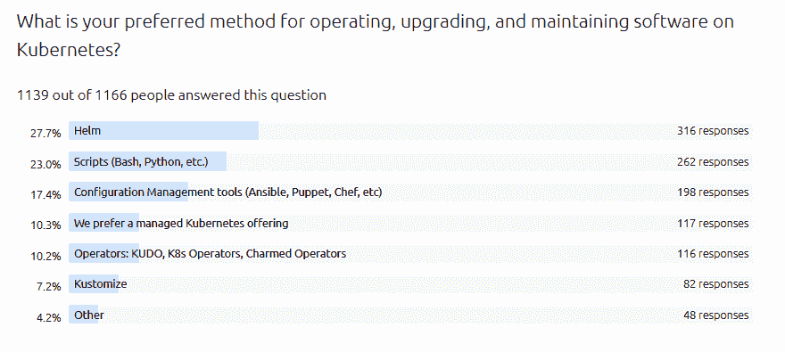
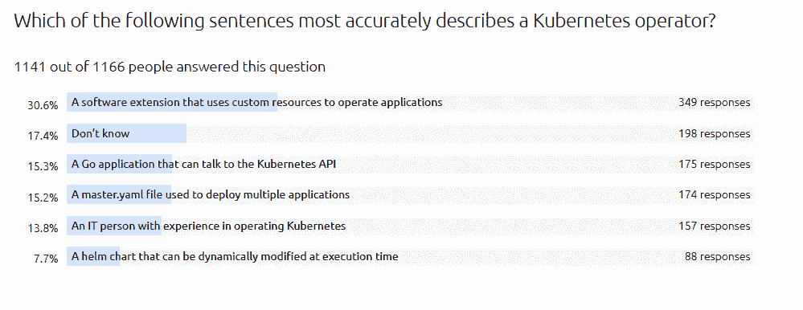

# 你好 Kubernetes 运营商(和供应商)，很少有人知道你在卖什么

> 原文：<https://thenewstack.io/hello-kubernetes-operators-and-vendors-few-people-know-what-youre-selling/>

[增加 Kubernetes 部署规模的支出](https://www.cncf.io/blog/2021/06/29/finops-for-kubernetes-insufficient-or-nonexistent-kubernetes-cost-monitoring-is-causing-overspend/)让人们对云原生世界的核心部分的下一步感到兴奋，但在代码世界这一基础设施的许多领域存在相当大的混乱和低采用率。目前，充满运营商的服务目录的承诺似乎还很遥远。为了了解原因，我们查看了 Canonical 的 [*Kubernetes 和云原生运营报告 2021*](https://juju.is/cloud-native-kubernetes-usage-report-2021) ，该报告调查了 1200 名 IT 专业人士，其中许多人来自 Canonical 的 Ubuntu 使用客户群。

根据这份报告，虽然 Kubernetes 早已过了期望的高峰和幻灭的低谷，但只有 46%的企业在生产中实际使用 Kubernetes。然而，几乎所有人都在考虑将更多的应用程序转移到 Kubernetes。这些工作负载的增长速度将决定未来几年哪些技术会受到青睐。

报告中有一个有趣的地方:只有 17%使用 Kubernetes 的受访者在生产中使用操作符。相比之下，72%的人说他们的团队在过去 90 天里使用或修改了掌舵图。我们自己对这个话题的探索，Mary Branscombe 的“ [Kubernetes:什么时候使用，什么时候避免，操作者模式](https://thenewstack.io/kubernetes-when-to-use-and-when-to-avoid-the-operator-pattern/)”解释了为什么操作者不适合所有人，并表明公司没有超越自己。

Canonical 对人们对 Kubernetes 操作符的理解非常感兴趣，因为它提供了 Juju，这是一个开源应用程序建模工具，是该公司相对于其他操作符、 [Helm](https://helm.sh/) 、Ansible、 [Terraform](https://thenewstack.io/terraform-1-0-reflects-what-hashicorp-has-learned-about-infrastructure-as-code/) 和 [Kustomize](https://kustomize.io/) 定位的更大的“魅力操作符框架”的一部分。

当用户被问及他们在 Kubernetes 上操作、升级或维护软件的首选方法时，Helm 以 28%的投票率高居榜首，相比之下，Ansible 等配置管理工具的投票率为 17%，运营商的投票率为 10%(包括 [KUDO](https://thenewstack.io/kudo-automates-kubernetes-operators/) )。Helm 做得更好，在生产中运行 Kubernetes 的组织中上升到 38%。随着组织进入生产阶段，他们不太可能使用脚本和遗留配置管理工具，但也不太可能使用 Canonical 提供的产品。

关于什么是操作符有很多困惑，但是如果每个人都知道正确的定义，他们仍然不会被广泛采用。Kubernetes 的官方文档说，操作者模式是利用定制资源来管理应用程序及其组件的软件扩展。

当面对六个不同的选项时，只有 31%的人认为这个定义最准确地描述了运营商。但是，在生产用例中使用操作符的人中有一半(50%)得到了“正确”的定义几乎一半(46%)的人也认为他们是太多舵图表的“答案”。也许他们确实有未来，但不是现在。

该图表包括正在评估 Kubernetes 并且只在开发环境中使用它的受访者。如果我们只看生产中使用 Kubernetes 的 46%，那么对 Helm 的偏好上升了 10 个百分点，达到 38%，对 Scripts 的偏好下降到 15%。来源:Canonical 的《Kubernetes 和云原生运营报告 2021》。

[Alexis Richardson](https://www.linkedin.com/in/richardsonalexis/),[weaver works](https://www.weave.works/?utm_content=inline-mention)的创始人兼首席执行官认为，为了真正使用 Kubernetes 中的数据，运营商是必要的。报道援引他的话说，“平台团队将成为运营商的成熟用户，然后应用开发团队将把他们基本上视为附加产品。”在他看来，Helm、Juju、运营商只是企业应用商店中可供选择的东西。

这一切对你来说意味着什么？缺乏技能是人们在 Kubernetes 面临的最大挑战。从 CI/CD、GitOps、cloud 什么的角度看都无所谓，[cloud bees](https://twitter.com/jstrachan)的杰出工程师、Groovy 和 Apache Camel 的创造者 James Strachan 认为，唯一的解决办法就是边做边学；选择一条道路，尝试新技术。

实际上，理解什么是技术是很大的第一步。经过十年的讨论，至少五分之四的调查对象认为混合云至少包括一个私有云和一个公共云。我们可以将此作为我们在社区中获得多少共识的基准。

调查问卷还问到，“在基础设施领域，术语‘基板’对您来说意味着什么？”**嗯？**这是 35%的人对自己说的话，因为他们不知道这是什么意思。27%的人认为底层是构建一切的基础设施，但“虚拟机/容器”、“抽象层”、“裸机”和“物理层”也得到了投票。[凯尔西·海托华](https://twitter.com/kelseyhightower)，谷歌的首席开发者和谷歌云平台倡导者，认为“平台”在这种情况下是一个更合适的术语。

“Kubernetes 在很大程度上是控制平面(在只有 K8s 的环境中)，”但运营商可以跨基板扩展的控制平面，[Edward Jones 的高级企业架构师 Ken Sipe](https://www.linkedin.com/in/kensipe/) 在 Canonical 报告中说。

## 别人的条件

[Substrate](https://www.substrate.io/) 也是一个流行的框架，由 [Polkadot](https://polkadot.network/) 背后的同一家公司 [Parity Technologies](https://www.parity.io/) 构建，用于区块链开发。在最近的加密热潮冷却之后，将会有一批真正的 Web 3.0 基础设施供企业使用。如果大型科技公司不小心，他们将会把产品销售到一个由别人定义的市场。这个基底可能是一个守护者，因为它允许开发人员使用 [WebAssembly](https://thenewstack.io/webassembly-developers-lust-for-rust-and-assemblyscript-but-not-go/) 编写逻辑。

“现实就是大多数人所认为的那样，”Sipe 说。他可能是正确的。对技术定义和市场类别的理解可能有广泛的影响，因为投资通常是基于它们进行的。可观察性、原生云、数据科学、Jamstack，凡是你能想到的，关于一些[时髦词汇的争论还在继续。你认为新堆栈下一步应该挑战哪个？](https://thenewstack.io/aiops-blockchain-and-other-buzz-words/)

### 更多资源

来源:本文引用了该图表中的数据。Canonical 的《Kubernetes 和云原生运营报告 2021》。

<svg xmlns:xlink="http://www.w3.org/1999/xlink" viewBox="0 0 68 31" version="1.1"><title>Group</title> <desc>Created with Sketch.</desc></svg>