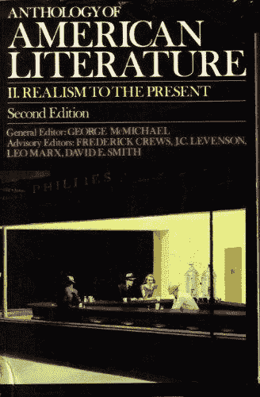
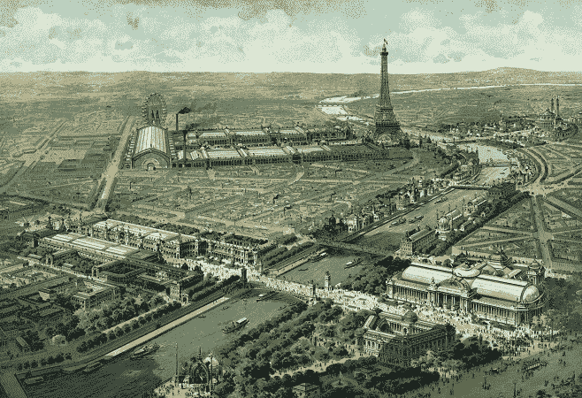

# 亨利·亚当斯如何应对 1907 年的技术进步

> 原文：<https://thenewstack.io/henry-adams-grappled-march-technology-1907/>

今天的极客们最近将注意力转向了一本 100 年前的回忆录——[《亨利·亚当斯的教育](https://www.amazon.com/gp/product/1548380172/ref=as_li_qf_sp_asin_il_tl?ie=UTF8&tag=the0757-20&camp=1789&creative=9325&linkCode=as2&creativeASIN=1548380172&linkId=eaf5af4ce61f15a308d9f7a0a0db49fd)*——该书于 1919 年获得普利策奖。在今天的这本回忆录中，它关于技术的教训仍然相关吗？在在线[文化网站 *The Millions*](http://www.themillions.com/2017/06/on-the-education-of-henry-adams.html) 上，书评人[迈克尔·林格伦](http://www.mikelindgren.net/)分享了他自己对进步本质的历史性探索的想法。*

 *亨利·亚当斯是享有特权的终极男人。他的祖父是美国第六任总统，他的曾祖父是美国第二任总统。然而,“这本书的一个笑话是，亚当斯在他着手做的每一件事上都不断失败,”林德格伦文章顶部的一段引文这样写道。

林德格伦显然很喜欢这本回忆录——他称之为“非同寻常、令人抓狂、时而引人入胜、时而乏味，就像经常讽刺而又出人意料地有趣一样。”但他也称这本书“既与我们的时代极其相关，又与我们的时代极其遥远。”亚当斯原本计划在泰坦尼克号返航时出航，林德格伦文章中引用的达拉斯历史学家苏珊·汉森认为，这一事件明显影响了亚当斯的前景。她写道，对于亚当斯来说，这一事件“似乎过于简洁地证明了他对现代人相信他可以控制和操纵自然以创造地球上的天国的警告的真实性。”

这种悲观主义让亚当斯在生命的最后时刻，无法理解这个变化太快的社会。

绝望的寻找答案，一个衰老的亚当斯描述了自己在世纪之交的巴黎博览会上漫步。直到 1900 年 11 月的世界博览会闭幕之前，亚当斯一直萦绕心头，渴望汲取知识，却又无力寻找。

他遇到一辆汽车，“自 1893 年以来，这辆时速 100 公里的汽车成了一场噩梦。”但是吸引他注意力的是电动发电机，他认为它是无限的象征——几乎是一种道德力量，比地球更令人印象深刻，而且“几乎没有发出任何声音警告，要求人们为了尊重权力而站得更远。”

人类已经进入了一个无形力量的世界，“在这个世界里，除了他感觉不到的运动的偶然碰撞，他什么也测量不到。”

林格伦认为这是洞察力的壮举。“亚当斯比他的任何同龄人都更清楚——对于一个 72 岁的人来说，这不是一个通常与灵活接受陌生技术联系在一起的年龄——这种新技术不仅改变了工作、社会，还改变了思想。”

他引用历史学家 Jennifer L. Lieberman 的话，她最近写了《T2》从 1882 年到 1952 年的输电线路史，认为发电机“激励 Adams 以新的方式书写历史”。它的‘力量’促使他超越自己狭隘的视角去思考——不要把历史想象成一系列人类成就，而是一部包含系统互联能量的更大的戏剧。”

在他的一生中，没有任何东西让他为这一发展做好准备，这让亚当斯甚至为一条通往理解的道路而挣扎。亚当斯写道:“1800 年的美国人试图教育 1900 年的美国人，这种尝试往往是愚蠢的，”他补充说，“1900 年的美国人试图教育 2000 年的美国人，肯定比 1800 年的国会议员更盲目，除非他知道自己的无知。”相反，亚当斯看到了更原始的斗争。

“在一百万或两百万年间，每一代人都在无尽的痛苦中努力获得和运用权力，同时对他们创造的权力表现出最深切的震惊和恐惧。”正是这些释放出来的力量教会了人类其能力的真正程度和极限，随着几个世纪的过去，“力量将继续教育，头脑将继续反应。老师所能希望的就是教它反应。”

亚当斯严肃对待教育，他曾写道“一个老师影响永恒；他永远也说不清自己的影响力止于何处。”但在他的书的结尾，亚当斯抱怨说，“教育的困难随着煤炭产量的增加而增加一倍，直到为了面对第七倍的复杂性而等待另一个十年的前景，稍微吸引了一个人的想象力……下一个新力量的巨大涌入似乎近在咫尺，其教育风格承诺将是暴力强制的。”

有时他的回忆似乎惊人的当代。亚当斯说，历史的力量需要一种新的社会意识，他在书的结尾描述了从船上看到的纽约的天际线，“疯狂地试图解释一些蔑视意义的东西。”

权力似乎已经摆脱了它的奴役，并宣称它是自由的。圆筒爆炸了，把大量的石头和蒸汽抛向天空……以前从未想象过的繁荣，人类从未行使过的权力，除了流星以外任何东西从未达到过的速度，使这个世界变得急躁、紧张、爱发牢骚、不可理喻和恐惧。”

硅谷也是如此吗？例如，亚当斯写道，“所有凝聚成公司的新生力量，都在要求一种新型的人——一种耐力、精力、意志和头脑都是旧类型的十倍的人——他们愿意为之支付数百万美元。”他是否预示着对 10x 程序员的渴望？

随着现代微处理器的力量激发一种新的历史，历史会再次重演吗？这可能是由对大量二进制计算之美的欣赏所驱动的？

林德格伦警告说，看到太多的相似之处。“这一愿景感觉如此准确，并不意味着我们居住的世界与亚当斯的世界是一样的。”相反，林德格伦认为，这本书给了我们一个视角，让我们了解世界是如何变化的，并“告诉我们如何关注我们自己教育旅程的细节，无论它们可能是什么。”

相反，林德格伦指出，亚当斯对后代采取了无情的谦逊态度，他说亚当斯“回顾自己对青年时代的先入之见，得出的结论是，他试图对后代说的任何话都比无用更糟糕。”文章引用了约翰·c·奥尔在*现代美国哲学家词典*中的一个有趣的总结——“一个人继承的思维模式【将总是】落后于科技发展。”或者，正如林德格伦所说，当技术和知识都以指数速度增长时，“教育的内在真理在于认识到它的局限性。”

"我们首先必须知道我们不知道的是什么。"

* * *

## WebReduce

<svg xmlns:xlink="http://www.w3.org/1999/xlink" viewBox="0 0 68 31" version="1.1"><title>Group</title> <desc>Created with Sketch.</desc></svg>*