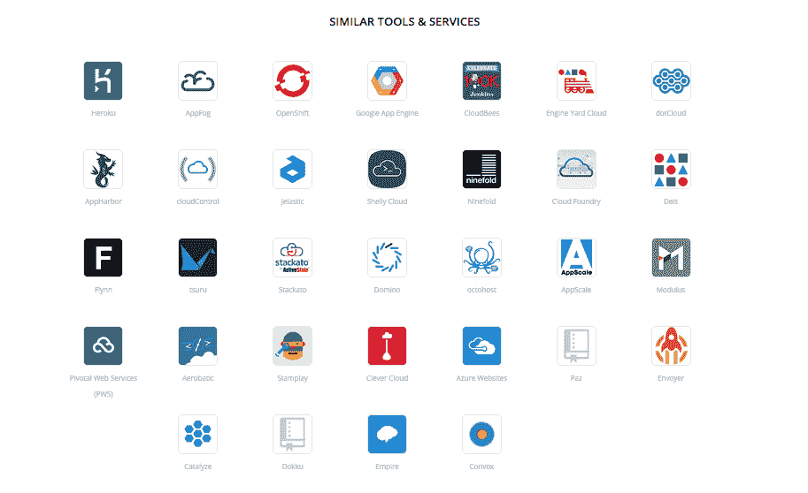
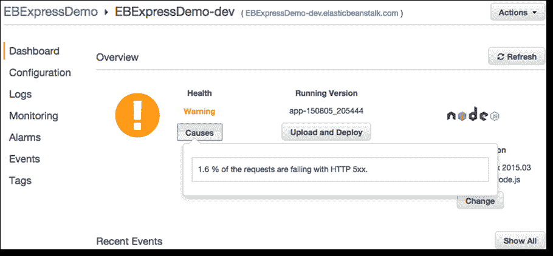
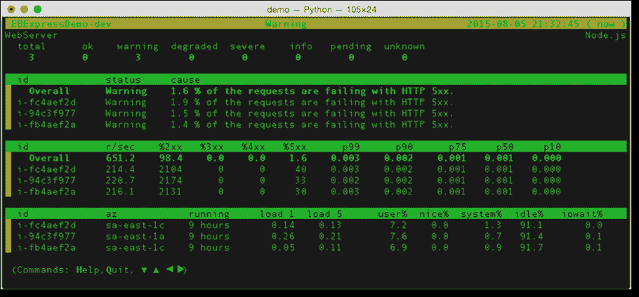

# 这里有一个 AWS 弹性豆茎及其新的实时健康检查看看

> 原文：<https://thenewstack.io/heres-a-look-at-aws-elastic-beanstalk-and-its-new-real-time-health-checks/>

随着 web 应用程序的扩展，返回 500 内部服务器错误的风险也会增加。开发人员通常倾向于在用户发布访问页面的问题后，通过偶尔抽查网站来监控此类问题，或者通过监控负载平衡器指标来确定是否存在问题。

AWS Elastic Beanstalk 现在[整合了一个新的应用健康监控工具](https://aws.amazon.com/blogs/aws/elastic-beanstalk-update-enhanced-application-health-monitoring/)来自动检测错误实例(例如 500 个内部服务器错误)，创建了新的工作流来确保新的部署通过健康检查，并提高了报告的粒度(从三个健康状态值增加到七个)。

对于那些不熟悉 AWS Beanstalk 的人来说，这里有一个它所提供内容的简要总结。Beanstalk 是 AWS 基础设施之上的一个[抽象](http://readwrite.com/2012/03/23/paas-or-fail-does-elastic-bean)。 [Stackshare](http://stackshare.io/aws-elastic-beanstalk) ，对豆茎的特性进行了总结。AWS 服务使用熟悉的软件栈，如 Apache HTTP Server for Node.js、PHP 和 Python、Passenger for Ruby、IIS 7.5 for。NET 和 Apache Tomcat for Java。Docker 也在 Beanstalk 上运行。它可与多种服务相媲美，但其与 AWS 基础设施的配置方式有所不同。以下是 Stackshare 对前景的看法:

新功能的核心是自动运行状况监控流程，该流程显示在 AWS 管理控制台仪表板中。为此，Elastic Beanstalk 监控应用程序和代理进程的 EC2 和 ELB 状态，并跟踪“基本指标”,如 CPU、内存、磁盘空间。

然后，这些数据点通过一组 AWS 管理控制台业务规则运行，以检测异常情况，并在应用程序管理器的显示错误率的仪表板中标记它们。例如，黄色警告表示五分之一的服务实例受损。作为新的 AWS Elastic Beanstalk 特性的一部分，已经发布了一个[更详细的用于评估应用健康状况的编码系统](http://docs.aws.amazon.com/elasticbeanstalk/latest/dg/health-enhanced-status.html)。

用户可以通过 AWS 管理控制台或直接通过 Elastic Beanstalk 命令行界面来监控新的健康报告。

该功能的引入是实现 web 级应用程序实时自动化的又一个基础。在亚马逊的功能公告中，这意味着应用程序健康状态现在处于“近实时”状态(即每十秒钟而不是每分钟监控一次)，这是对应用程序开发人员需求的认可，但更重要的是对应用程序用户需求的认可。随着 web 应用程序的扩展，要求它们在任何给定时刻保持稳定和可用的压力越来越大。为了帮助实现这一点，在版本部署被记录为成功之前，Elastic Beanstalk 特性会自动添加健康检查，作为审查滚动部署的必要要求。

开发人员甚至可以从 AWS 管理控制台或命令行进行集成，以适合他们工作实践的格式触发自动警报:例如，向工程师发送文本消息或自动向工程团队的项目管理工具添加任务。这是运行状况检查中的下一行。既然运行状况检查本身更加及时、更加精细，那么它就需要脱离作为控制面板指标的环境，成为自动化的、可触发的操作。

Docker 是新堆栈的赞助商。

专题图片:[肯·提格丁](https://www.flickr.com/photos/teegardin/)的[戴眼镜的视力](https://www.flickr.com/photos/teegardin/5547069087/in/photolist-9sbboc-heEDgL-cXe39U-cXdV6w-6X4VM4-79EgEe-7LK3MG-fGH3uD-hjvtnB-hixmHq-d5HZyd-hiKe4V-byRzGB-hixdj1-hhNxHB-hktNBY-5XASjA-hik8B9-him2d4-hhQHfj-hktprt-nzMWVH-hffa2b-hfgk7Z-rD3c6Y-dShudJ-qeYZP9-hktXRh-hfb2qD-cLSMHb-hjyrPD-5sMMXE-rGx8hm-w2JakD-ccC5gY-9HrTJe-fpS9Qp-hj2gSj-bZ3VyN-c5qqwf-c5qr37-c5qqBb-p6N6iQ-b7vKsK-o9VYoZ-gtZQYt-edqYi5-bUxTmC-hkqDeV-hkqKQa)。根据 CC BY-SA 2.0 获得许可。

<svg xmlns:xlink="http://www.w3.org/1999/xlink" viewBox="0 0 68 31" version="1.1"><title>Group</title> <desc>Created with Sketch.</desc></svg>