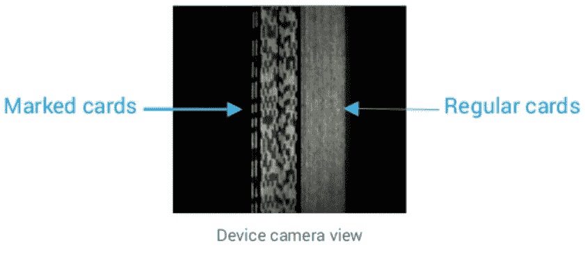

# 这里有一个定制的智能手机，可以帮助你在扑克中作弊

> 原文：<https://thenewstack.io/heres-customized-smartphone-help-cheat-poker/>

想象一下，再也不用虚张声势，每次玩扑克都是赢家。一家中国制造商开发了一种巧妙的新产品，可以向扑克玩家提示，这样他们就知道什么时候该拿牌，什么时候该弃牌。这是一款定制的智能手机，内置作弊设备，可以告诉你每个人手里都有什么。

这个狡猾的装置几乎和追踪它的极客的故事一样有趣。

这个故事出现在谷歌反虐待部门研究小组成员埃利·伯茨坦的网站上。

当他在一个论坛上读到一个关于扑克的有趣帖子时，他得到了关于手机的线索。有人声称他们被一种秘密设备骗了，这种设备可以远程读取所有的牌，并确定哪个玩家的牌最好，然后，当然，向骗子告密。那个神秘的帖子是用中文写的，更神秘的是，他看完不久就不见了。

Bursztein 后来说，他怀疑整件事是不是一个幻觉。但是后来他发现了另一个关于德克萨斯州使用的类似探测装置的参考资料。“一群家伙逃脱了将近一年，直到其中一人向某人泄露秘密，所有人都发现了，”他指出。那些传说真的是真的吗？

Bursztein 开始寻找这种设备，并最终追踪到一家中国制造商。他必须看到这个神奇的机器，所以他还能做什么？他给一个陌生人汇了 1500 美元——然后等着他的包裹。他在拉斯维加斯举行的 DEF CON 黑客大会上讲述了整个经历。

当设备到达时，Bursztein 开始行动，分析它的硬件、软件和无线电频率使用情况。他发现了一种“詹姆斯·邦德式作弊”的方式如果一个秘密超级特工想在扑克中作弊，他不会只标记 a 就乱来。“他会去实验室问并说‘嘿。你有没有那种疯狂的小玩意，然后我就可以作弊，看到所有的牌？"

这正是这个设备所做的。

[https://www.youtube.com/embed/coY2Lrd_AIE?feature=oembed](https://www.youtube.com/embed/coY2Lrd_AIE?feature=oembed)

视频

他收到的是一部功能齐全的智能手机——可能是三星 Galaxy——有 8g 存储空间和 1GB 内存。除了特殊的卡片检测摄像头和其他内置的扑克作弊硬件，“这也是一款不错的智能手机，可以打电话，运行所有你喜欢的应用程序，”Bursztein 补充道。它是通过非常专业的操作制造的——一个“激活密钥”被单独发送，为了保护他们的知识产权，制造商甚至禁用了手机的[ADB/调试模式](http://android.stackexchange.com/questions/112040/how-to-enable-usb-debugging-in-android-if-forgotten-pattern-for-screen-unlock),使其更难对设备进行反向工程。

事实上，作弊硬件在用户界面中几乎“看不见”。“用于作弊的硬件是由一个定制的 Android 应用程序通过一个定制的内核模块控制的。在专用应用之外，没有办法与作弊硬件互动，”他在博客上写道。

作弊硬件被一个看似无辜的名为“游戏”的应用程序激活。

这款手机可以配置成支持许多不同种类的纸牌游戏，或者“升级选项”

“总共有数百种受支持的游戏，这支持了高端作弊设备不仅用于扑克，还用于任何涉及纸牌的赌博形式的假设，”他指出。

它还有一个非常重要的附件:一副特别标记的卡片。

卡片没有标记在正面或背面，而是沿着它们的窄边。一个简单的二进制代码(短块和长块)表示每张牌的花色和级别，设备从牌叠顶部开始扫描每个代码。这些标记只有智能手机的秘密红外摄像头才能看到。

“在仔细检查了几副牌之后，很明显他们使用的是真正的自行车牌(或者任何你想要的品牌)，并且使用专用的机器来标记它们，”Bursztein 在他的网站上写道。制造商甚至从底部重新密封了卡片包，所以看起来包装从来没有被打开过。

更多的诡计正在上演。“手机外壳由红外通带塑料制成:虽然手机的侧面看起来是实心的和不透明的，但实际上，它允许红外光通过……”

这是另一个秘密成分。三个发光二极管发出红外光，照亮卡片边缘的特殊红外墨水标记，但红外光仍然不可见，人眼无法察觉。“该设备的一侧嵌入了一个隐藏的摄像头，”Bursztein 在他的网站上解释道，“它的红外过滤器已经被移除，因此它可以感知红外光。”

这个超级小工具甚至配备了一套特殊的振动器，可以用来发送触觉反馈信号，表明哪个玩家的手最好。为第一个座位的玩家触发蜂鸣器 1，为第二个玩家触发蜂鸣器 2。另一个选项只是把同样的信息隐藏在手机锁屏显示的时间信息中。

但是等等，还有呢！制造商还提供了一个版本，它被无辜地伪装成沃尔沃钥匙链。如果你不喜欢沃尔沃，他们还会提供假的大众钥匙链。唯一的问题是它太小了，它的小电池只能维持半个小时，而且它使用的电量惊人。

这个包有几个特点。因为它是在中国制造的，所以翻译并不完美，它把俱乐部称为“李子”。还有一个更秘密的特征:大量的电话家庭代码，可以打回中国。

但尽管如此，“这是我们见过的最复杂的作弊设备，”Bursztein 告诉 DEF CON 的观众。“你必须重新安装普通手机，添加大量电子设备，编写大量程序。”在他的网站上，他补充说，“这些设备的复杂性和构建质量，以及它们支持的游戏数量，表明赌博作弊设备有一个非常有利可图和活跃的黑市。”

正如威廉·吉布森曾经说过的，“街道为事物找到了自己的用途”。

所以很明显，这个设备已经存在于世界上了。Bursztein 的帖子促使一位评论者想起了几年前无限注德州扑克的一些可疑的高赌注游戏。街上有传言说，骗子们——配备了一个耳机，可以小声告诉他们每张牌——最终带走了 7 万美元的扑克筹码。尽管在那之前“人们已经开始怀疑了。”

这不是唯一一个见过这个神秘装置的人。“在 DEF CON 讲话之后，匿名消息人士告诉我，这些设备确实在美国，包括拉斯维加斯，被积极用于敲诈勒索，”Bursztein 在他的网站上发布。

他指出采取一些对策是可能的。

“手机摄像头对红外线有点敏感，所以把你的手机摄像头对准一个扑克作弊装置会显示出巨大的光爆炸，”他指出。也有可能通过各种方式干扰信号。

但这可能只是冰山一角。当埃利的帖子出现在黑客新闻上时，一位评论者指出赌场已经知道这件事将近三年了。该评论与来自*全球游戏商业*杂志的一篇文章相联系，该文章警告说，“这种设备可以像硅对整容手术行业所做的那样对骗子做些什么。”

该杂志认为作弊技术的解决方案是更多的 T4 技术，而不是更少。它建议修改赌场的摄像头，使其也能屏蔽红外线。

另一位黑客新闻读者——他曾在 Meetup 上主持过扑克游戏——最终表示他必须停止，因为作弊似乎是游戏中如此常见的一部分。有些人真的讨厌失败，于是求助于一种更古老的技术。

"很快，高端游戏开始在枪口下遭到抢劫."

<svg xmlns:xlink="http://www.w3.org/1999/xlink" viewBox="0 0 68 31" version="1.1"><title>Group</title> <desc>Created with Sketch.</desc></svg>