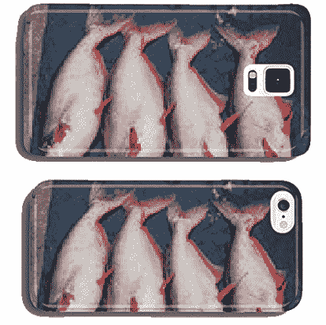
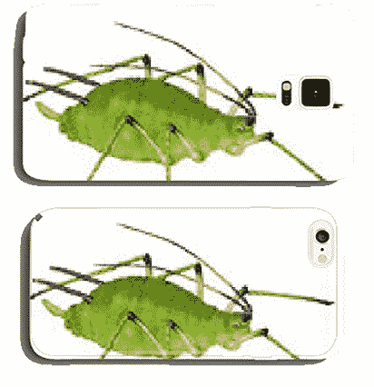
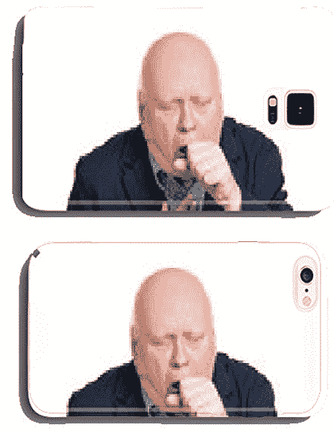
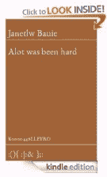
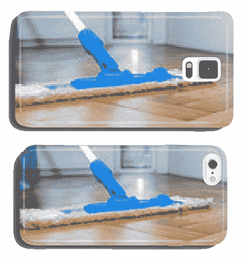

# 海洛因、勺子和注射器手机壳以及一个发疯的机器人列出的更多超现实的清单

> 原文：<https://thenewstack.io/heroin-spoon-syringe-phone-case-surreal-listings-bot-gone-mad/>

本周，在浏览亚马逊的手机外壳列表时，数据科学家拉塞尔·朱尼发现了“一个亚马逊案例机器人 AI 发疯了。”它在亚马逊上列出了 30，000 多个定制手机保护套，但它们显然是从库存照片中自动生成的——其中许多是*医疗*库存照片——导致出现了“海洛因、勺子和注射器手机保护套”等产品的列表

https://Twitter . com/kellyryanobrien/status/884132426435489793

“只有一个库存，”亚马逊咆哮道，并补充说“更多在路上……”很快其他 Twitter 用户分享了他们自己从同一供应商那里发现的奇怪东西。

*《卫报》*后来称他们为“[有史以来最糟糕的手机壳](https://www.theguardian.com/technology/shortcuts/2017/jul/11/the-automated-amazon-seller-making-the-worst-phone-cases-ever)”，问“如果无限多的猴子制造无限多的智能手机手机壳，他们最终会卖出一个吗？”但他们的记者认为这些图片是免费的，并补充说，至少从商业角度来看是可行的，因为“制作清单不需要任何成本。”

尽管你完成交易的可能性很小。

由于这个明显自动化的过程，这里有一些其他不太可能的图像被变成了手机外壳:

似乎购买的唯一可能原因是一种讽刺感。一位评论者在《卫报》的*上写道:“我可以想象赶时髦的人争相购买正在建设的混凝土化粪池或类似的图像。*

这些超现实的组合已经在亚马逊上引起了一些讽刺性的评论。

一位评论者写道:“感谢[成人尿布手机壳](https://www.amazon.com/adult-diaper-crutch-phone-iPhone6/dp/B01C1VM5SA/)让我变得前卫，在所有绵羊中脱颖而出。”

另一篇评论更加讽刺。“多年来，我一直在寻找一款简单而优雅的智能手机保护套，它描绘了一位老人穿着尿布，拄着拐杖蹒跚而行……”

其他人似乎惊叹于整个过程的独创性。“你可以通过对每张随机来源的照片只制作一个箱子来使它艺术化，”卫报的另一位评论者在*上建议，“让买家没有选择哪张照片会出现在那里，并收取至少 400 英镑。”*

“我不能确定这是极端的犬儒主义，还是绝对的天才，”另一个人补充道。“因此我得出结论，两者都是。”

但是另一位评论者发现整个现象非常令人沮丧。"我们真的不配作为一个物种生存下去."

本周晚些时候，Geek.com 注意到手机壳的供货情况变为“暂时缺货”或“目前无货……我们不知道这款产品何时或是否会有货。”

“没有关于卖家的细节，”他们的记者写道，并补充说，“仍然不清楚是谁或什么在运行这个账户。”

他们还想知道卖家是否真的是一个人类——也许有着奇怪的幽默感——他只是简单地将*伪装成了一个机器人。但对于一个小背景，请记住，如果真的是机器人生成这些奇怪的列表，这不会是第一次。早在 2012 年，数百本电子书开始出现在亚马逊的 Kindle 商店，除了从 YouTube 上剪切并粘贴的随机评论之外什么也没有。*

由此产生的书籍——标题如*、*和*、*通常爱什么苏什么的书——是由一种算法创造的，这种算法被设计成[一件行为艺术作品](http://traumawien.at/ghostwriters/),由两名柏林艺术家创作，以抗议新兴的“无意义经济”在他们看来，YouTube 的评论区是一个“交流垃圾工厂”,仍然以某种方式产生利润——通过出售用户免费生成的内容。

亚马逊最终识破了他们的计划，删除了这些作品——辩称计算机生成的电子书“[可能会导致糟糕的客户体验](https://www.techdirt.com/articles/20120613/03584719300/amazon-deletes-ebooks-automatically-generated-youtube-comments-leaving-many-questions-unanswered.shtml)同样的命运显然等待着 900 本直接从维基百科条目中剪切粘贴的电子书。一位名叫乔治·安德森的作家创作了一个名为“维基福克斯”的系列——尽管最后，他的评论很糟糕…

“毫无价值…半杯咖啡会更有价值…”

“这本‘书’只是维基百科页面的逐字副本……”

“你显然只是垃圾邮件机器的一部分，兜售这些劣质出版物，这些出版物只是免费资源的一部分，并出售给不知情的人……”

具有讽刺意味的是，他最终抽出时间[剪切并粘贴了一本关于奇点](https://web.archive.org/web/20120418071445/http://www.bloggingthesingularity.com/2011/07/29/singularity-a-wikifocus-book-by-george-andersen/)的书——这是一个假设的时刻，即社会被超级智能人工智能的广泛应用所改变。但是消费者保护最终摧毁了他的商业模式，因为在电子书的情况下，亚马逊承诺任何购买可以在七天内全额退款。

亚马逊最终彻底删除了大部分电子书。

随着本周超现实的手机外壳上市，它至少 100%清楚什么是提供销售。

即使它是一种没有消费者愿意购买的消费品。

# WebReduce

<svg xmlns:xlink="http://www.w3.org/1999/xlink" viewBox="0 0 68 31" version="1.1"><title>Group</title> <desc>Created with Sketch.</desc></svg>