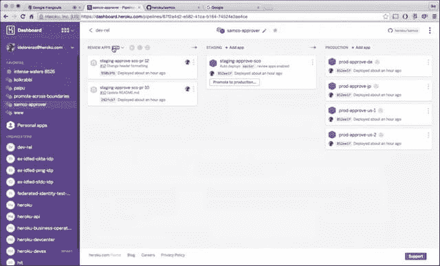

# Heroku 通过在 GitHub 上自动升级来支持 CI/CD

> 原文：<https://thenewstack.io/heroku-officially-embraces-cicd-automating-staging-github/>

在很短的时间内，GitHub 已经从一个开源项目中使用的文件共享工具，发展成为面向全球开源应用的项目支持系统。据 GitHub Inc .[估计，其服务在 2015 年](http://www.nextplatform.com/2015/09/24/inside-the-github-systems-where-open-source-lives/)从 1700 万个独立存储库扩展到 2600 万个，其成员在此期间增长了 25 %,达到 1000 万个账户。

版本和修订控制已经成为 GitHub 皇冠上的宝石。Salesforce 的 Heroku 是世界上第一个伟大的 PaaS 平台之一，因此，首先是一个命令行驱动的系统。在过去的几年里，Heroku 支持 GitHub 作为备用库，但主要是为了那些知道如何在 Heroku 的语法中用 GitHub 替代 Heroku 的开发人员的利益。

通常，当持续集成和持续部署的概念与特定产品混淆时，它就是 CloudBees 的 Jenkins。然而，通过在非常基础的级别建立版本控制，GitHub 已经被一些平台制造商用作持续集成/持续开发(CI/CD)的框架。与此同时，用 Heroku 构建 CI/CD 管道需要利用一个完全不同的平台，比如 CircleCI。

CI/CD 是这里的游戏规则改变者。首先，它在提交生产变更的过程中引入了安全措施，建立了过滤器和规则来防止未经测试和批准的情况下的变更。它防止正在运行的应用程序中断。

但是第二，它将管理员和 DevOps 专业人员带入了这个过程，利用了更符合这些群体期望的工具和工作风格，而不是原始的 Linux 命令行。

## “规定的解决方案”

去年 9 月，Heroku 推出了 [Flow，这是一个简化的、面向管道的结构](https://blog.heroku.com/archives/2015/9/3/heroku_flow_pipelines_review_apps_and_github_sync)，它使用一个纯粹的可视化系统实现 CI/CD，并不比在亚马逊 AWS 上提供服务更困难。当时，作为 Flow 的一部分，Heroku 推出了进入 beta 的管道。Pipelines 取代了与 GitHub 和 Heroku 交互时通常使用的冗长语言，它用一个图形系统描述了一个应用程序项目在其各自发展阶段的所有活动版本。

上周，Heroku 发布了全面可用的管道。为了纪念这一时刻，Heroku 首席执行官 Adam Gross 和产品经理 Ike DeLorenzo 向新堆栈展示了工作中的流程和管道。这更像是首席信息官(CIO)等高管可能欣赏的那种演示:更少的语法，更多的双击。

“我们试图做的是为我们的客户和开发人员提供一种规范性的解决方案，围绕他们如何拥有一种敏捷的、持续的交付系统，”Gross 告诉我们。

Gross 说:“在基础设施和 PaaS 的世界中，很多东西都留给了读者的想象力，对于组织来说，将所有正确的工具和流程缝合在一起，使他们能够拥有与生产力相适应的更现代的开发环境，这是非常具有挑战性的。”

格罗斯的意思是，许多目前 Heroku 的客户(更确切地说，是负责预算的人)没有看到 Heroku 和连续交付是如何联系在一起的——即使他们实际上已经看到了，通过那些语法繁重的命令行。

Heroku 流程和管道的工作方式是将每个应用程序的生命周期分成几个阶段——默认情况下，常见的三个阶段代表“开发”、“试运行(或测试)和生产”。为了更加清晰起见，Pipelines 将第一阶段保留给已经作为候选推送到 GitHub 的“审核应用”。

一旦 GitHub 存储库连接到 Heroku 管道，正如 Ike DeLorenzo 向我们展示的那样，在两者之间可以设计任意数量的连接点。当一个包准备好进行评估时，在 GitHub pull 请求过程中可能会发生这种情况。Pipelines 使 DevOps 能够将这些 pull 请求显示为 review 应用。

“通常当开发人员在 GitHub 中修改代码时，”DeLorenzo 解释道，“他们会创建一个 pull 请求。这个拉取请求被发送给团队中的其他人，每个人对它进行评估，然后有人批准这个拉取请求。这是 GitHub 上同行审批的核心工作流程。

“在审查应用程序之前，客户看着代码，猜测它可能如何运行，”他指出。"现在你可以在评论应用中看到它实际上是如何运行的."

每个审核应用程序(拉取请求)由一张卡片表示(可能是从 Trello 那里得到的提示)。评估 review 应用程序中的代码就是直接从卡中启动它；Heroku 在浏览器中自动升级应用程序。DeLorenzo 说，GitHub Inc .称这一功能为“将拉取请求带入生活”。

当开发人员对代码进行更改并提交这些更改时，DeLorenzo 展示了 Pipelines 如何自动化生成 pull 请求的过程。因此，这不是开发者在 GitHub 和 Heroku 中做了什么事情就能获得事件的问题；这是一个使用 GitHub API 的双向工作流程，直接与 GitHub 合作完成。

“这是 PaaS 作为一个行业第一次提供这种高保真度，”首席执行官 Gross 说。“在引擎盖下，我们不仅仅是在观察一个拉取请求或者看到代码是如何被改变的；实际上，我们正在利用这些新代码构建一个完整的端到端应用环境。”

## 推拉

DeLorenzo 认为，通过增加审查应用程序的拉请求数量，而不是堵塞 GitHub 管道，更多的开发人员被带入开源审查过程。“你包括设计师、产品经理和利益相关者，他们不编码，但可以点击查看运行的东西。”

但是，通过分阶段评审应用程序和分阶段“分阶段”应用程序(并给用户创建更多阶段的选项)，Pipelines 的新模型难道没有模糊传统 CI/CD 中明确的责任委托之间的区别吗？

“你是对的，因为你有这些容器和这些应用程序，它们在工作流程的不同阶段运行代码，”DeLorenzo 回应道。“区别在于工作流程。你可以让你团队中的一个程序员写一些疯狂的特性，你不确定你是否想在主分支中，这是作为拉请求创建的。该拉取请求可能被批准，然后被合并到暂存中；或者它可能被拒绝，它只是被删除和销毁。

“所以拉取请求实际上是在测试一个特性的个体工作，”他继续说道。"中间服务器是集成测试，不同拉取请求中所有这些特性的集成."

从 staging 开始，可以建立管道来触发一系列自动测试，类似于埃森哲平台在 Jenkins 内触发的那些[。通过这种方式，自动化服务可以在人工评估代码之前和/或之后评估代码，以满足一组基本的可靠性和安全性标准。一旦明确了阶段代码已经通过了所有的测试，在管道中，它可能会被“提升”到生产中。](https://thenewstack.io/the-year-behind-changing-perceptions-about-the-diffferences-between-faster-delivery-and-cicd/)

“这可能是整件事情中最令人兴奋的部分，”德洛伦佐说。对于公共云部署，升级可让开发运维人员根据自己的喜好选择可用性区域，用于优化或推广部署。

“一旦你已经构建了代码，并且已经在一个与生产环境非常相似的应用程序中进行了测试，那么它们在生产中失败的概率就非常低，”DeLorenzo 说。

GitHub 的用户将能够阅读 Heroku 生成的审计跟踪，详细说明拉请求作为审查应用程序的日期和时间，或者代码何时被“推送到主服务器”并构建在暂存中。Heroku 似乎明白 GitHub 用户不会仅仅因为一些 PaaS 将 GitHub 包装在 GUI 中就停止使用它。所以它在两者之间建立了联系。

这是一个工作流模型，至少目前来说，它非常适合应用程序的传统概念，而不是微服务概念，在微服务概念中，功能之间的交互没有类的界限。亚当·格罗斯意识到了这一点，他给我们的印象是，这是一场他愿意承担的赌博，以满足 Heroku 当前客户群的需求。

“我们推出这种产品的部分目标是看看人们会把它带到哪里，”格罗斯告诉我们，“这样我们就可以学习和适应。”

Ryan McFarland 制作的[阿拉斯加管道的标题图片，在知识共享 2.0 下获得许可。](https://commons.wikimedia.org/wiki/File:Alaska_Pipeline.jpg)

<svg xmlns:xlink="http://www.w3.org/1999/xlink" viewBox="0 0 68 31" version="1.1"><title>Group</title> <desc>Created with Sketch.</desc></svg>