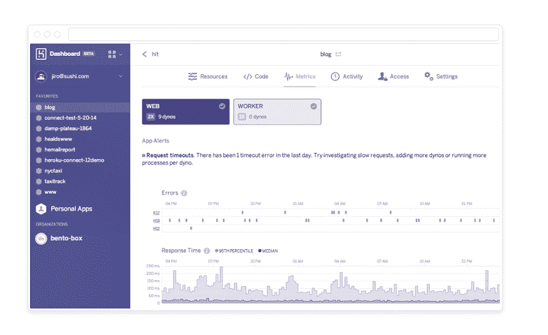

# Heroku 推出指标来帮助用户获得更好的应用性能

> 原文：<https://thenewstack.io/heroku-rolls-out-metrics-to-help-users-optimize-performance/>

Heroku 正在推出新功能，让用户更好地了解他们正在运行的服务，并提供如何提高性能的提示。这些功能已经在测试版中推出，但现在已经普遍可用。

付费的 Heroku 用户将开始获得显示响应时间、错误、每秒请求数、CPU 利用率和内存利用率的指标。

Heroku 的新仪表板和指标。

Heroku 的产品副总裁 Adam Gross 说，Heroku 认为响应时间对开发者来说特别重要。Heroku 向用户展示了平均响应时间以及第 95 个^(百分点的响应时间。他说，这些指标向开发者展示了平均用户体验是什么样的。)

但是 Heroku 不仅仅是展示这些指标，让用户知道如果响应时间慢了该怎么做。“我们会自动提供你应该做什么的建议，”他说。在某些情况下，用户只需要添加更多的资源。其他时候，用户可能会被建议对他们的应用程序进行一些调整。

Heroku 还在其 Postgres 数据库服务的基础上提供了一系列服务，旨在为他们提供更多的洞察力。Gross 说，对于数据库开发人员来说，找出使用了过多资源的进程是一项挑战。例如，他们花费大量时间来识别占用最多 I/O 或最占用内存的查询。

Heroku 提供的 Postgres 指标截图。

Postgres metrics 特性将突出显示数据库中的“热点”,以便开发人员能够发现他们可以对 SQL 或模式进行更改以提高性能。“回答我需要优化哪些查询是一个难以捉摸的问题，”Gross 说。“我们正努力让这变得尽可能简单。这在今天是可能的，只需要数据库管理员真正的专业知识和一整套工具来处理这些数据。”

除了新的指标，Heroku 正在推出其改进的仪表板，并谈论其“[部署到 Heroku 按钮](https://blog.heroku.com/archives/2014/8/7/heroku-button "Heroku")Heroku 大约一个月前推出的按钮，让企业在网站上放置一个图标，允许任何人点击它，立即在 Heroku 上配置和实例化一项服务。

迄今为止，包括优步、Twilio 和 DropBox 在内的开发者已经在 400 个项目中使用了这一功能。Heroku 正在维护一个目录，任何人都可以在其中查找已经创建的按钮。

图片来自 Heroku

<svg xmlns:xlink="http://www.w3.org/1999/xlink" viewBox="0 0 68 31" version="1.1"><title>Group</title> <desc>Created with Sketch.</desc></svg>