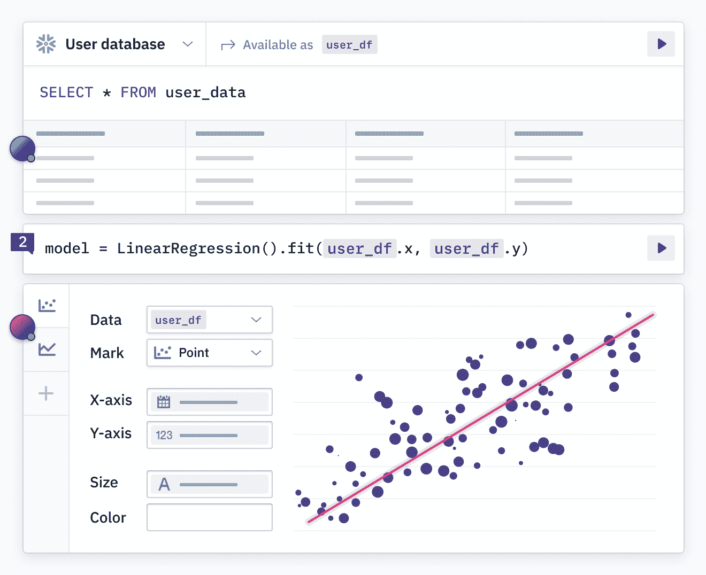
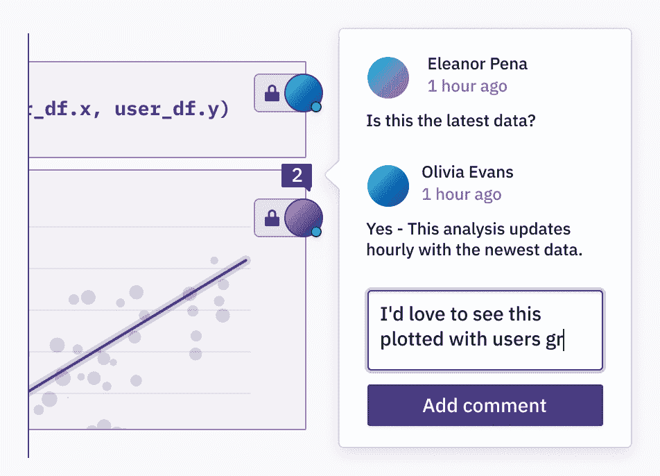
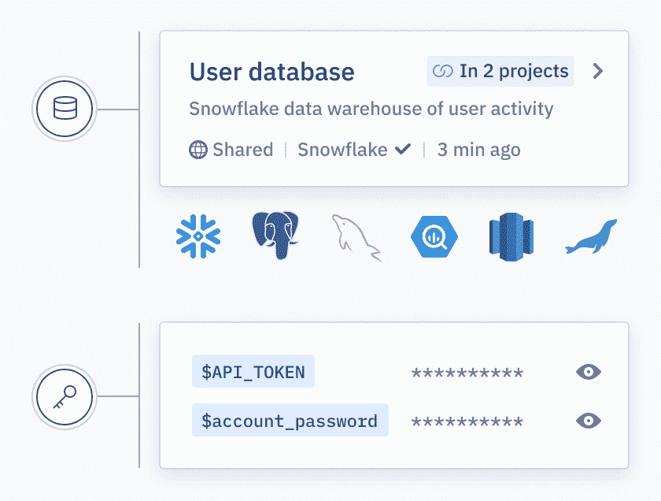

# Hex 希望为现代数据堆栈构建前端

> 原文：<https://thenewstack.io/hex-wants-to-build-the-frontend-for-the-modern-data-stack/>

Google Docs 为文字处理所做的，Figma 为界面设计所做的， [Hex](https://hex.tech/) 希望为数据科学所做的。也就是说，使用基于 web 的用户界面，使数据科学和分析成为一个协作过程。

我与 Hex 首席执行官 [Barry McCardel](https://www.linkedin.com/in/barrymccardel/) 谈论了数据堆栈在 2020 年将如何变化，以及这对数据科学家的常用工具数据科学笔记本电脑意味着什么。

“我们认为自己是构建现代数据堆栈的前端，”McCardel 开始说道。虽然这是最终目标，但实际上 Hex 属于被称为[数据科学笔记本](https://datasciencenotebook.org/)的一类工具。它与其他类似产品竞争，如 Jupyter、亚马逊 SageMaker 和谷歌 Colab。编程笔记本实际上至少从 20 世纪 80 年代末 Mathematica 推出时就已经存在了。但是在现代云计算时代，开源的 Jupyter 笔记本已经成为数据科学笔记本行业的旗手。Jupyter 项目于 2014 年推出，作为 IPython(交互式 Python)的副产品。

“我认为本质上，笔记本真的只是一种能够进行迭代分析的非常好的方式，”McCardel 告诉我。“它基本上是把你的代码分成块，叫做单元。所以你有可重新运行的单个程序块。这些块既可以作为一个小单元运行，也可以向您显示输出。这确实是笔记本电脑格式的核心创新之一，我可以运行一小部分代码，看看它能做什么——也许我看到的是一个图表，或者一个表格，或者只是一个结果集，或者其他任何东西。”

然而，McCardel 认为 Hex 不仅仅是一个笔记本，或者是“云中的 Jupyter”(这是他对 Hex 的一些竞争对手的分类)。“我们从客户那里看到的是，他们不只是在寻找笔记本电脑解决方案，”他说。“他们在寻找一些有助于他们分享、有助于他们吸引不同背景和利益相关者的东西。”

## Hex 用户不仅仅是数据科学家

Hex 试图将自己定位为不仅是数据科学家的工具，也是数据分析师和商业智能(BI)角色的工具——这两者都不太技术性，更侧重于商业。

在 Hex 中，用户可以使用无代码接口，或者用 SQL 或 Python 进行查询。数据科学家传统上使用 Python，但根据 McCardel 的说法，Hex 用户未必如此。

“哦，数据科学家是高端技术人员，使用 Python，而 SQL 是次要的，这种想法根本不正确！SQL 确实擅长很多事情。你会和很多主要使用 SQL 的数据科学家交谈，这很酷。这并没有降低他们作为数据科学家的地位。(用 SQL)可以做很多非常棒的事情。”

不过，很明显，Hex 瞄准的是一个比那些只关注数据科学家的竞争工具更广阔的市场。这让人想起了近年来在企业开发市场上出现的许多流行的低代码平台，其中大多数也是针对商业用户的。

关于 Hex 的目标用户，McCardel 说:“我们希望所有技术水平的人都能轻松使用它。“只有基线数据知识和好奇心的人，可能来自电子表格或 BI 工具的人。”

我问，Python 用户也采用十六进制吗？

“是的，这是 Jupyter 能做的一切，甚至更多。如果你是从事基于 Python 的数据科学工作的，Hex 将会是熟悉而强大的，给你带来许多新的超能力。”

## 十六进制如何适应数据堆栈

Hex 另一个有趣的方面是，它似乎已经与另外两家现代数据公司联手。两个领先的数据仓库 Snowflake 和 Databricks 都是 Hex 在三月份的最近一轮融资[的投资者。所以我问 McCardel，一个数据专家如何将 Hex 与其他一个或两个工具一起使用？](https://hex.tech/blog/series-b)

“因此，Hex 位于这些环境之上——位于雪花之上和数据块之上——并帮助客户充分利用这些环境中的数据。如果您已经将所有数据放入数据仓库，包括这两个数据仓库，通常下一个问题是:现在该怎么办？我如何使这一点对组织有用和有影响？Hex 真的试图回答这个问题。”

不过，最终很大程度上取决于 Hex 模仿 Google Docs 和 Figma 的能力，成为一个用户友好的工具，也提供足够的魅力让高级用户满意。在这种情况下，数据科学家就是超级用户。

McCardel 钦佩 Figma 如何“允许设计师分享他们的工作，并让其他人作为利益相关者参与到这个过程中来”，他希望在 Hex 中为数据科学家实现这一目标。不仅如此，他说，Figma“将这些人(利益相关者)转化为编辑。”用户成为系统的创造者，而不仅仅是观众。

“所以当我看到这种事情在 Hex 中发生时，我真的很兴奋，”他继续说道。“我们看到工程师、产品经理和其他人加入进来，实际上成为了编辑。Hex 不仅仅是高端数据科学家的专利。”

## 数据堆栈的下一步是什么

最后，我们讨论了数据堆栈的发展方向。有了像 Snowflake、DataBricks 和现在的 Hex 这样的工具，企业用户可以使用的工具变得越来越复杂，并且可以通过 web 轻松访问。我很好奇麦卡德尔对接下来会发生什么的想法。

“过去几年是数据世界和集成故事的革命，”他说。“我使用 Fivetran、Stitch 或 Airbyte 将我的数据从 source 导入我的仓库。现在我的数据在我的仓库里，我可以使用 DBT[数据构建工具]来转换它。我可以使用观察工具来监控质量。[……]我可以以任何比例存储它。我可以运行任何规模的查询，您不再需要担心配置服务器。我从事数据工作已经有 10 年了，这和 10 年前有着天壤之别。这就像是一个组织能够将我所有的数据都放在一个地方，并对其进行集成、清理和准备。”

然而，他补充道，故事还没有结束。他认为云数据革命的下一部分将是前端工具，或者如他所说，“数据栈的新前端是什么。”

Hex 显然对数据栈前端虎视眈眈，但我们只能等待，看看它是否能像 Figma 一样在接口设计方面占领市场。

<svg xmlns:xlink="http://www.w3.org/1999/xlink" viewBox="0 0 68 31" version="1.1"><title>Group</title> <desc>Created with Sketch.</desc></svg>