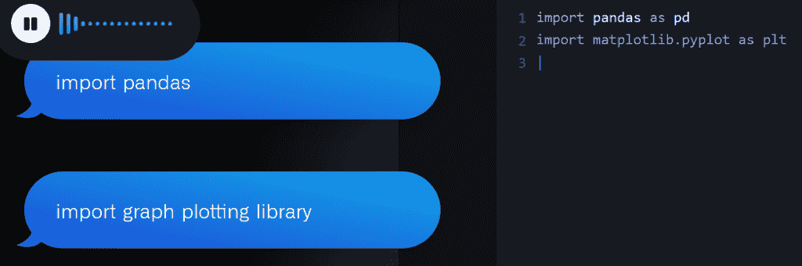
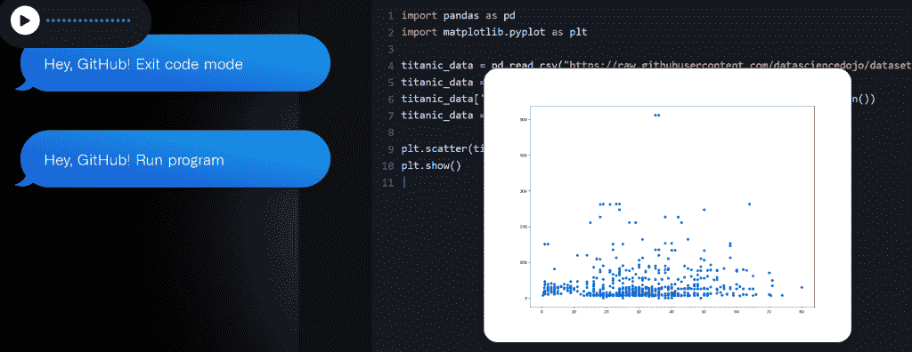

# 嘿 GitHub！尝试 Copilot 的语音界面

> 原文：<https://thenewstack.io/hey-github-tries-a-voice-interface-for-copilot/>

GitHub 揭秘已经两周了"[嘿，GitHub！在旧金山举行的年度](https://githubnext.com/projects/hey-github) [GitHub Universe](https://githubuniverse.com/) 会议上，”——GitHub Copilot 的新语音界面。

但是它产生了一些兴奋…

GitHub 的研究人员[拉胡尔·潘迪塔](https://githubnext.com/team/rahulpandita/)在上周的一次电子邮件采访中说:“我们被压倒性的支持和热情所感动。"自从在 Universe 上发布以来，已经有近 7000 人加入了技术预览的等候名单."

自 2021 年以来，Pandita 一直是 GitHub Next 项目背后的团队的一部分，此前他曾在 Phase Change Software 为 COBOL 程序员开发人工智能助手。Pandita 现在认为，数以千计的 Hey，GitHub 技术预览版注册“显示了社区对工具的渴望，这些工具可以提高所有开发人员的生产力，并使使用键盘有困难的人更容易使用编码。”

“少打字，多编码，”GitHub 为项目设计的[新网页解释道，吹捧一个实验性的新工具，承诺让开发者“不用键盘就能写代码”](https://githubnext.com/projects/hey-github)

但是在我们的采访中，Pandita 强调这不仅仅是一个新奇的东西，而且这个项目的首要任务之一是为需要无障碍界面的社区服务。“我们让人们在滚动的基础上进入技术预览，并努力确保我们有足够多的开发人员在使用键盘上有困难。”

## 改变我们的工艺

“‘嘿，吉图布！’仍然是一个实验，GitHub 还没有任何公开发布的计划。

这只是 GitHub Next 的几个项目中的一个，一个小组在其网页[上将其描述为“GitHub 的一个研究人员和工程师团队，探索超越邻近可能性的事物。来自 GitHub Next 的一些其他项目包括](https://githubnext.com/) [GitHub Blocks](https://blocks.githubnext.com/) ，用于创建交互式代码库、文件夹和文件，从搜索窗口和工作流界面到可嵌入的图表和数据可视化，应有尽有。还有 GitHub Copilot CLI，它使用 Copilot 的功能为您的命令行建议输入。

但是是声音编码激发了潘迪塔和他的团队的想象力。“如果 GitHub Copilot 是我们的结对程序员，为什么我们不能和它对话？”GitHub 的首席执行官在他的博客中问道，并补充道“这正是 GitHub Next 团队努力的方向。”

该项目的官方网页展示了其将简单英语命令立即翻译成代码的能力。它可以回应任何事情，从“嘿，GitHub！插入新行”和“导入图形绘图库”到更复杂的命令，如“从 titanic 数据中清除年龄为空的记录”和“用平均列值填充列 Fare 的空值”

网页上的一个视频也显示了它对更一般的命令的反应，比如“定义一个接受用户三个数字作为输入的函数”

“嘿，GitHub！”can 还可以跳转到代码中的特定位置—只需说出行号、方法名或“下一个块”。程序员不需要在堆栈溢出中搜索正确的语法，而是可以让代码自动从口头的简单英语命令中生成，比如“return a Boolean”(“如果你不喜欢生成的内容，用简单的英语要求改变，”它的网页解释道。)你甚至可以要求它解释一段代码是做什么的，只要要求它并提供行号。“嘿，GitHub！解释第 3 行到第 10 行…”

当用户退出代码模式，运行程序，并在散点图上看到他们所有的数据时，演示达到了高潮。

它得到了一位测试用户的好评。在一个视频中(分享在“嘿，GitHub”网页上)，微软软件工程师 Beatrice Tohnia 称这个工具“完全不同于我以前用过的任何东西”。你实际上是从你想做的事情开始，然后告诉计算机，它会为你创建代码……”

“以后您仍然可以编辑代码。它只是跳过了许多繁琐的中间步骤。

[https://www.youtube.com/embed/rwN7bYhF2_Q?feature=oembed](https://www.youtube.com/embed/rwN7bYhF2_Q?feature=oembed)

视频

## 未来事物的形状

在视频的最后，开发人员预测这将是我们用来编写代码的工具的更大革命的一部分。“我认为‘嘿，GitHub’和类似的东西将成为每个人的编码未来——因为技术将变得太强大而无法使用。”

GitHub 首席执行官托马斯·多姆克(Thomas Dohmke)也试图将该项目放在一个更大的背景下，他在[的一篇博客文章](https://github.blog/2022-11-09-everything-new-from-github-universe-2022/)中回忆道，GitHub 上第一行代码的提交仅用了 15 年时间，并且“从那时起，我们的目的就是为开发者提供他们所需要的一切，让他们做到最好。”

“我们正处于一个转折点，是时候开始新的开发者体验了。”

首席执行官多姆克在 LinkedIn 上的帖子中对即将到来的革命更加具体。“人工智能将是自开源兴起以来对软件开发本质的最大改变，Copilot 的语音编码人工智能是这一根本变化的另一个明显例子。

“很快，编写整行代码就像说‘嘿，GitHub！’—然后你就要去参加比赛了。"

多姆克的[博客帖子](https://github.blog/2022-11-09-everything-new-from-github-universe-2022/)甚至认为，这是推动 Copilot 更易使用的一部分，假设人工智能本身“将很快融入开发者体验的方方面面”

尽管目前它只适用于 VS 代码。

GitHub 正在邀请感兴趣的开发者参与研究和测试。“我们正在寻找人们来帮助我们进一步完善这个实验，”Pandita 上周在 LinkedIn 上[发帖，分享了“技术预览”注册和该项目的官方 Discord 服务器的 URL。](https://www.linkedin.com/feed/update/urn:li:activity:6998717721420992513/)

<svg xmlns:xlink="http://www.w3.org/1999/xlink" viewBox="0 0 68 31" version="1.1"><title>Group</title> <desc>Created with Sketch.</desc></svg>