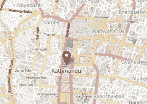

# 嘿，马克·安德森，尼泊尔的开发者和创业场景值得一看

> 原文：<https://thenewstack.io/hey-marc-andreessen-the-developer-and-startup-scene-in-nepal-is-one-to-watch/>

嘿，马克！你最近一直在说硅谷应该有[变化](http://blog.pmarca.com/)。嗯，有一个社区，不在美国，你应该知道。他们没有按照硅谷的 方式复制 自己 ，但是 他们有足够的才华回国，你会 聪明 至少来看看他们在这里做什么。让我告诉你我在加德满都观察到了什么。

加德满都有越来越多的开发者和初创企业，原因有很多。首先，这是自 2006 年以来重建的信任的结果，当时尼泊尔的民主运动导致了该国众议院的重建。从那以后，源源不断的技术专家 回到尼泊尔，在自己的家乡硅谷和印度、新加坡等发达国家接受教育并获得工作经验。

### 介绍

在我深入这个故事之前，请让我介绍一下我自己。我叫 Atul Jha，是印度孟买新堆栈的社区经理。我在印度北部靠近尼泊尔边境的比哈尔邦长大。我从家乡的朋友和孟买的开发商那里听说了加德满都正在发展的技术领域。我在那里搜索了一些初创公司(我在[AngelList](https://angel.co/)上找到了大约 16 家)，然后坐了三个小时的公交车来到这座位于喜马拉雅山脚下的城市，和家人呆在一起，并与我在网上找到的这些人见面。

到达后，我雇了一名摄像师，花了一周时间与开发人员、初创公司创始人和首席技术官交谈。在接下来的几天里，我将发布一些关于我遇到的技术专家的信息，他们正在创建的 堆栈 ，他们面临的挑战，以及一些关于工作文化的信息，还有一些关于创业办公室的视频。

尼泊尔的多山地形有助于定义你所说的如此重要的技术主题。半个多世纪前，硅定义了你所在的世界。这里定义技术文化的是 地理数据 。这不是企业推动的努力。这是这里的土地经常需要几天跋涉的结果。地理数据 ，借助[开放街道](https://www.openstreetmap.org/?mlat=27.7079&mlon=85.3154#map=14/27.7080/85.3154)

为了了解这个社区，我采访了六位初创公司的创始人和首席技术官，询问他们的技术。下面列出的这些公司可能没有最先进的服务，但它们是对构建新堆栈兴趣高涨的好例子。这个社区开始发展生态系统，改变喜马拉雅山脚下这片美丽土地的经济面貌，这只是时间问题。

https://www.youtube.com/watch?v=30qM8tEHvQ4

[Grepsr](http://www.grepsr.com/):一个 8 人的小团队，从事网络抓取和数据提取服务。新栈亮点:Elasticsearch、MongoDB、M emcached 带有一个运行在PHP Zend 框架 上的核心产品。

[Sparrowsms](http://sparrowsms.com/):20 人团队，Sparrowsms是尼泊尔领先的增值服务和短信网关提供商之一。新的堆栈亮点:Kannel，一个开源的 WAP 和 SMS 网关，以及 PHP，MySQL，Ng inx 和 Apache Web Sever。

[pico Vico](http://www.picovico.com/en/home):一个 10 人团队，提供将图片集转换成视频相册的解决方案，并提供模板和音乐。他们正在使用 OpenGL 和各种云计算服务。

11beep: It 是 社交网络 融合了 蜉蝣 和匿名性，专为 移动 提供 平台 供人们享受无拘无束的自由表达。他们使用 Python 中的金字塔框架，以 Postgres 作为他们的数据库。

[视频兴趣](http://vidinterest.tv) :该服务允许您将多个来源的视频加入书签，创建播放列表以共享或保留隐私，并建立自己的社区。目前该产品由三名 人 管理。该解决方案使用 PHP、MySQL 和 Rackspace 云托管。

[Taranga](http://taranga.com.np):最近上线的四人团队，Taranga正在致力于一个使用 Arduino 的开放硬件服务。他们正在研究一种解决方案，这种解决方案将赋予计算机知识并传播开来。

Marc，尼泊尔离成熟的技术市场还有很长的路要走。2600 万人口中约有 27%可以上网。但是大约 72%的人有移动设备。种子基金的概念很少，但有一个运动，投资于彼此的项目，以帮助推动他们的增长。

值得注意的是，旧金山和硅谷反映了世界其他地区的情况。深度创新来自硅谷。但是新的书库正在加德满都和世界其他地方建造。这些新的堆栈正在改变我们的工作和生活方式。

有机发展正在使尼泊尔成为一个创业和开发者的社区。我鼓励你 去 一趟。这里有很多迹象表明，它不仅仅是硅谷的一个变种。它有自己的社区，就像你在旧金山或任何其他技术中心找到的任何开发者社区一样充满激情。他们真正需要的是更多的关注，或者至少是一些投资者愿意听他们说些什么。

New Stack 创始人亚历克斯·威廉姆斯编辑并促成了这篇文章。

通过 知识共享上的 Flickr 功能图片[。](https://www.flickr.com/photos/mikebehnken/5136942634/in/photolist-8PWb5s-dWXFvF-8XJC7K-6WhoV9-dRnFzE-ckNxmU-vCeZZ-dR8vNj-bXUfT3-82y8PD-nwZ9Vm-72BU-8XJzZ8-6w36xp-5sgEJR-4NnV3g-e3n6zd-4rYdiF-72BY-9F4iN-63xNve-7AXCvH-5VF9S5-bvJxUm-6FngFw-faJGwh-4NnWf8-8CsijZ-6VbVyb-vCeTa-5Ks4oR-8YmBr1-nvaeRp-dThSkn-4akRSq-fUCq36-kZdkk-8XfBRo-4NnWLX-6XZFMc-5VUHaP-7sxkNR-7JU45g-8hzvyg-6X9je4-4NnW7a-62n8uu-aiDxDT-9DkZ5-5CMYRP)

<svg xmlns:xlink="http://www.w3.org/1999/xlink" viewBox="0 0 68 31" version="1.1"><title>Group</title> <desc>Created with Sketch.</desc></svg>