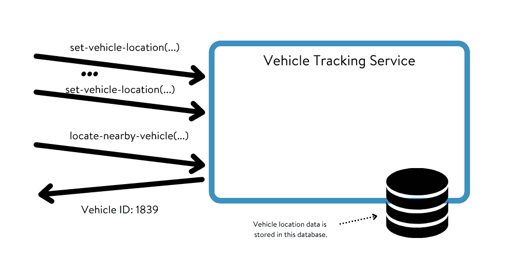

# 嘿服务，你的数据在哪里？

> 原文：<https://thenewstack.io/hey-service-where-is-your-data/>

[](https://www.linkedin.com/in/leeatchison/)

 [李·艾奇逊

李是云计算领域公认的行业思想领袖，也是畅销书《面向规模的架构》的作者，该书由 O'Reilly Media 出版。Lee 拥有 34 年的行业经验，其中在 New Relic 工作了 8 年，在亚马逊和 AWS 工作了 7 年。](https://www.linkedin.com/in/leeatchison/) [](https://www.linkedin.com/in/leeatchison/)

*当您构建一个大型的多服务应用程序时，决定将数据放在哪里与决定如何设计应用程序本身一样重要。*

架构服务和基于微服务的架构的一个基本但经常被忽视的方面是决定您的应用程序数据驻留在哪里。数据是否驻留在服务中？是否与其他服务共享？它在共享的中央数据库中吗？

无论您是在构建一个新的应用程序，还是将现有的应用程序迁移到基于服务的架构，记住您在应用程序或系统中存储数据(以及应用程序状态的其余部分)的位置都是至关重要的。

## 无状态服务

并非所有服务都利用存储的数据。许多服务不使用任何存储的数据，它们不维护状态信息。当调用服务或从其他来源引用数据时，他们执行工作所需的所有数据都被传递到服务中。服务本身不维护状态。

以执行简单数学计算的服务为例。在本例中，该服务获取一对纬度/经度坐标，并确定这两点之间的距离。对该服务的调用可能如下所示:

```
find-distance?(start:(48.590870,  -122.937424),end:(37.333041,  -121.932043))  ->  (miles)

```

该服务采用两组坐标，并将它们转换成距离。该服务执行计算，但是除了传递给服务的数据(坐标)之外，不需要其他数据。该服务不需要维护任何状态信息。

[](https://cdn.thenewstack.io/media/2021/04/74b0a9f2-image1.png)

图一。无状态服务

无状态服务为伸缩提供了巨大的优势。因为它们是无状态的，所以通常很容易向服务添加额外的服务器容量，以纵向和横向扩展到更大的容量。如果您的服务不维护状态，您可以在如何以及何时扩展您的服务方面获得最大的灵活性。

此外，如果缓存不需要关心服务状态，那么服务前端的特定缓存技术就成为可能。这种缓存让您可以用更少的资源处理更高的扩展需求。

显然，并不是所有的服务都可以变成无状态的，但是对于那些可以是无状态的服务来说，这是一个相当大的优点。

## 有状态服务

有状态服务是一种需要在应用程序的生命周期中保留数据(应用程序状态)的服务，并且对该服务的多个请求使用该数据。

举个例子，有一项服务可以跟踪车队中运输车辆的位置。对这种服务的调用可以是告知服务特定车辆所在位置的调用，例如:

```
set-vehicle-location(vehicle-id:  133928,  location:  (48.590870,  -122.937424))

```

然后，可以通过请求特定车辆的位置来定位该车辆:

```
get-vehicle-location(vehicle-id:  133928)  ->  (lat,long)

```

或者，查找离给定位置最近的车辆:

```
locate-a-nearby-vehicle(location:  (37.483577  ,  -122.225983  ))  ->  (vehicle-id)

```

该服务执行了一个有用的功能，但是为了实现这些命令，该服务必须维护数据——车辆及其当前位置的列表。这些数据存储在数据库中，由服务用来执行其操作。

这是一个有状态的服务。

[](https://cdn.thenewstack.io/media/2021/04/ebba2afc-image2.png)

图二。有状态服务

有状态服务更难扩展，因为这不仅仅是增加 CPU 能力来处理更多请求的问题。您还必须考虑数据存储在哪里，以及如何扩展保存数据的数据库。这使得扩展服务的能力变得复杂。

## 在哪里存储数据

当您构建需要数据的服务时，将数据存储在尽可能少的服务和系统中似乎是显而易见的——使尽可能多的服务成为无状态服务。这可能会导致您将所有数据集中在一个位置。理论上，将数据保持在一起可以减少存储数据的服务数量。

没有什么比这更偏离事实了。

相反，在构建基于服务的架构时，尽可能将数据本地化是非常重要的。让服务和数据存储仅管理执行工作所需的数据。在上面的示例中，存储指定车辆在车辆定位服务中的位置的数据。

这往往会将您的应用程序数据分散到大量的服务中，使数据更接近需要数据的服务。

以这种方式本地化数据有几个好处:

*   ***减小单个数据集的大小*** 。因为您的数据被拆分到分布在多个服务上的数据集，所以每个数据集的大小都较小。较小的数据集意味着减少了与数据的交互，使数据库的可伸缩性更容易。这被称为*功能划分*。您正在根据功能线而不是数据集的大小分割数据。
*   ***本地化访问*** 。当您访问数据库或数据存储中的数据时，通常会访问给定记录或一组记录中的所有数据。通常，很多数据对于给定的交互来说是不需要的。通过在多个较小的数据集中使用数据，可以减少每个查询中不需要/未使用的数据量。
*   ***优化访问方式*** 。通过将数据拆分为不同的数据集，可以优化适合每个数据集的数据存储类型。特定的数据集需要关系数据存储吗？或者简单的键/值数据存储可以接受吗？将您的数据与使用这些数据的服务相关联将创建一个更具可伸缩性的解决方案，更易于管理架构，并允许您的数据需求随着应用程序的增长而更容易地扩展。

## 用您的服务构建您的数据

设计一个大型的、高度可伸缩的 web 应用程序是一项复杂的任务。有时，您必须做出看似错误的决策，但最终会提高应用程序或服务的可伸缩性，从而提高可用性。

确定您的数据架构就是这些任务之一。在设计应用程序和组成应用程序的服务的结构时，必须考虑这些服务的数据需求。

扩展您的数据存储和访问非常困难，并且您的数据架构会极大地影响您的数据可伸缩性。即使您使用高度可伸缩的数据库，如 AWS DynamoDB 或蟑螂实验室的 CockroachDB，您也需要注意您的数据架构以满足您的伸缩需求。

*O ' Reilly 的《面向规模的架构设计》的两章免费摘录 **[可供下载](https://www.cockroachlabs.com/guides/oreilly-architect-for-scale/)** **。***

<svg xmlns:xlink="http://www.w3.org/1999/xlink" viewBox="0 0 68 31" version="1.1"><title>Group</title> <desc>Created with Sketch.</desc></svg>