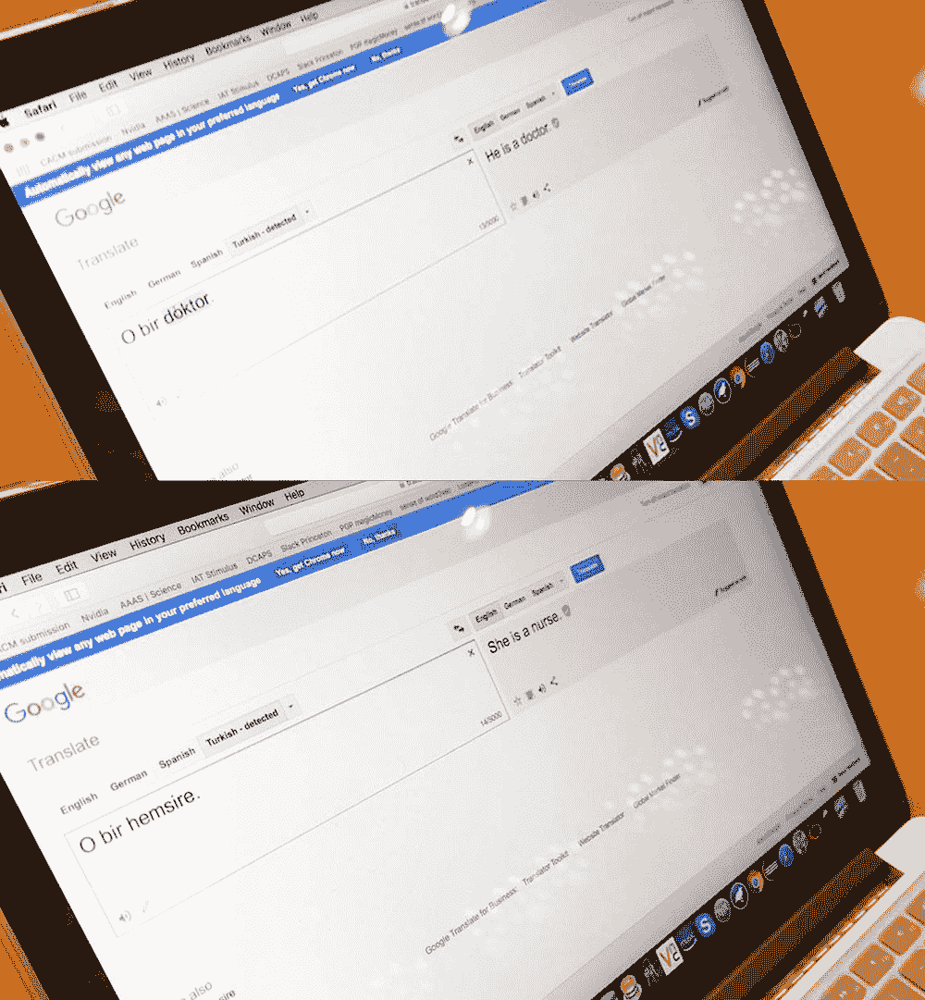
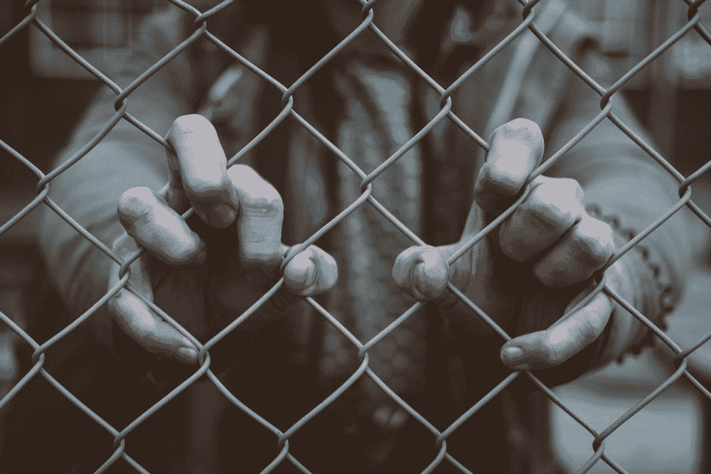

# 数学清洗:算法如何隐藏性别和种族偏见

> 原文：<https://thenewstack.io/hidden-gender-racial-biases-algorithms-can-big-deal/>

学者们早就指出，语言的结构和使用方式可以透露出说这些语言的人的世界观:他们相信什么，他们认为什么是神圣的，以及他们的偏见是什么。我们知道人类有自己的偏见，但相比之下，我们中的许多人可能会有这样的印象，即机器在某种程度上天生是客观的。但这种假设适用于新一代智能的、由算法驱动的机器吗？这些机器正在学习我们的语言，并从人类生成的数据集进行训练？由于是由人类设计的，并且通过学习[自然人类语言](https://en.wikipedia.org/wiki/Natural_language)，这些人工智能机器会不会也发现一些人类的偏见？

看起来机器能够也确实吸收了人类的偏见，无论这些偏见是基于种族、性别、年龄还是审美。专家们现在正在寻找更多的证据来支持这种[算法偏差](https://en.wikipedia.org/wiki/Algorithmic_bias)的现象。作为帮助机器学习、推理、识别模式和独立执行任务的指令集，算法越来越多地渗透到我们的生活中。在这个世界上，算法已经成为许多可能永远改变生活的重大决策的基础，研究人员发现，许多算法并不像我们假设的那样客观。

艾的词汇联想形象:“医生”是从土耳其语翻译过来的“他”，“护士”是“她”(Via:普林斯顿大学)

## 反馈回路

在最近的一项[研究](https://www.princeton.edu/news/2017/04/18/biased-bots-artificial-intelligence-systems-echo-human-prejudices)中，该研究用 220 万个单词训练了一个现成的机器学习 AI 系统，[普林斯顿大学](https://www.princeton.edu/)的研究人员使用了一种单词关联技术来绘制该系统在单词和概念之间会有什么样的联系。它发现，系统会将“花”和“音乐”这样的词比“昆虫”和“武器”这样的词更令人愉快。

但更能说明问题的是，该系统如何将欧美名字解释为比非裔美国名字更令人愉快，或者它如何将“女人”和“女孩”与艺术联系在一起，而不是科学和数学。在分析自然语言学习过程中产生的联系时，机器学习系统确实似乎采取了一些人类可能支持的现有性别和种族偏见。

这些发现的性质在另一项实验中得到了印证，该实验显示，与女性相比，男性更有可能被展示给有针对性的高薪职位广告。

“在所有机器学习帮助感知任务的情况下，令人担忧的是，如果机器学习复制人类的偏见，它也会将这种偏见反映到我们身上，”普林斯顿计算机科学家和[论文的](http://science.sciencemag.org/content/356/6334/183)作者之一 [Arvind Narayanan](http://randomwalker.info/) 在 IEEE Spectrum 上说。"也许这将进一步造成一个反馈循环，使这些偏见永久化."

## 选举，贷款，工作

乍一看，这些潜在的偏见似乎没什么大不了的，但现实世界的后果实际上可能相当严重。这些影响可能包括社交媒体新闻背后的推荐引擎，这些引擎会显示有针对性的信息，最终可能会左右选举。

潜在的数字借贷软件算法的偏见也可能歧视人们，给他们较低的信用评级，因为[因素与他们的个人信誉](https://www.npr.org/sections/alltechconsidered/2017/03/31/521946210/will-using-artificial-intelligence-to-make-loans-trade-one-kind-of-bias-for-anot)无关，如他们的社交媒体联系，他们购买的东西，他们的 SAT 分数，他们是否吸烟，或者他们在短信中是否正确使用标点符号。

这些因素之间可能存在松散的关联，但这并不一定意味着因果关系。“[数字贷款人]吹嘘他们在一定程度上根据人们使用标点、大写和拼写的能力来评分，这显然是教育质量的一个代表，”前数学教授、现领导一家算法审计公司[的凯茜·奥尼尔在美国银行家 T5 的](http://www.oneilrisk.com/) [*上指出。“这与信誉无关。一个不识字的人仍然可以支付他们的账单。”*](https://www.americanbanker.com/news/can-ai-be-programmed-to-make-fair-lending-decisions)

同样的担忧也适用于帮助公司将申请人与职位空缺匹配的申请人跟踪软件。机器学习算法可以用来过滤和剔除大部分简历——根据一个来源，高达 72%——甚至在人类看到它们之前。问题是，如果存在人类偏见——不管是不是有意的——这类项目可能会以基于性别、种族、年龄或残疾的歧视而告终，这是违法的。

虽然招聘软件可以节省人力资源部门的时间和金钱，但问题是很难完全理解所有这些软件中的底层算法是如何工作的，即使对它们的创造者来说也是如此。这些算法通常是专有的，公司通常不太清楚它们是如何运行的。

## 

## 算法错误标记

也许一个人可以忍受得不到理想的工作。但是，在为刑事司法系统所做的自动风险评估报告中，改变生活的潜在后果非常突出。这些报告上的分数评估了哪些囚犯最有可能再次犯罪，并被法院用来决定谁应该获得假释，或替代治疗，或释放。正如最近的 *ProPublica* [报告](https://www.propublica.org/article/machine-bias-risk-assessments-in-criminal-sentencing)所揭示的，一个生成风险评估的程序背后的算法错误地给黑人评分的可能性是高风险累犯的两倍，而将白人(他们后来会犯下更多罪行)错误地标记为低风险罪犯。

“这是机器学习的一个非常普遍的问题，”加州大学伯克利分校的计算机科学家[莫里茨哈特](http://mrtz.org/)在 [*科学新闻*](https://www.sciencenews.org/article/machines-are-getting-schooled-fairness) 上说。“你很可能会陷入一个存在公平性问题的境地(即使算法不是故意这样设计的)。这与其说是例外，不如说是默认。”

在另一个例子中，使用过去犯罪的时间和地点的数据，可以使用“[预测警务](https://thenewstack.io/predictive-policing-real-just-not-effective/)”算法来预测未来犯罪可能发生的时间和地点。这些预测然后被执法部门用来决定巡逻队应该去哪里和什么时候去。但正如一些专家指出的那样，问题是犯罪可能发生在一个城市的任何地方，这种算法方法可能会导致警方过于依赖有偏见的算法，促使他们不公平地针对某些街区或描述某些人，从而形成一个自我延续的循环。

到目前为止，几乎没有证据表明风险评估报告和预测性警务模式在预防犯罪方面是有效的。正如[人权数据分析小组](https://hrdag.org/people/william-isaac/)的分析师威廉·伊萨克在*的一份报告中指出的:“他们没有预测未来。他们实际上预测的是下一次警方记录的观察将会发生在哪里。”*

 *## 偏差校正和“数学清洗”

但是，计算机只和它们的程序员一样优秀，通过识别任何不想要的偏见，反复检查结果并相应地重新校准算法，有可能减轻这些隐藏的偏见。使用多种算法也可能有所帮助，同时让一个人参与进来，手动监控系统。正如一些研究人员所提议的，实施[偏差修正算法](https://www.zdnet.com/article/ai-bias-in-hiring-loans-dating-this-search-tool-aims-to-create-a-level-playing-field/)在不改变排名的情况下重组搜索结果是另一种选择。

这些趋势似乎表明，我们过于信任算法，尽管我们并不完全掌握它们是如何工作的。这种盲目相信数学模型不受偏见影响的行为——或者“[数学清洗](https://www.mathwashing.com/)”隐藏在我们算法中的偏见的潜在陷阱——可能会产生巨大的意想不到的后果。在一个社会经济不平等日益加剧的世界里，这些算法偏见最终可能会加剧这些不平等，不公平地剥夺那些客观上有资格获得大学录取、贷款或工作的人的机会，最终剥夺他们对世界的潜在贡献，并在不经意间将那些能够通过算法考试的人与那些不能通过的人分开。

[谷歌](https://cloud.google.com/kubernetes-engine)是新堆栈的赞助商。

图片:ikukevk.com，普林斯顿大学，[rawpixel.com](https://unsplash.com/@rawpixel)，[米切尔·伦辛克，](https://unsplash.com/@lensinkmitchel)

<svg xmlns:xlink="http://www.w3.org/1999/xlink" viewBox="0 0 68 31" version="1.1"><title>Group</title> <desc>Created with Sketch.</desc></svg>*