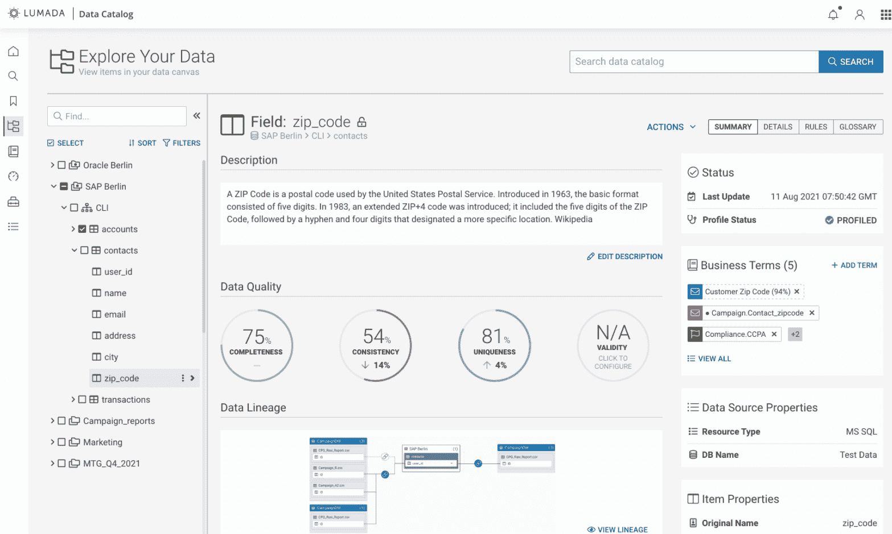

# Hitachi Vantara 提高了数据集成、目录和物联网的风险

> 原文：<https://thenewstack.io/hitachi-vantara-raises-data-integration-catalog-iiot-stakes/>

Hitachi Vantara 周三介绍了其 Lumada DataOps 平台的增强功能，并发布了新的 Lumada Industrial DataOps 产品组合。这些版本提供了增强的数据集成、数据治理、数据质量和工业物联网(IIoT)功能。Hitachi Vantara 表示，这些产品可以帮助客户构建他们的分布式数据结构，并实现 IT 和 OT(运营技术)的集成。

IT 和业务用户之间的集成也是一个因素。在本周早些时候的简报中。Hitachi Vantara 的产品营销负责人——Lumada Software 的 Madhup Mishra 认为“我们正在向这种现代运营模式发展，我们看到业务和 IT 团队正在紧密合作”，并解释说新的 Lumada 版本旨在“向商业用户的方向发展”

除了这些高层次的愿景陈述，深入到新版本的功能揭示了许多实质内容。

## **数据治理、质量和集成**

在 Lumada DataOps 方面，Hitachi Vantara 正在推出其数据目录和数据集成产品的新版本。与我最近报道的 Alteryx 的新分析云版本没有什么不同，这个 Lumada DataOps 版本整合了几家收购公司的技术。

**也可阅读:[日立万塔拉推出云原生数据操作套件](https://thenewstack.io/hitachi-vantara-launches-a-cloud-native-dataops-suite/)**

例如，Lumada Data Catalog 主要基于 Hitachi Vantara 2020 年 4 月收购 Waterline Data 获得的技术。这一新的 7.0 版本在 2021 年 6 月 Hitachi Vantara 收购 [Io-Tahoe](https://www.iotahoe.com/) 时获得的 UI 刷新和复杂的数据质量功能的基础上更上一层楼。结果是可以根据业务术语表术语评估数据质量的数据目录，而不仅仅是物理数据列。

Hitachi Vantara 新发布的 Lumada 数据目录截图，显示了业务术语表、数据质量和数据沿袭特性

这里有很好的协同作用，因为 Io-Tahoe 衍生的数据质量能力利用了机器学习驱动的“指纹”(数据分类和标记)能力。Lumada 现在还可以连接到 [Collibra 治理中心](https://www.collibra.com/us/en/platform/data-governance)，允许在那里跟踪的数据被 Lumada 数据目录标记和采集指纹。

数据集成的故事围绕 Pentaho 数据集成的 v9.3 版本展开(Pentaho 本身在 2015 年被日立收购)。9.3 是精通云的版本，无论是在产品可以运行的地方，还是它可以连接的数据源，包括[雪花](https://www.snowflake.com/workloads/data-warehouse-modernization/)、 [MongoDB Atlas](https://www.mongodb.com/cloud/atlas/lp/try2) 、 [Teradata](https://www.teradata.com/Cloud) 、[弹性搜索 7.x](https://www.elastic.co/blog/elasticsearch-7-0-0-released) 和 [IBM MQ 9.2](https://www.ibm.com/docs/en/ibm-mq/9.2?topic=920-whats-new-in-mq) 。

## **重工业**

在 IIoT 方面，Lumada Industrial DataOps 带来了新的数字孪生功能，即机器学习(ML)服务，包括针对特定工业领域用例的预训练 ML 模型，以及与 Lumada DataOps 的集成，所有这些都带来了 IT/OT 融合。

Hitachi Vantara 引用了一个非常有趣的案例研究，其中迪士尼乐园和度假村使用 Lumada Edge Intelligence 和 Lumada Industrial DataOps 对其全球乐园中的几个游乐设施进行预测性维护。Hitachi Vantara 表示，该解决方案使用数字双模拟和 ML 服务进行异常检测，在维护问题可能发生前 48 小时预测它们。这种伙伴关系显然非常强大，Hitachi Vantara 是迪士尼的官方游乐设备和演出分析提供商。

## **全家人**

日立有限公司拥有超过一个世纪的历史和在工业环境中工作的丰富经验。Hitachi Vantara 成立于 2017 年，并利用从几家创新创业公司获得的技术加强了其本土的 IIoT 和分析平台。这种结合使其能够提供一个可以独立运行的分析平台，但特别适用于工业数据用例。要了解其价值，请将此与 SAP 或 Oracle 提供面向业务应用程序和交易数据的分析平台的方式进行比较。这么多纯粹专注于技术的初创公司存在了这么长时间，看到它们进行整合是积极的，也不奇怪，通常是在企业和工业实施服务中。

Lumada DataOps 的数据目录和 Pentaho 9.3 的更新现已发布。Lumada Industrial DataOps 软件将于 4 月底上市。

*披露:Andrew Brust 是 [Blue Badge Insights](https://www.bluebadgeinsights.com/) 、*的负责人，这是一家研究、战略和咨询公司，为数据和分析软件公司、解决方案提供商和客户提供服务*。Io-Tahoe 在 2017 年至 2018 年期间是 Blue Badge Insights 的客户。*

<svg xmlns:xlink="http://www.w3.org/1999/xlink" viewBox="0 0 68 31" version="1.1"><title>Group</title> <desc>Created with Sketch.</desc></svg>