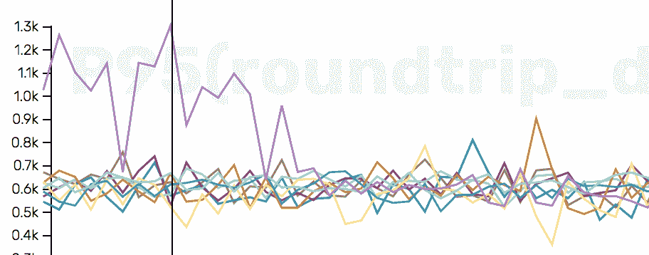
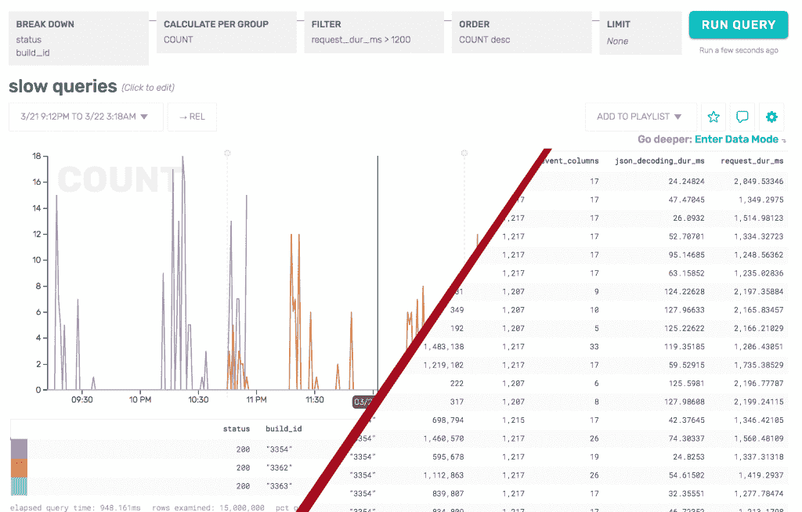
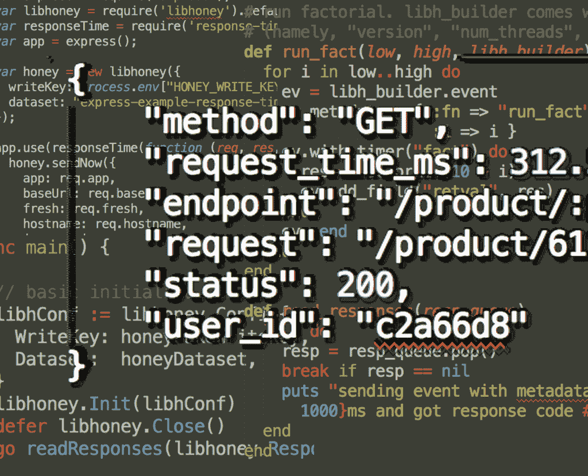
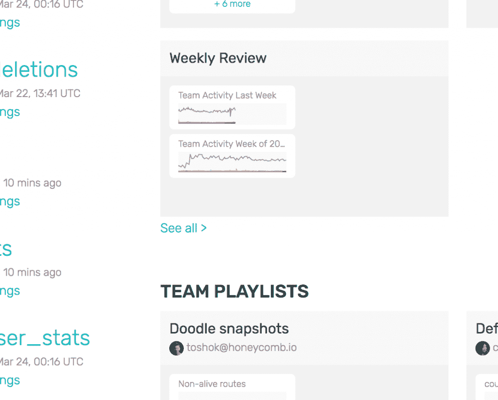
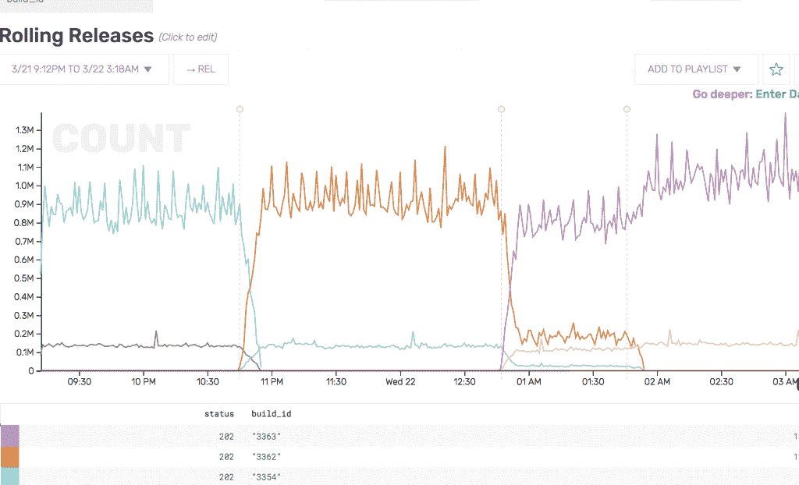

# 介绍 Honeycomb:一种解决系统缺陷的新调试服务

> 原文：<https://thenewstack.io/honeycomb-addresses-flawed-systems/>

 [朱舒·威尔克斯

朱舒·威尔克斯，博士，在 2015 年离开科技行业之前，从事了 20 年的各种工程角色。她写作，做独立研究员，剪羊毛。应我们的要求，Honeycomb.io 委托朱舒撰写了这篇介绍公司及其技术的文章。](https://honeycomb.io/) 

如果在线系统已经一次又一次地证明了一个真理，那就是它们中的大多数至少在某些时候会以某种方式出错。开发人员、工程和支持团队不知道这一点是可以原谅的，因为他们不能:用于识别和暴露这些问题的系统本身就是有缺陷的。

这就是 Honeycomb 这个简单而强大的现代软件调试工具所要解决的难题。它使工程团队能够解决一般基于度量和日志的工具无法解决的问题，并有助于回答即使在今天仍然神秘的问题:我的东西在工作吗？如果没有，为什么没有？

Honeycomb.io 将于本周全面推出其 SaaS 服务，为事件驱动的调试提供全栈可观察性。该公司的设计初衷是调试实时生产软件，使用任何数据模型从任何来源获取事件数据，并将协作作为解决问题的核心部分。

Honeycomb 建立在软件栈的事件聚焦视图的概念上。简而言之，它提供了真正的全栈可观察性，从客户端(移动、物联网)，到您自己的服务(API、其他微服务)，到其他人编写的软件(数据库、消息总线、web 服务器、代理、容器、调度器等等)。它允许你在栈的任何子集上提问和回答问题，不管是不是你写的。

由于一些不同的原因，现有的工具使得我们很难发现和诊断那些我们每天都会遇到的意料之外的、不可预测的问题。他们:

*   对最终用户的技术环境做出固有的假设；
*   依赖预定义的索引和模式；
*   不能有效地处理高粒度数据(基数)；
*   不是为探索、迭代或实时分析而设计的；
*   从根本上来说不是合作的。

让我们来看看这些缺点，以及 Honeycomb 如何解决它们。

## 蜂巢是环境不可知的

许多工具对客户的技术环境做出假设，这使得这些系统很难超越他们对什么是重要的先入为主的观念。此外，初始仪器的成本可能很高，这使得此类系统的推广和更改既昂贵又耗时。

相比之下，Honeycomb 不受环境限制，集成速度快，成本低。这意味着，除了其他事情之外，很容易向蜂巢发送更多不同的数据。Honeycomb 为各种语言、平台和软件提供了助手，但它说 JSON，而且只说 JSON。蜂巢联合创始人兼首席执行官 [Charity Majors](https://twitter.com/mipsytipsy) 说:“一个应用程序的丰富性和细节大多存在于节点和组件之间。“除了所有服务和团队的通用语之外，任何东西都没有意义。”

## Honeycomb 不依赖于预定义的索引和模式

许多工具依赖于索引和模式，它们根据定义是预定义的:它们要求您预测将来需要运行什么样的查询。这在技术危机期间尤其成问题。当事情出了乱子，工程师需要攻击和破坏问题时，他们要么花太长时间，要么不可能回答他们事先没有想到但迫切需要回答的问题。

正如 Majors 所说，“模式给你的开发流程增加了摩擦和僵化。这是一件非常糟糕的事情，因为这意味着你试图预测不可预知的事情。很多时候，奇怪的、相邻的事实——不太符合事实——最终揭示了一个复杂的问题。Honeycomb 捕捉了所有这些细节，而不会让您放慢脚步，考虑它是否真的重要到足以支付迁移成本，或者它是否真的可以压缩到一些现有的数据模型中。”

有了蜂巢，工程师永远不会到达不能问更多问题的地步。

紫色线显示一个缓慢的查询。

这张图片详细描述了上面显示的第一张图片。在这里，Honeycomb 专门研究慢速查询，并在其数据模式中查看完整的事件数据。数据模式检查图表中表示的每个事件的完整数据，并提供一种从发送到 Honeycomb 的实际事件中获取完整上下文的方法。术语播放列表(右上角，“添加到播放列表”)描述了用户定义的查询的集合，这些查询保存在 Honeycomb 中供以后使用或供团队中的其他人使用。

Majors 补充说“一些度量公司试图模仿这种方法，在他们的度量上使用‘标签’,但是这种方法受到他们存储数据的方式的严重限制。在它倒下之前，你只能有几十个，或者几百个。这就排除了每个主机 ID、构建 ID 或用户 ID 都有一个标签的可能性，这是这些平台的用户抱怨最多的问题之一。有了 Honeycomb，每个指标实际上也是一个标签，您可以通过它进行搜索。"

许多工具不能处理将“user_id”作为维度，因为拥有大量用户会导致较高的基数。然而，Honeycomb 正是为此而生的；user_id 作为一个维度是 Majors 和 Yen 支持 60，000 个应用程序的经验的直接结果，这些应用程序为 Parse 的数百万用户提供服务。

同样的问题也困扰着仪表板，仪表板只显示他们被告知要显示的内容，并且经常将问题隐藏在图表和平均值后面。在你掌握了什么是重要的之后，仪表盘会很有帮助。然而，它们并不是一个很好的方法来找出什么是最重要的，也不能做必要的调查工作。

[Honeycomb 联合创始人兼首席技术官 Christine Yen 表示:“我在 Parse(后来被脸书收购)工作了数年，试图告诉开发者，基于预先汇总的指标和固定报告的 Parse Analytics 足以了解他们的应用程序正在发生什么。然后，我转身使用内部脸书工具，如](https://twitter.com/cyen)[水下呼吸器](https://research.fb.com/publications/scuba-diving-into-data-at-facebook/)，因为它们可以对任意数据集进行实时、专门的分析。”

Yen 和 Majors 在 Parse 相遇，他们希望所有的工程师都能够这样做，把事情掌握在自己手中，深入研究自己的数据。

## 蜂窝状表面细粒度数据

传统工具不能提供足够精细的解决方案来将问题锁定到非常具体的情况。

比方说，一个占流量 0.1%的客户报告说某个东西很慢:他们的系统处理了大约一百万个查询，其中有 1000 个看起来很慢。典型的第一个支持响应是检查第 99 百分位(P99)响应时间。当然，P99 不会包括这 0.1%的客户，因此该活动将会失败。

然而，即使 P99 很高，它也不会给出关于哪些请求很慢的线索，并且知道哪 1000 个请求有问题以及它们有什么共同点是极其重要且非常困难的。典型的工具只显示有 1000 个这样的有问题的东西，让工程师在日志文件中搜寻，这是唯一可用的真实数据。但是，根据专业人员的经验，“使用原始测井曲线是一种混乱、昂贵、浪费且难以实施的方法。”

举一个 API 出错的例子，对于少数客户来说，这是半可靠的，但不足以引起任何系统范围的警报。支持人员需要知道这些客户是谁，他们有什么共同之处，但是 Honeycomb 是唯一可以方便地告诉他们的系统。

## 蜂巢是实时的

许多工具都自称为实时工具，但归根结底，大多数都不是。蜂巢是。工程师和支持人员可以实时提出任何问题，并在几秒钟或几秒钟内得到答案，而不是几分钟、几小时或几天。

## 蜂巢支持协作调试

Majors 和 Yen 认为“调试是一项社会活动”，团队协作时最有效、最成功，可以利用当地多种水平的专业知识。梅杰斯说，“它必须让你最缺乏经验或技能的表演者从你的顶级制片人和彼此的努力中受益。”

Honeycomb 为团队中的所有开发人员提供了一种理解和共享整个系统中发生的事情的方式，并且以一种更高级的开发人员可以理解的方式来这样做。工程师可以共享不同的数据视图来相互解释，包括回顾过去的视图。

每周回顾显示蜂巢中团队的所有活动。能够看到和共享工作是 Honeycomb 使用的核心，因为它为每个工程师创建了一种机制，可以提升到特定领域(如 MongoDB 操作)中最佳工程师的技能水平。

至于“我的东西管用吗？”例如，进行询问的团队成员可以看到他们代码发布的时间框架，并收到与他人分享的真实答案。大多数工具为工程师提供基本信息，如“在我的代码发布之前，一个查询需要 7 毫秒；后来，花了 1 毫秒。是的，它在工作。”然而，Honeycomb 可以告诉工程师“我处理的特定查询花费了 7 毫秒”，这些数据可以在更典型的系统范围平均值中被洗掉。

这是一种事件(在本例中是一个 http 202 状态代码),在一段时间内不同的构建中都可以看到。在最后一个版本中，这些事件的数量会增加。

因为 Honeycomb 允许不同类型的问题，所以它在更深的粒度级别上准确地描述了正在发生的事情及其原因。

<svg xmlns:xlink="http://www.w3.org/1999/xlink" viewBox="0 0 68 31" version="1.1"><title>Group</title> <desc>Created with Sketch.</desc></svg>