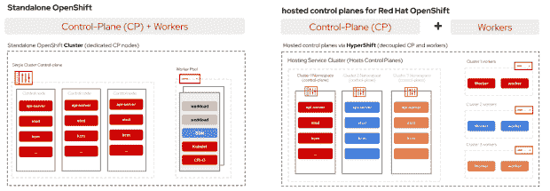
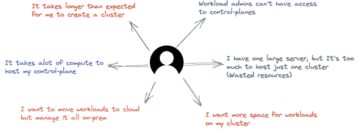
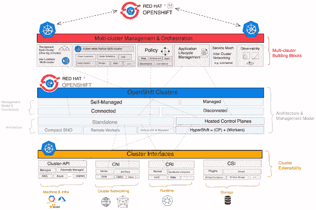

# 托管控制平面带来了额外的能力和更多的成本控制

> 原文：<https://thenewstack.io/hosted-control-planes-bring-extra-power-and-more-cost-control/>

核反应堆使用控制棒来控制内部发生的裂变数量。镉棒会吞噬中子，所以将一根长棒一直推过反应堆中心会大大减少反应发生的次数。只要你能控制那些棒，把它们拉出来，或者把它们推进反应堆，你就处于控制之中。

对于 Kubernetes，控制平面节点也是如此。这些节点——每个 Kubernetes 集群都需要存在的三个控制平面节点——已经成为该平台的许多用户的一个症结，而且原因也不尽相同。

问题确实出现在天平的两端。对于大规模用户来说，数百个节点运行数千个 pod，失去这三个控制节点中的任何一个都可能完全破坏集群的想法可能会有点令人不安。随着规模的扩大，这也可能成为一个瓶颈。

在规模较小的一端，可以将所有这些控制系统塞进一个节点。我们称之为[单节点 OpenShift，或 SNO](https://www.redhat.com/en/blog/meet-single-node-openshift-our-smallest-openshift-footprint-edge-architectures) ，它非常专注于边缘部署中的使用。在反应堆的比喻中，它是那种你可以放进航空母舰或潜艇的东西:便携、小巧且不太复杂。

然而，对于管理这座城市来说，有三个单点故障是不行的。再加上始终存在的对安全性、成本效益和生产力的需求，您就在 Kubernetes 堆栈中获得了一席之地，我们可以在其中为每个相关人员带来巨大影响。因此，我们一直在努力为 Red Hat OpenShift 开发一个新功能，我们称之为[托管控制平面](https://cloud.redhat.com/blog/hosted-control-planes-is-here-as-tech-preview)。

## 拥有最多的主机

继续我们的控制棒比喻，我们的 Kubernetes 核反应堆可能运行有点过热，需要加以控制。传统上，我们会有三根棒推进反应堆来减慢速度。首先，这将限制反应堆的大小，除非我们建造巨大的镉棒。

托管控制平面允许我们将几十个、几百个甚至可能几千个更小的控制棒推进反应堆。我们可以有效地运行三个独立的控制集群，每个集群都有自己的大小和形状，而不是三个节点运行集群。

我们如何运行小型控制集群并保持它们的协调？当然是通过在上面运行 Kubernetes。三个托管控制平面中的每一个都是自己的集群，具有自己的扩展和可用性设置，因此，集群管理的每个方面现在都可以单独扩展。

同样，虽然这肯定适用于向上扩展，但对于向下扩展也极其重要。在不太繁忙的周期中，这些托管的控制平面可以随群集一起缩减，从而节省 CPU 周期和云信用。

这实际上已经在我们的测试中得到证实，我们看到控制平面的成本下降了三倍之多。此外，这种新架构通过在工作负载之间实施更严格的分离来增强多租户功能，您可以看到，当托管控制平面于 2023 年正式发布时，它将为我们的客户提供许多优势

## 你不会注意到的

如果您不是组织内部实际建立和运行 OpenShift 集群的人，您很可能不会注意到向托管控制平面的转移。从用户或开发人员的角度来看，这种改变不会有太大的不同。然而，对于站点可靠性工程师和集群管理员来说，这应该提供一些急需的灵活性，并对集群的每个方面的工作方式进行更精细的控制。

这里的人们一直称托管控制平面为“Inception”，因为“这是 Kubernetes 中的 Kubernetes”，这是该架构的本质。虽然这看起来更复杂，但最终结果实际上是运行每个集群所需的开销大大减少。

借助托管控制平面，您的管理员将拥有所需的工具，根据需要经济高效地运行集群。这使得单个开发团队甚至单个开发人员可以创建他们自己的隔离集群来测试更大规模的服务部署。

正如电力是企业运营的基础一样，计算能力也是如此。无论您是在每个分支机构现场放置一个核反应堆，还是为每个分支机构提供由总部 IT 集中管理的 Kubernetes 集群，结果都是一样的:在困难时期提高生产力和更好的恢复能力。幸运的是，如果您的 Kubernetes 集群融化，没有人会受到伤害，更幸运的是，使用托管控制平面将有助于从一开始就防止这种情况发生。

<svg xmlns:xlink="http://www.w3.org/1999/xlink" viewBox="0 0 68 31" version="1.1"><title>Group</title> <desc>Created with Sketch.</desc></svg>