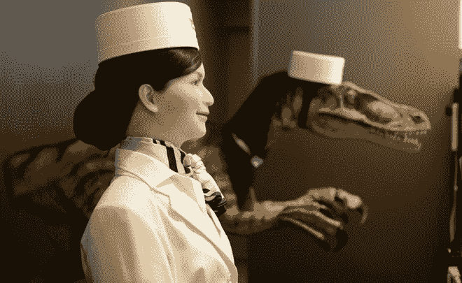
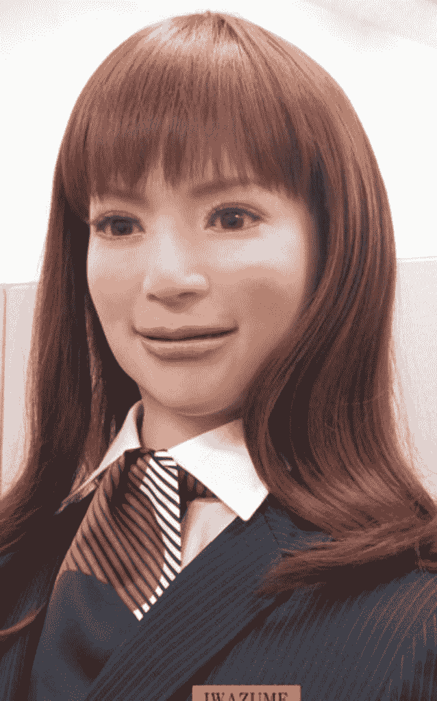
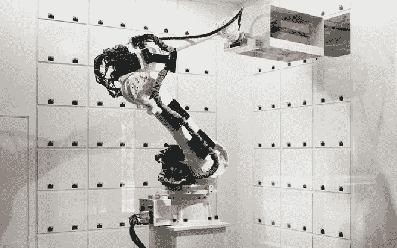
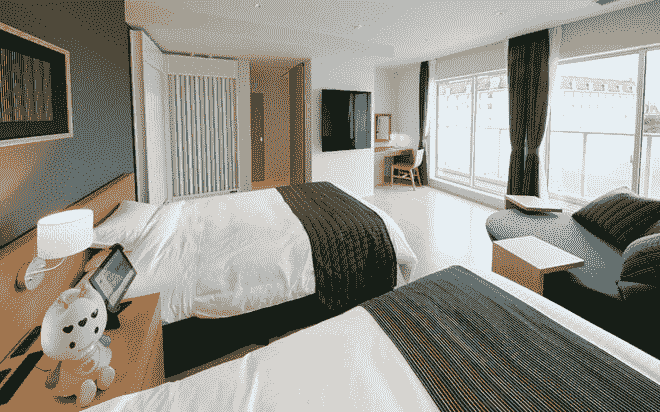
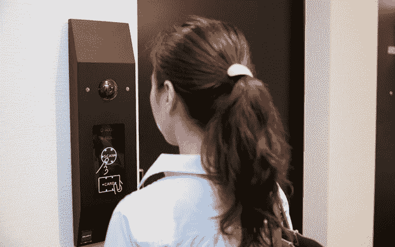
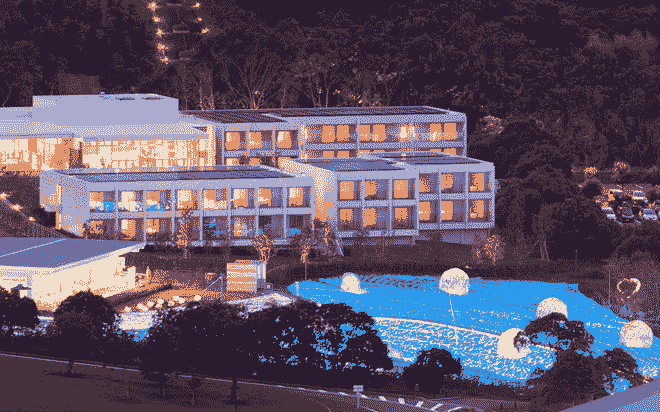
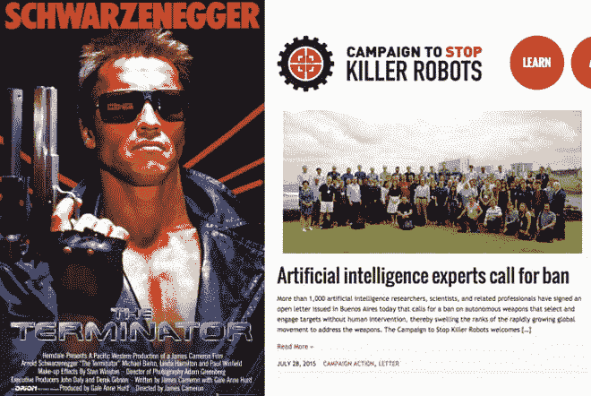

# 由机器人经营的超高效酒店在日本开业

> 原文：<https://thenewstack.io/hotel-run-entirely-robots-opens-japan/>

日本以其古怪的民族性格而闻名，这表现在它的[奇怪的发明](http://justsomething.co/23-craziest-japanese-inventions-you-never-knew-existed/)，它复杂的[鞋子礼仪](https://quirkyjapan.wordpress.com/2010/02/12/quirks-24-27/)和它对技术的热情拥抱，这可以从像[音乐厕所](http://www.telegraph.co.uk/travel/destinations/asia/japan/11605880/Japan-thinks-its-high-tech-toilets-are-the-way-to-tourists-hearts.html)和 [3D 打印的假食物复制品](https://thenewstack.io/the-paradox-of-3d-printing-japanese-fake-food-replicas/)中看出。现在，日本人对技术的热情的又一证明是，一家超高效的酒店上个月在长崎县开业，它几乎完全由机器人经营。

拥有 72 个房间的亨纳酒店(翻译成“奇怪的酒店”)主要由 10 个机器人组成——在前台迎接客人的人形机器人，一个红色的像车辆一样的搬运工引导你到你的房间，以及一个液压手臂机器人在“机器人衣帽间”储存客户的行李由于内部传感器、“全向视觉传感器”和自适应人工智能，这些人形机器人将保持目光接触、眨眼、呼吸，并被编程为学习和定制他们的行为以适应客户的反应。

还有其他不同的机器人会提供信息，打扫房间；每个房间都将有一个可爱的机器人助手，名为 Chu-ri-Robo，客人可以与它互动，以设置起床时间和调暗灯光。其他奇怪的机器人包括前台的一个电子恐龙机器人，它可以和英国顾客说话——尽管所有的机器人员工都懂多种语言，会说日语、汉语、韩语和英语。

[T3](https://thenewstack.io/wp-content/uploads/2015/08/japan-robot-hotel-9.jpg)T5

其他最先进的功能包括对客人使用面部识别技术的门锁，无需传统的钥匙。室温由体热传感器控制，可以自动调节舒适度。

该酒店是作为一个名为[豪斯登堡](http://english.huistenbosch.co.jp/)的主题旅游综合体的一部分而设计的，这个旅游综合体是仿照一个理想化的荷兰小镇设计的。Kokoro 是这家酒店的所有者，也是 Sanrio(是的，Hello Kitty 的名气)的一个分支，从过去十年来，它一直在设计类似人类的“actroid”机器人。该公司总裁 Hideo Sawada 表示，他们的目标是“打造世界上最高效的酒店”Sawada [说](http://www.japantimes.co.jp/news/2015/07/16/business/robot-porter-check-staff-innovative-sasebo-hotel/#.Vb0CN8ZVhHx)由于使用了机器人，这家相对低成本的酒店成本得以控制。“我想突出创新。我还想为酒店价格上涨做点什么。”在日本，某些银行和餐馆已经配备了机器人员工。

日本[在创造看起来像人类的机器方面的领先优势](http://www.ibtimes.co.uk/human-machine-life-like-android-robots-japan-show-glimpses-future-1453992)可能最终应用于服务机器人，帮助老人和教孩子。虽然机器人有可能接管更平凡、更费力的任务，这很好，但另一方面也提出了一个问题，即人类是否很快会被机器淘汰，甚至可能受到机器的威胁。毕竟，机器人越来越多地被用于工业制造和我们的家庭，而军方正在试验能够产生复杂、紧急行为的[自主机器人、导弹](https://en.wikipedia.org/wiki/Robot#Military_robots)和[群体机器人](https://en.wikipedia.org/wiki/Swarm_robotics)。

自主机器和人工智能的快速发展创造了一个充满伦理和生存担忧的未知领域，导致斯蒂芬·霍金和埃隆·马斯克等专家和行业领袖呼吁暂停研发杀手机器人和无需人类干预即可摧毁的自主武器。

那么我们应该对未来的机器人革命感到恐惧吗？看情况；酒店里的机器人是一个伟大的想法——非道德的机器人可以"[选择并攻击目标而无需人类干预](http://www.telegraph.co.uk/news/science/science-news/11633838/Killer-robots-will-leave-humans-utterly-defenceless-warns-professor.html)"？不是什么好主意。要了解更多关于机器人酒店的信息或预订房间(起价 7000 英镑或 56 美元)，请访问 [Henn-na Hotel](http://www.h-n-h.jp/en/) 。

[https://www.youtube.com/embed/oCDY3kNz5hw?feature=oembed](https://www.youtube.com/embed/oCDY3kNz5hw?feature=oembed)

视频

图片:[亨纳酒店](http://www.h-n-h.jp/en/)，[终结者](https://www.imdb.com/title/tt0088247/)，[阻止黑仔机器人的战役](http://www.stopkillerrobots.org/)。

<svg xmlns:xlink="http://www.w3.org/1999/xlink" viewBox="0 0 68 31" version="1.1"><title>Group</title> <desc>Created with Sketch.</desc></svg>