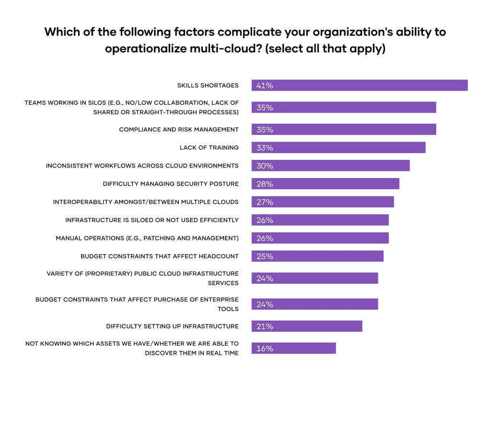

# 云技能短缺如何影响多云的采用

> 原文：<https://thenewstack.io/how-a-cloud-skills-shortage-is-affecting-multicloud-adoption/>

企业正面临云技能的持续短缺，这促使许多组织创建云平台团队并投资自动化工具。

这是本月发布的 2022 年 [HashiCorp 云战略调查](https://www.hashicorp.com/state-of-the-cloud)的关键发现之一，该调查基于 HashiCorp 委托的研究，由 [Forrester Consulting](https://www.forrester.com/consulting/) 进行。

## 技能短缺是实施多云的最大障碍

当被问及哪些因素会影响组织实施多云的能力时，技能短缺是最受欢迎的选择，有 41%的受访者选择了这一选项。缺乏培训也是首选，有 33 %的受访者选择了这一选项。

然而，这只是开始。高达 94%的受访者表示他们有可避免的云支出，缺乏必要的技能是云浪费的第三大原因，近一半(47%)的受访者提到了这一点。

但是等等，还有更多。82%的受访者认为适当的人员配备和技能水平对于决定其组织的云战略的成功非常重要(41%)或非常重要(41%)，这是第四大常见选择。

## 平台团队利用最好的工程师来解决技能问题

 [弗雷德里克·保罗

弗雷德是哈希公司的编辑和内容总监。他是旧金山的一名资深科技记者，曾在 CNET、信息周刊、AllBusiness 和许多其他公司担任高级编辑职务，并在 New Relic 和 Redis 等公司担任内容领导职务。](https://www.linkedin.com/in/fredricpaul/) 

尽管存在所有这些问题，许多受访者正在寻找一种有效的方法来解决他们通往多云成功的道路上的这些问题:使用集中式云平台团队。

平台团队是为组织或整个公司整合和标准化云基础架构的团队，旨在利用企业最佳工程师的技能和专业知识。

鉴于调查中揭示的技能短缺的影响，86%的受访者表示他们依赖于云平台团队或云卓越中心(CCoE)等集中化的组织团队或职能部门也就不足为奇了。

值得注意的是，组织正转向平台团队来为各种各样的任务创建、分发和实施最佳实践和通用工具。事实上，至少有四分之三的受访者选择了所有 15 项功能作为调查选项:

## 多云救援的自动化工具

然而，即使最好的平台团队自己也只能做这么多。努力应对云技能短缺的组织表示，他们还需要自动化工具来帮助他们难以找到的工程人才提高工作效率。事实上，89%的受访者表示自动化工具对于运营他们的多云基础设施非常重要或极其重要。只有 1%的人认为这些工具不重要。

根据调查结果，一致和自动化的工具带来了更灵活的 IT 基础架构(47%)、更好的安全性和治理(46%)、更好的云资源利用率(43%)以及对 IT 问题和事件更快的响应(42%)。

这些工具已经带来的主要优势包括可扩展性(49%)、基础设施配置/基础设施即代码(42%)和成本优化(40%)。在接下来的一年中，受访者预计这些工具将有助于成本优化(42%)、可扩展性(39%)和提高开发人员的工作效率(37%)。

更能说明问题的是，受访者表示，自动化工具为云基础架构的四个关键层(基础架构、安全性、网络和应用部署)提供了重要优势。其中包括重要的功能，如自动化操作工作流、动态和自动化服务网络、集中式机密管理以及提供灵活的部署选项。

## 查看 2022 年哈希公司云战略状态调查

为了收集此处提供的信息，HashiCorp 委托 Forrester Consulting 调查了全球各行各业员工超过 1000 人的公司中的 1000 多名技术从业者和决策者。您可以在 HashiCorp 的[交互式云战略状态调查微型网站](https://www.hashicorp.com/state-of-the-cloud)上了解调查的完整结果，也可以在那里下载 Forrester 的“释放多云的运营潜力*”*研究，该研究介绍了该公司的主要调查结果、分析和对企业的建议。

其他主要结果包括:

*   81%的受访者选择多云
*   90%的人表示，多云正在帮助他们的组织实现其业务目标
*   89%的人认为安全性是云成功的关键驱动因素
*   99%的人认为自动化对于多云运营非常重要
*   88%依赖安全工具和自动化

<svg xmlns:xlink="http://www.w3.org/1999/xlink" viewBox="0 0 68 31" version="1.1"><title>Group</title> <desc>Created with Sketch.</desc></svg>