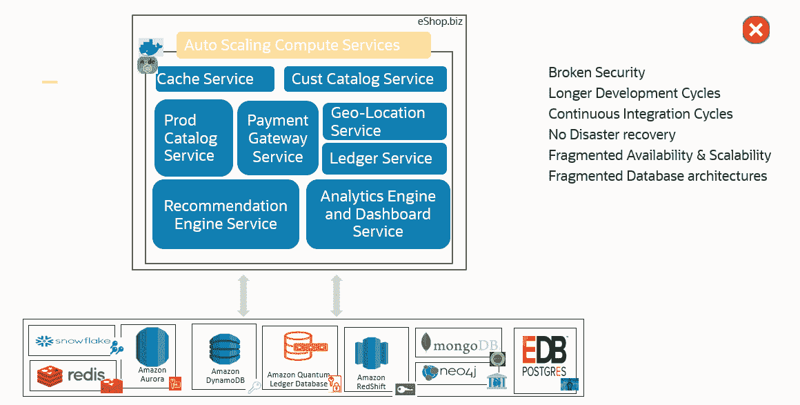

# 融合数据库如何帮助开发团队更智能地构建

> 原文：<https://thenewstack.io/how-a-converged-database-helps-dev-teams-build-smarter/>

 [杰夫·埃里克森

杰夫是甲骨文公司技术内容总监。你可以在 twitter @erickson4 上关注他，在那里你可能会看到关于禅宗、有趣的科技、足球和公开水域游泳的帖子。](https://www.linkedin.com/in/jeff-erickson-6ba4b41/) 

在现代应用程序中，数据库发挥着核心作用，远远超出了捕获简单的交易和生成月度报告的范围。现在，客户和用户都是自己的交易代理。他们通过手机、笔记本电脑和其他设备开展业务，不分昼夜。这就产生了需要不断存储和共享的复合数据。如果不是这样，应用程序将会错过对今天的客户关系如此重要的实时提示。

随着时间的推移，许多开发人员正在通过使用零碎的解决方案——按需获得的数据库技术和架构——来应对这种复杂的局面。其中一些是专有的，一些是自主开发的，还有一些是开源的。

在某种程度上，这是有意义的:随着 IT 的发展，键值、空间、图形、区块链、文档、时间序列和物联网等数据类型已经出现。这些数据集必须与关系数据共存。从整体上看，每一个现代的、数据驱动的应用程序都有固有的数据类型复杂性。因此，交易、分析、机器学习和物联网等工作负载需要不同的数据库算法来解决独特的需求。

但是，尽管单一用途的数据库在孤立的情况下可能看起来是同类最佳的，但当它们被拼凑在一起时，很快就变成了最大的弱点——数据碎片和安全性变得不一致，管理变得临时。随着数据复合，系统变得更加脆弱，阻碍了公司的灵活性和创新能力。

另一种方法是使用统一的数据库引擎，它可以处理所有这些数据类型和用例。单个多模型数据库可以包含关系数据库、JSON 数据库、XML 数据库、图表数据库、空间数据库和 OLAP 数据库；并促进不同类型的工作负载，如交易、分析、内存、物联网、流式传输和区块链。

在最近的一篇博客文章中， [Arvind Bhope](https://in.linkedin.com/in/arvindbhope) 带读者了解了一家虚构的零售公司 eShop.biz 的一天，并展示了这两种不同的方法是如何发挥作用的。

在一个场景中，eShop.biz 的开发人员使用一个聚合数据库(在本例中是一个 Oracle 数据库)为所有开发提供一个数据库。在他的例子中，单一数据库架构意味着 DevOps 可以更快地提供开发和测试环境，而 API 和查询可以跨数据类型编写。

他还展示了单一融合数据库如何让系统管理员和数据库管理员能够更好地控制他们关心的事情，例如跨所有数据类型和数据流程的一致高可用性和灾难恢复。这有助于他们简化数据的管理、保护、编辑和屏蔽流程，以便进行测试和支持。

在 Arvind 的文章中，[融合数据库](https://www.oracle.com/database/)简化了 IT 运营，使企业能够更好地应对业务挑战和机遇。查看[融合数据库研讨会](https://apexapps.oracle.com/pls/apex/dbpm/r/livelabs/workshop-attendee-2?p210_workshop_id=613&p210_type=1&session=6047818784487)，获得使用多模式数据库的实践经验。

<svg xmlns:xlink="http://www.w3.org/1999/xlink" viewBox="0 0 68 31" version="1.1"><title>Group</title> <desc>Created with Sketch.</desc></svg>