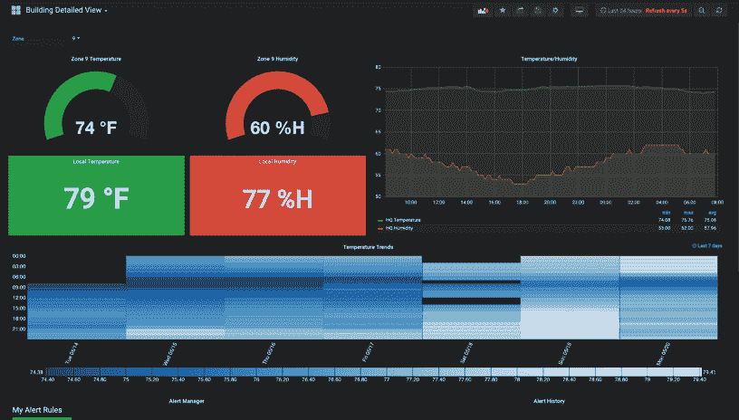
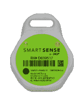
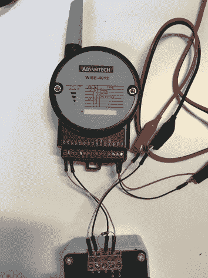
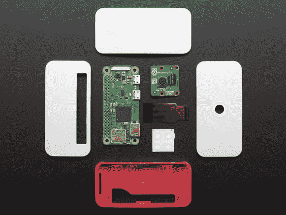
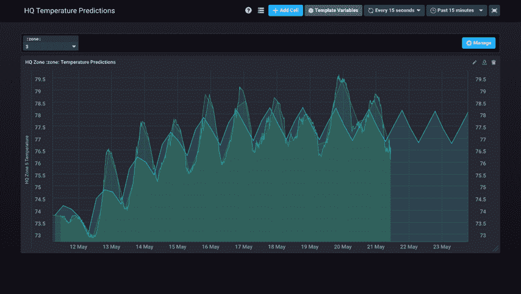
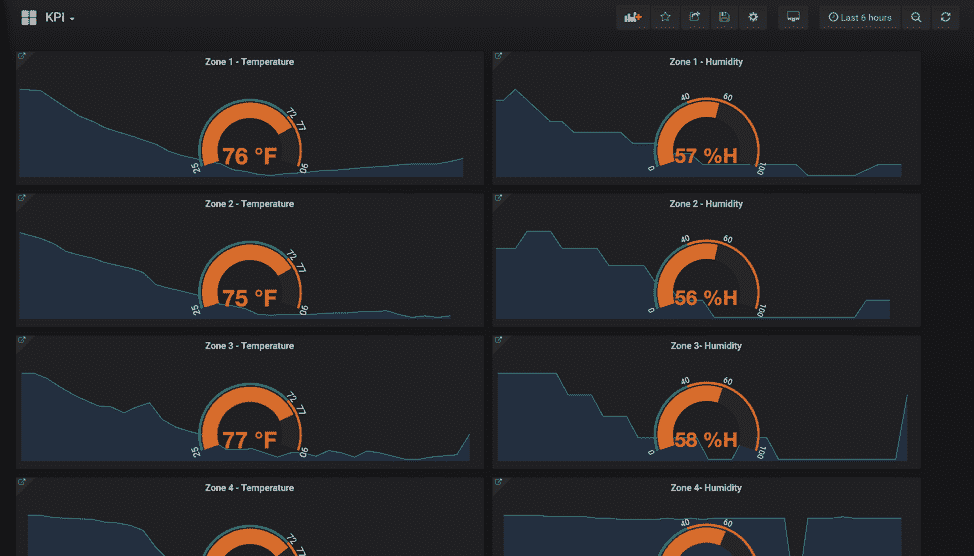
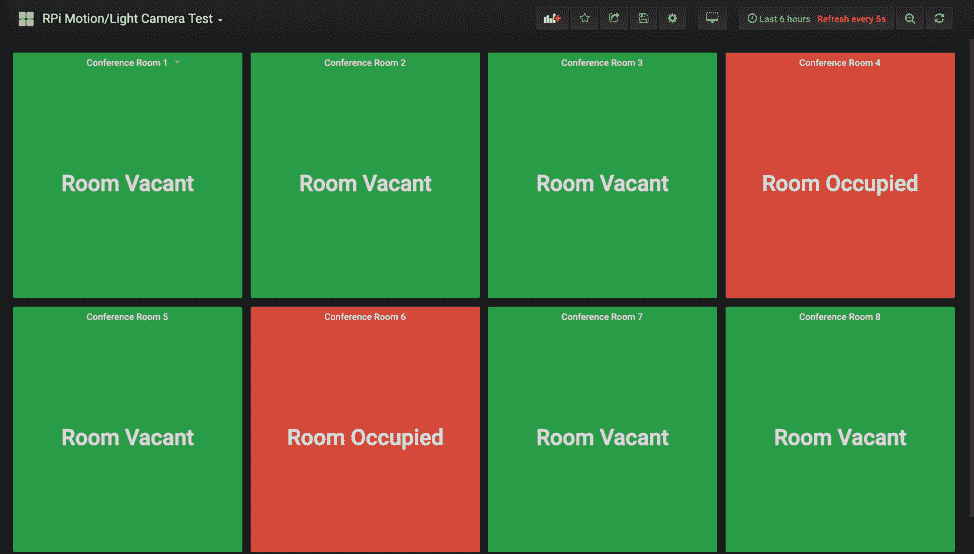
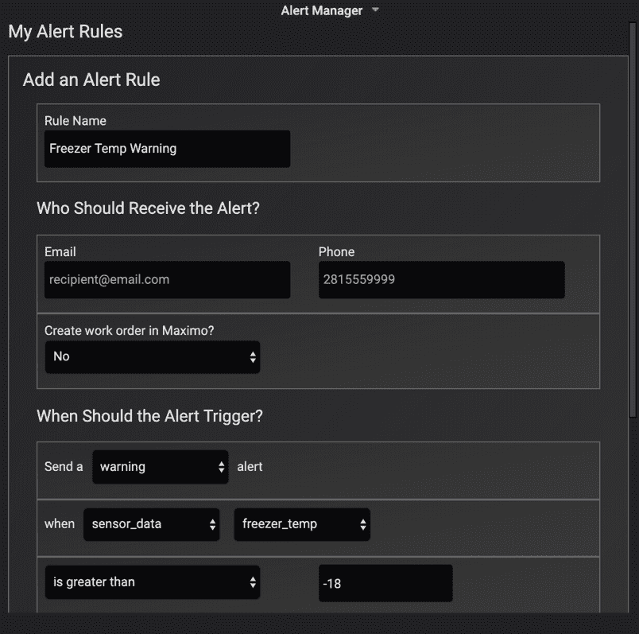

# 一家创意科技公司如何使用 InfluxDB 开发智能设备

> 原文：<https://thenewstack.io/how-a-creative-tech-firm-used-influxdb-to-develop-a-smart-device/>

[InfluxData](https://www.influxdata.com/) 赞助了这篇文章。

我在 [Timbergrove](https://timbergrove.com/) 工作，这是一家总部位于美国的创意技术工作室和咨询公司。最近，作为我们更广泛的 [Moonshot 物联网](https://timbergrove.com/solutions/internet-of-things)(物联网)产品的一部分，我们创建了一个智能工作场所套件，以帮助建筑经理开始使用物联网。先睹为快，这里有一个 Grafana 仪表板示例，供我们的楼宇管理人员使用:

该仪表板具有仪表图、线图和热图面板，可轻松监控我们的办公环境。

## 物联网设备

我们一直在试验无线传感器节点和网关，所以我们手头有相当多的设备。对于这个办公室监控解决方案，我们最终选择了 Digi SmartSense 设备进行湿度和温度监控。

它们有很长的电池寿命，并且很容易安装在任何地方。通过几个放置得当的中继器，我们能够用一个网关覆盖 35，000 平方英尺的空间。

对于电源监控，我们探索了许多选项。在这种情况下，我们决定采用带 Advantech WISE-4012 节点的 CT 传感器:

我们还使用配有摄像头模块的 Pi Zero-Ws 监控共享空间的占用情况。虽然这对于简单的运动检测来说有些过分，但该解决方案非常灵活，如果楼宇管理人员愿意，他们可以在未来请求更多高级功能(如人数统计或面部识别)。

## 流向云的数据流

 [阿斯彭·霍利尔

作为一名训练有素的教育家，Aspen 在德州农工大学学习课程和教学时，对以用户为中心的体验和游戏化产生了兴趣。她开始编程，以便能够为她的高中学生建立酷的学习体验。最初的爱好发展成了职业，她现在在 Timbergrove 担任软件开发人员，为各种网络应用和物联网项目做出贡献。在业余时间，她参加了几个休斯顿公民技术小组，组织黑客马拉松，并担任 StartHereNow 女性创业竞赛的技术顾问。](https://aspenhollyer.com/) 

Digi 向我们展示了一个数据集成队列。我们努力与让数据集成变得容易的合作伙伴合作。这就是我们如何在不产生巨大开发成本的情况下保持我们产品的灵活性。至于我们自己管理的设备，我们使用的是 IBM 的 Watson 物联网连接服务。

虽然 Watson 提供了一些优秀的开发人员工具和强大的数据治理，但我们发现缺少终端用户工具。为了填补空白，我们探索了几种选择，最终选定了 InfluxDB 和 Grafana。

我们做出这一选择有几个原因，包括 InfluxDB 是最受欢迎的开源时间序列数据库，Grafana 是可视化时间序列数据的顶级开源工具。他们一起无缝工作。

Grafana 提供了帮助工具，用于构建带有许多聚合和过滤器的 InfluxDB 查询。我们还可以基于 InfluxDB 标记设置模板变量，这使得创建动态仪表板变得相对容易，当我们添加新的传感器和设备时，这些仪表板会“自我更新”。当我们想更直接地使用 InfluxDB 时，我们发现文档写得非常好，有许多例子。TICK 堆栈为我们提供了大量工具来探索和处理我们的数据。虽然需要一些定制来获得我们想要的所有特性，但我们对这个解决方案非常满意。

## 流向流入

对于 smart workplace kit，我们从 Digi 队列和 IBM Event Streams(一个托管的 Kafka 服务)向 InfluxDB 传输数据。虽然我们向最终用户提供 Grafana 仪表板，但我们也喜欢在内部使用 Chronograf 来探索和可视化数据。在这里，我们使用内置的[霍尔特-温特斯预测算法](https://docs.influxdata.com/influxdb/v1.7/query_language/functions/#holt-winters)来预测我们的温度数据:

办公室温度(华氏)与时间(天)。绿线代表原始数据。蓝线代表 Holt-Winters 预测函数发出的预测。

## 使用 Grafana 可视化 InfluxDB 中的物联网数据

有了 InfluxDB 作为我们的数据源，为 Grafana 的最终用户创建漂亮的仪表板变得很容易。第一个仪表板允许用户监控不同建筑区域的温度和湿度水平。第二个仪表板显示会议室占用状态。

KPI 仪表板显示每个建筑区域的温度和湿度。用户可以单击任何面板，深入查看特定建筑区域的详细仪表板。

这种可视化让员工一眼就能确定会议室的占用情况。

## 通过自定义 Grafana 插件配置 Kapacitor 警报

虽然 Grafana 有一个提醒功能，但我们发现它不符合我们的目的。因此，我们构建了一个定制的 Grafana 插件，允许我们的用户通过 Kapacitor 的 REST API 配置提醒。该表单使用了一些 Kapacitor 模板，允许用户设置不同类型的警报和通知。具体来说，它允许用户设置阈值警报，为警报分配严重性级别，并通过电子邮件将这些警报发送给收件人。以下是 Kapacitor 警报表单的一个示例:

一个 Timbergrove 定制的用于配置 Kapacitor 提醒的 Grafana 插件的例子。

实际上，我们已经开发了几个定制插件。我们有一个用于地图框的地理围栏，一个用于在用户上传的图像上叠加热图。我们期待着尽快将这些插件发布到野外。我鼓励你在 Linkedin 或 T2 Twitter 上关注我们，以了解更多信息并跟进这些项目。

## 未来集成

智能工作场所套件已经使用了几个星期，温度监控特别有帮助。我们与 Weather.com 合作，将建筑的内部条件与当地天气数据关联起来，通过这种方式，我们发现了一些趋势，使建筑管理者能够更有效地使用他们的暖通空调系统。

我们仍在增加功能，改进套件，并准备在更多地方安装它。在不久的将来，我们将在 [IBM Watson YouTube](https://www.youtube.com/channel/UCxPJljXUHvUd9idyfEHvXqg) 频道推出一个演示。

另外，我们还在办公室的小桶上安装了智能阀门和流量计。它允许建筑管理人员监控啤酒的流动。他们可以为下班后的活动申请小桶押金，监控消费金额，并相应地发放部分押金退款。他们甚至可以远程关闭水龙头——尽管这一功能可能不会为我们赢得任何同事的欢迎。虽然它现在链接到一个定制的网络应用程序，但我们计划将其与 Grafana 集成，这样我们的用户就可以从一个地方做任何事情。

## 结论

未来，我们期待扩展我们的物联网产品，同时坚持我们的最初目标:提供即时价值，保持模块化和可扩展，让我们的用户生活更轻松，而不是更困难。如果您有任何问题，或者想了解更多信息，请访问我们的网站[https://timbergrove.com/](https://timbergrove.com/)或者关注我们的网站 [@TimbergroveTalk](https://twitter.com/TimbergroveTalk) 。

## 贡献社区亮点

你是潮人社区的一员吗？你有故事要讲吗？如果有，我们很乐意分享！请联系[分析师](mailto:anais@influxdata.com)。

通过 Pixabay 的特征图像。

<svg xmlns:xlink="http://www.w3.org/1999/xlink" viewBox="0 0 68 31" version="1.1"><title>Group</title> <desc>Created with Sketch.</desc></svg>