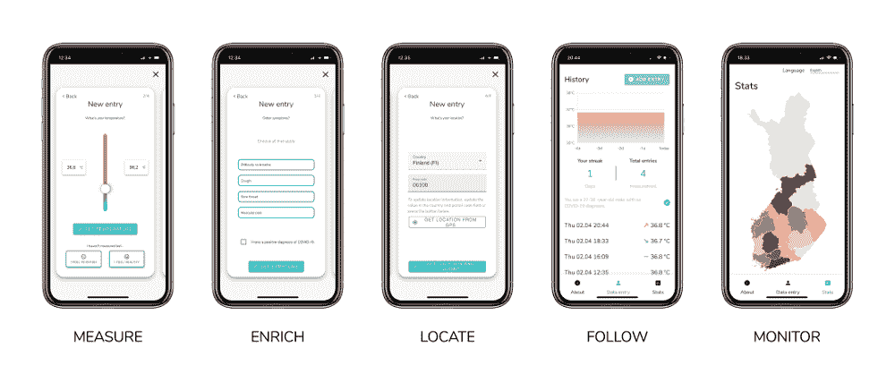
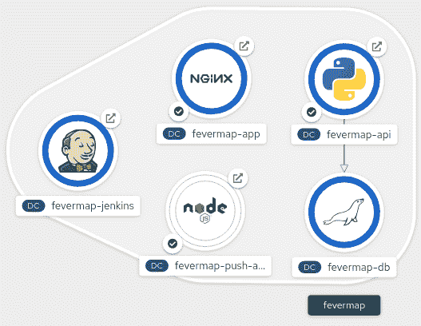
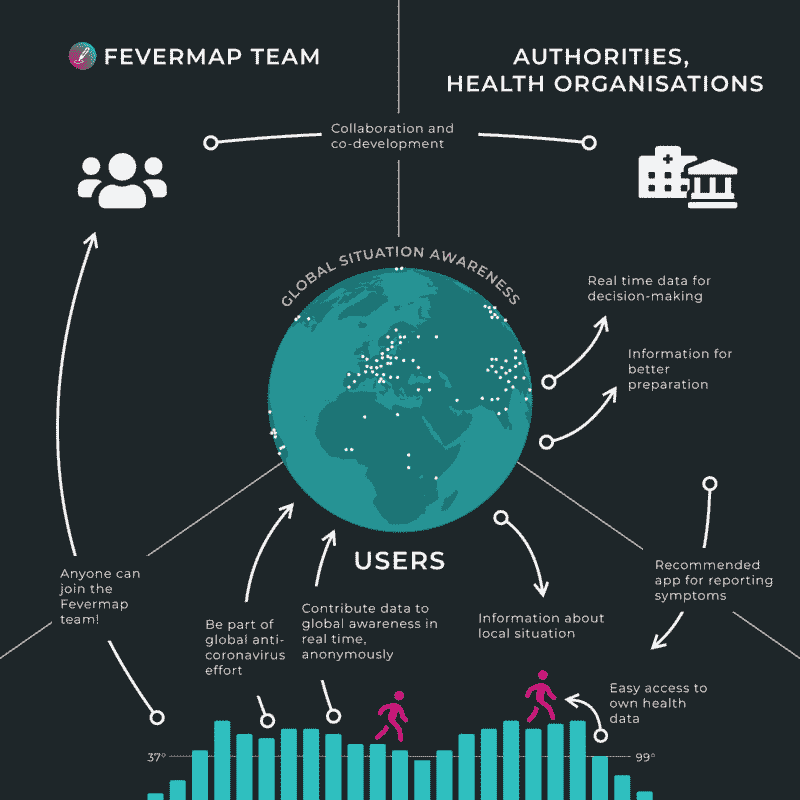

# 黑客马拉松新冠肺炎应用如何移植到 OpenShift

> 原文：<https://thenewstack.io/how-a-hackathon-covid-19-app-was-ported-to-openshift/>

[红帽](https://www.openshift.com/)赞助本帖。

 [亚历克斯·汉迪

亚历克斯是红帽公司的技术营销经理。在他之前的生活中，他报道了第一台 iMac 的发布，然后开始了 20 多年的科技记者生涯。他的作品出现在《连线》、《亚特兰大宪法日报》和《奥斯汀美国政治家》上。](https://www.linkedin.com/in/alhandy/) 

当受到适当激励时，软件开发人员可以走得很快，还有什么比帮助数百万人应对新冠肺炎危机更好的激励呢？没过多久，全世界的程序员都来尝试帮忙了。为正在进行的病毒爆发构建软件的黑客马拉松早在 3 月 22 日就开始了，其中[打破了](https://garage48.org/hackthecrisis) [的](https://www.hackthecrisisnorway.com/) [竞赛](https://www.hackthecrisisfinland.com/) [被](https://www.hackthecrisis.se/) [国家](https://www.hackthecrisis.at/)打倒 [。](https://hackthecrisis.lt/)

在芬兰，一个由奥托·凯克莱宁、马蒂亚斯·胡赫塔、图乌利·埃洛宁和奥利·萨维萨里组成的最初团队接受了挑战，他们要对全球的手机进行某种形式的测试，不管这种测试多么初级。但是构建他们的移动应用程序和服务器架构只是成功的一半；另一半需要红帽 OpenShift。一夜之间从少量用户扩展到数百万用户需要规划和 Linux 容器，因为当它还必须处理隐私、地理位置和实时数据时，即使是最简单的应用程序也会变得复杂。

FeverMap 是一个隐私感知应用程序，旨在帮助跟踪用户的体温，并收集数据以帮助跟踪新冠肺炎的传播。对决策者来说，知道一个特定地区有多少发烧是一个[良好而可靠的数据点](https://twitter.com/Cmdr_Hadfield/status/1235931836532101120)。

通过一个简单的对话框，用户可以用滑动条提交他们的当前温度。该应用程序还收集了新冠肺炎的典型症状和一些匿名的个人数据，如年龄范围和性别。

FeverMap 是被选中在现实世界中继续存在的提交作品之一，在黑客马拉松之后继续开发。然而，这意味着在项目中引入更多的规模和合作者。

例如，自推出以来，FeverMap 应用程序被翻译成 22 种语言。这款应用能够追踪全球用户。各国很难对所有公民进行测试，世界上有相当一部分人根本没有被统计在内。FeverMap 是一个轻量级的解决方案，可以立即获得传播的指示。信息很重要，例如在决定何时开放封闭的社会和企业时。

[红帽公司芬兰首席解决方案架构师伊尔卡·滕瓦尔](https://www.linkedin.com/in/ikket/?originalSubdomain=fi)，在最初的黑客周末之后，看到了凯凯莱宁关于 FeverMap 的推文。他认为这是一个伟大的创举，并开始在业余时间做出贡献。他还邀请他的同事 Tero Ahonen 加入。他们请求红帽的支持。红帽公司同意作为公司赞助人赞助这项申请。

Tengvall 说，“当我第一次看这个项目时，我看到它是使用 Docker 图像完成的。我想，“哦，这对于放入 Kubernetes 来说是微不足道的，并且自动化了整个构建过程，有助于更快地将更新和发布发布到生产中，并且有助于协作过程。”"

为此，Tengvall 和 Ahonen 帮助团队将他们的应用程序部署到 OpenShift 上，以允许快速扩展到全球规模，同时使分布式开发团队能够更新和调整应用程序。最后一部分需要一个自动化的、开放的、基于云的混合构建和部署流程。

“所以出于好奇，我开始在家里黑它，看看我们是否可以在 OpenShift 上部署和托管它，”Tengvall 说。“这似乎很容易；然后我想我们需要写一些说明，最后把它放到我自己的演示和实例中。于是我们在 OpenShift Online 上建立了这个项目，经过几个晚上的努力，FeverMap 有了一个完全自动化的构建过程。现在，通过将容器向前推进到 OpenShift，进行构建，让它们在那里运行，并得到监控和自动缩放，就可以做到这一点。”

“首先，FeverMap 应用程序是一个很好的架构。这是一个简单的小型架构，由三个容器和一个数据库组成。有前端 web 应用程序、API 容器、推送通知 API，然后是 MariaDB 数据库。我在 GitLab 模板中记录了完全相同的设置。

“因此，它现在在 OpenShift Online 上以这样一种方式设置，即有一个单独的 MariaDB，然后有一个 API 和应用程序容器的自动缩放器。如果有更多的流量，前端和 API 将扩展。Otto 告诉我们，数据库将成为瓶颈，所以一旦数据提交率增长，我们将数据移动到 MariaDB 云服务，更改地址和数据将流向那里将是微不足道的。这都是开源的，潜在的组织可以随心所欲地运行这些组件。他们可以拥有自己的数据库实例，并按照自己的意愿来做，所以他们不依赖于 MariaDB Cloud 或 Openshift Online，”Tengvall 说。

这种灵活性是开放式混合云的关键。虽然它使开发人员能够利用基于云的服务，构建和部署管道，以及 GitOps 的工作方式，但它也足够开放，允许为独特的问题提供定制的解决方案，例如希望将第三方服务引入您自己的托管环境。

图片来源:奥利·萨维萨里

Tengvall 说:“FeverMap 是一个例子，说明了一个自发的想法如何能够成为现实世界问题的非常及时和专业的解决方案。这也表明了组织并不经常理解开源的好处。不幸的是，世界上没有一个组织将该解决方案投入生产。然而，数百万美元的预算用于在不同的地方创建新冠肺炎追踪应用程序。”

虽然 FeverMap 已经停止开发(7 月份关闭)，但它证明了全球规模的应用程序可以多么迅速地被设计、部署和修改。该项目现在可能处于休眠状态，但如果另一个项目发现在这个开源代码上构建很有用，团队可能会在未来重新开始工作。已经提出了不同类型的未来使用案例，如使用它进行学术研究的数据收集，或监控繁忙的公共交通路线。这是从高质量代码和自动化基础中创建任何此类变体的非常好的基础。

通过 Pixabay 的特征图像。

目前，新堆栈不允许直接在该网站上发表评论。我们邀请所有希望讨论某个故事的读者通过推特(Twitter)或脸书(T2)与我们联系。我们也欢迎您通过电子邮件发送新闻提示和反馈:[反馈@thenewstack.io](mailto:feedback@thenewstack.io) 。

<svg xmlns:xlink="http://www.w3.org/1999/xlink" viewBox="0 0 68 31" version="1.1"><title>Group</title> <desc>Created with Sketch.</desc></svg>