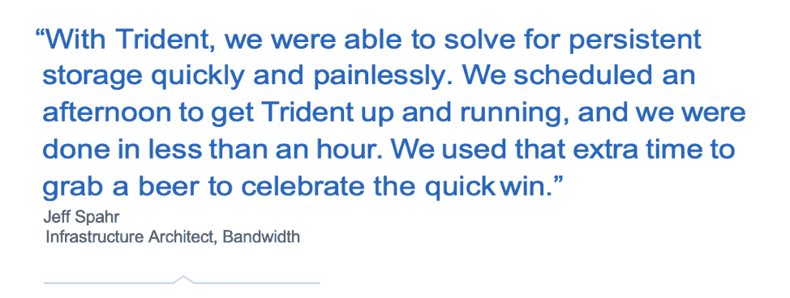
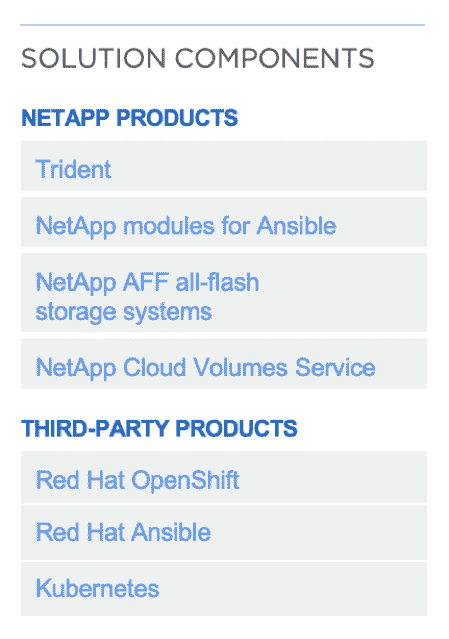

# DevOps Jumpstart:持久存储和容器编排

> 原文：<https://thenewstack.io/how-a-leading-api-platform-provider-relied-on-trident-to-jumpstart-its-devops/>

[NetApp](https://www.netapp.com/us/solutions/devops/index.aspx) 赞助了这篇文章。

 [约瑟夫·克里斯蒂安森

Joseph 是 NetApp 开发运维部门的产品营销经理，他为希望成为开发运维就绪型客户的客户创建生动的内容和成功案例。在加入 NetApp 之前，Joseph 从事产品管理工作，并担任创意营销顾问。工作之余，约瑟夫作为一名活跃的滑板车爱好者，在科罗拉多的阳光下消磨时光。](https://www.linkedin.com/in/johanchristianson/) 

带宽是一个 API 平台提供商，每天提供影响数百万人的语音、消息和 911 服务。在幕后，Bandwidth 的 DevOps 发挥着关键作用，通过不懈的创新来改善公司的平台并更快地将新服务推向市场，从而确保这些服务的交付。

事实上，带宽正在改变世界的通信方式，这在很大程度上要归功于 DevOps 团队。世界上一些最大的品牌，包括谷歌、微软、Zoom 和 GoDaddy，都依赖于 Bandwidth 的 API 平台来帮助其发展和区分其业务。Bandwidth 的语音网络为全国数百万电话号码提供最高水平的质量和可靠性。业界领先的 API 使客户只需几行代码就可以轻松地将强大的语音、文本和 911 功能集成到其产品中。

为了满足开发人员对云敏捷性的期望，以满足极高的性能需求，运营团队开始了与 NetApp 的 DevOps 之旅，为 Kubernetes 容器编排部署 OpenShift 容器平台。Trident 是 NetApp 的开源解决方案，可实现持久存储和存储配置自动化，帮助带宽加速部署并减少应用程序所有者和基础架构团队之间的摩擦。

Bandwidth 的系统基础架构架构师 Jeff Spahr 表示:“从本质上讲，我们是一家提供通信平台即服务(CPaaS)的电信公司。“我们专门帮助客户通过 API 发送消息和电话，而无需了解传统电信网络的复杂性。”

为了满足不断变化的客户需求，Bandwidth 的开发团队不断努力更新现有产品和服务，并将新服务更快地推向市场。以下是带宽实现其目标的几种方式。

## 步骤 1:容器编排

在业务运营方面，一个小型的基础设施工程师团队支持一个更大的开发人员和应用程序所有者团队。以前的手动资源调配工作流非常耗时，并且不能根据业务需求进行扩展。基础架构团队需要实现基础架构自动化和自助服务，以便为其内部客户提供快速、一致且可重复的体验。

2017 年，Spahr 和他的团队开始了一个项目，通过实施容器编排平台来提供云原生基础设施，以帮助用户。“DevOps 的主要目标之一是减少或消除开发人员和运营人员之间的摩擦，”Spahr 说。“我们的目标是摆脱资源调配，这样我们就可以专注于更有趣的问题，避免我们的内部客户无所事事地等待资源。”

对于 Spahr 来说，开发运维的第一步是通过容器编排平台实现基础设施自动化和抽象化。对于这一步，他的团队选择了 Red Hat 的 OpenShift 容器平台作为其 Kubernetes 的发行版。OpenShift 支持带宽在内部或云中一致地部署容器化的应用程序。

只有一个问题:即使有了 Kubernetes，Spahr 和他的团队仍然必须手动配置存储。为了向使用 Kubernetes 部署的应用程序提供持久存储，必须由 Kubernetes 管理员预先提供和引入卷，然后开发人员才能使用它们。

“开箱即用，Kubernetes 解决您的计算和负载平衡自动化，”斯帕尔说。“存储可能会更加困难。存储自动化不是 Kubernetes 一个人能解决的。这就是三叉戟的用武之地。”

## 步骤 2:存储自动化

Trident 是面向 NetApp 产品组合的开源存储供应器和协调器。借助 Trident，Spahr 和他的团队将 Bandwidth 的 NetApp 全闪存存储无缝集成到其 Kubernetes 容器编排系统中。

“最初，我们计划在项目的第二阶段解决存储自动化问题，”Spahr 说。“借助 Trident，我们能够快速轻松地解决持久存储问题。我们安排了一个下午的时间来安装和运行 Trident，不到一个小时就完成了。我们利用额外的时间喝了一杯啤酒来庆祝快速获胜。”

## 步骤 3:添加 Trident 和 OpenShift

如今，借助 OpenShift 和 Trident，Bandwidth 的运营团队已经完全自动化了其容器环境的计算、存储和负载平衡供应。该团队现在可以减少在调配票证上花费的时间，转而专注于 DevOps 之旅的下一步。

“人们可以毫不费力地立即开始消费容器，”斯帕尔说。“在运营方面，我们真的很兴奋。但是，对于我们的开发人员来说，这太简单了，以至于很无聊。它刚刚成功了。”

开发人员现在更高兴了，因为他们可以更快、更一致地部署资源，更快地迭代，并加快开发周期。实验室环境完全是自助式的。门票已经是过去式了。只需点击一个按钮，开发人员就可以创建一个项目或名称空间，并开始部署他们的工作负载。

开发人员可以在几分钟内访问容器，加快新产品、服务和功能的上市时间，而不是花费数周时间开始工作。他们还可以快速将项目投入生产，并自行管理容器的生命周期。结果呢？“我们看到更多的合作，每个人都朝着减少开发和运营之间的摩擦这一目标努力，”Spahr 说。“我们现在可以让开发人员更快地交付新产品，并为我们的客户提供价值。”

NetApp AFF 全闪存存储为 Bandwidth 的容器平台提供了必要的速度、效率和可靠性，这意味着基础架构团队不再需要花费时间来解决存储性能和延迟问题。无中断操作消除了计划内和计划外停机，因此面向客户的应用程序可以以最高的可用性运行。这对于依赖带宽服务进行及时通信和关键紧急服务的客户来说至关重要。

“存储是我们基础架构的基础，实际上是任何人的基础架构的基础。如果您的存储出现故障，您的应用程序可用性会受到影响。NetApp 的可靠性和正常运行时间与我们的可靠性和正常运行时间直接相关，”Spahr 说。

接下来，Bandwidth 已经开始部署 Trident with NetApp Cloud Volumes Service for AWS，以便为开发人员提供相同的体验，而不管数据实际位于何处—云中还是内部。借助云卷服务，运营团队可以利用 NetApp Snapshot 副本和克隆等企业数据管理功能，同时选择能够为组织提供速度、安全性和成本最佳平衡的存储环境。

## 结论

通过将 Kubernetes 和 cloud native 整合到其运营中，Bandwidth 在很大程度上开始了其数字化之旅，无论是开发还是基础设施管理。自动化也对存储及其整个开发和部署管道发挥着关键作用，这在很大程度上要归功于它对 Trident 和 OpenShift 的采用。但在许多方面，带宽之旅才刚刚开始。

要了解更多使用 NetApp 技术的客户成功案例，请前往[NetApp.com](https://customers.netapp.com/en/bandwidth-devops-case-study/)。

通过 Pixabay 的特征图像。

<svg xmlns:xlink="http://www.w3.org/1999/xlink" viewBox="0 0 68 31" version="1.1"><title>Group</title> <desc>Created with Sketch.</desc></svg>