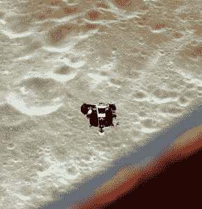
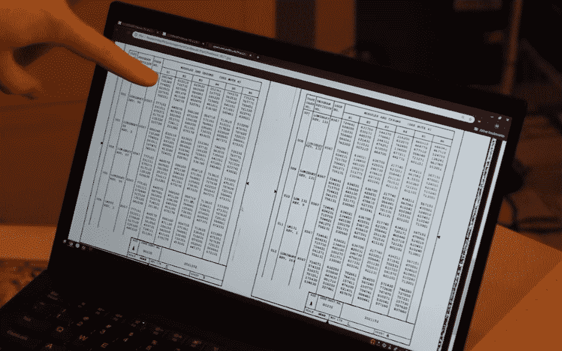
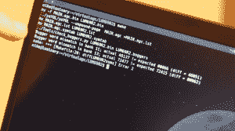

# 程序员如何重现阿波罗 10 号丢失的软件

> 原文：<https://thenewstack.io/how-a-programmer-recreated-apollo-10s-lost-software/>

一位现代航天软件工程师向半个多世纪前出现在他面前的程序员致敬，并重现了 1969 年美国国家航空航天局的一个月球登陆器模块中丢失的软件。

通过小心翼翼、煞费苦心地复活他们的汇编语言代码， [Mike Stewart](https://github.com/thewonderidiot) 拯救了一段伟大的编程历史。通过在网上分享，在他朋友的帮助下，他给了我们所有人一个机会来记住和欣赏过去的程序员所面临的挑战——以及自那以后的几十年里我们已经走了多远。

## **历史侦探**

斯图尔特专注于发生在 1969 年初的一次引人注目的太空飞行:阿波罗 10 号。它的八天任务？将三名宇航员送入绕月轨道——其中两名在一个模块中下降到距离月球表面 9 英里的[——这是两个月后历史性的阿波罗 11 号登月的“彩排”。](https://skyandtelescope.org/astronomy-news/astronomers-might-have-found-apollo-10-snoopy-module/)

软件控制着登月舱——但是软件现在在哪里呢？对于阿波罗 11 号后来的历史性月球漫步，那些第一批在月球上行走的宇航员将完全放弃他们的月球着陆器，将其留在一个缓慢衰减的轨道上，最终[坠毁在月球表面](https://nssdc.gsfc.nasa.gov/nmc/spacecraft/display.action?id=1969-059A)。但是之前的阿波罗 10 号任务将它的月球着陆器射向了太阳。不到一年前，天文学家终于再次发现了它，现在它正围绕太阳运行。

不幸的是，它还携带了唯一已知的月球着陆器软件副本。

斯图尔特的朋友马克·威尔迪尔(Marc Verdiell)曾形容该软件“已被历史遗忘”，称其绕太阳运行的遥远太空舱“是一个很难获得它的地方。”

## **没有迷失在太空中**

但是 Stewart 是唯一有资格迎接挑战的人，因为白天他是私营航天工业公司五车二航天公司的一名热情的现代航天软件工程师。他也在谷歌担任过同样的职位，还在[美国宇航局艾姆斯研究中心](https://www.nasa.gov/ames)进行了为期四个月的模拟实习。

他的朋友威尔迪尔在他的 YouTube 节目“好奇的马克”的 22 分钟视频中记录了斯图尔特对再造软件[的追求 Verdiell 也研究老式计算机——他是加州山景城](https://www.youtube.com/watch?v=-JTa1RQxU04)[计算机历史博物馆](https://computerhistory.org/)IBM 1401 修复团队的成员之一。(在[他的网页](https://www.curiousmarc.com/about)上，威尔把自己描述为“硅谷的一名科技高管”，同时也是前贝尔实验室研究员、英特尔研究员和硅谷几家科技创业公司的创始人，这些都与高速光纤通信有关。)

[https://www.youtube.com/embed/-JTa1RQxU04?feature=oembed](https://www.youtube.com/embed/-JTa1RQxU04?feature=oembed)

视频

幸运的是，斯图尔特有一个早期版本的登月软件——“几乎，但不完全是阿波罗 10 号上飞行的版本，”视频解释道。但是斯图尔特想要软件的实际“飞行版本”。好消息是他知道软件的新版本也做了同样的改变。坏消息是他也没有那个版本的软件。

但是稍晚一点的版本(两个月后用于历史性的阿波罗 11 号登月)是从该软件的修订版中派生出来的，大概也包含了这些变化。某处…

斯图尔特还发现了一份描述这一变化的备忘录——这使得控制器能够更准确地计算月球的引力，纳入了一种叫做“波音 R-2 月球潜力模型”的东西但是关键的线索最终来自罗恩·伯基，他对飞行控制器感兴趣已经将近 20 年了。2003 年，Burkey 已经从麻省理工学院上传的扫描图像中打出了阿波罗 8 号和阿波罗 13 号任务的每一行代码，后来用它在网上创建了一个虚拟的 T2 阿波罗导航计算机。伯基现在也是非营利的[阿波罗历史基金会](http://www.ibiblio.org/apollo/ApolloProjectOnline/)的编辑，“致力于通过保存该计划的文件并使其永久可供在线公众观看来保存阿波罗计划的遗产。”

伯基参与了美国国家航空航天局原始文件的扫描工作，许多文件存放在美国国家档案馆。在视频中，Stewart 解释了 Burkey 如何发现了一张类似于 Rosetta Stone 的图纸，标题是“计算机程序主甲板磁带”对于运行在登月舱导航计算机上的每一个任务软件版本，它都有一个不同的六位数……一个校验和。

我请好奇的马克解释为什么这很有用——首先，他确保我理解术语。Burkey 解释说，该软件已经被分解成称为“银行”的小代码块——“内存中 1024 个 15 位字的一部分(现代术语约为 2kb)”，可以在需要时交换。

只有 36 组代码，大约 72KB，但这仍然超过了 CPU 的处理能力。“可擦除核心内存(我们今天称之为 RAM)被分成更小的存储体(大约 512 字节)，这使得编程变得非常杂技！

“但事实证明，这对 Stewart 的恢复工作是一个福音，因为他可以分离出已更改到特定银行的代码部分。”

现在斯图尔特可以对原始代码进行修改，“如果银行的校验和是正确的，那么我们可能做了正确的事情，”视频解释道。

在后来的一封电子邮件中，Burkey 提醒我校验和至今仍被广泛使用。“当你安装下载的软件时，你有时会看到它，计算机首先验证下载的完整性。所有以太网流量和磁盘数据都会被校验和检查。

## **检查校验和**

由于 Stewart 有该软件的早期版本，他编写了一个程序，将 Burkey 为该软件的“飞行版本”找到的“罗塞塔石碑”号码与他和一组志愿者辛苦重建的文件的实际校验和号码进行比较。结果呢？它只在两家银行发现了错误。(第 11 排和第 13 排)。这意味着 36 家银行中有 34 家的代码块已经是 100%正确的了。

但是他怎么能纠正另外两个呢？

银行 11 的校验和似乎偏离得更多，所以 Stewart 猜测他们在备忘录中描述的重力模型中添加了所有这些更改。但是对于第 13 组，校验和的差异只表明了数据的几个比特。斯图尔特查看了代码的“受控常数”部分，“他们把所有与物理相关的数字或登月舱的机械部分，如几何图形放在那里。”

然后在镜头前，Stewart 重现了那激动人心的一刻。他知道后来的版本(两个月后用于历史性的阿波罗 11 号登月)包含了他一直在寻找的改变。所以他在屏幕上并排显示了两个版本的代码，并解释了他所看到的。“这里有一组常数都与引力模型有关。如果我们打开同样的东西……在阿波罗 11 号的代码中，所有这些都是一样的——除了这一行。”

他将这一行代码剪切并粘贴到他重新制作的阿波罗 10 号软件中——这让事情变得更糟。校验和的差异更大。“所以我在那里被困了一小会儿…”

但是备忘录中有描述这一变化的提示，这表明变量 TIMEDELT 需要一个新值。Mike 使用新值再次运行了他的测试——校验和匹配。他通过添加一行代码并更新一个常量的值解决了这个问题。

“现在，我们只有一家银行错了……”他得意洋洋地说。

"所以现在我们到了困难的部分，也就是实际的重力模型本身."

但是他有所突破，因为事实证明，至少在软件的这一部分，用于阿波罗 11 号历史性登月的重力模型代码与阿波罗 10 号代码的“飞行版本”中使用的代码是相同的。“所以我们要从阿波罗 11 号复制粘贴一大堆代码。”

这些代码在阿波罗 11 号软件中被分成了两个不同的地方——在两个不同的银行里。但是斯图尔特正确地猜到了它需要出现在阿波罗 10 号代码中的什么地方——并通过运行他的程序将已知的校验和与他新创建的程序的校验和进行比较来证明这一点。

成功。每个校验和都匹配。

在视频中，好奇的马克还分享了他自己对一段历史的看法。阿波罗 10 号任务没有携带足够的燃料登陆月球，马克开玩笑说，这是因为美国宇航局知道，否则他们的阿波罗 10 号宇航员“会太诱惑”自己尝试着陆。

“但如果他们有燃料——好吧，我们现在有着陆计划，我们可以证明他们可以着陆。”

好奇的马克现在用一系列特殊的 [t 恤](https://teespring.com/it-lands-we-checked?pid=211&cid=5291)、[帽衫](https://teespring.com/it-lands-we-checked?pid=227&cid=2664)、[咖啡杯](https://teespring.com/it-lands-we-checked?pid=658&cid=102908)和[贴纸](https://teespring.com/it-lands-we-checked?pid=794&cid=103544)来纪念这一发现。

“它着陆了。我们查过了。”

* * *

## WebReduce

<svg xmlns:xlink="http://www.w3.org/1999/xlink" viewBox="0 0 68 31" version="1.1"><title>Group</title> <desc>Created with Sketch.</desc></svg>