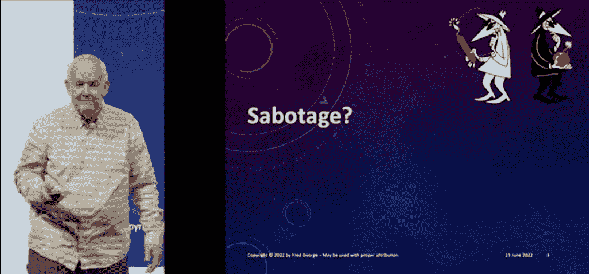

# 敏捷转换如何被破坏

> 原文：<https://thenewstack.io/how-agile-transformations-get-sabotaged/>

随着敏捷开发人员不断准备发布新的最新迭代，经理们突然被迫做出关于何时发布的关键决定。敏捷专家[弗雷德·乔治](https://github.com/fredgeorge)，在 [GOTO Amsterdam](https://gotoams.nl/) 的发言人之一争辩道，“他们还没有准备好”。“他们习惯于把东西扔过墙，然后走开。”

他认为，他们并不是组织中唯一想要敏捷部署的人。办公室里全是他们。

总的来说，他认为第一个破坏者总是那些正在*失去*权力的人——那些习惯于签字同意事情的人。“比如说，像高级建筑师这样的人，”乔治解释道。人们过去常常来到他们的办公室，在他的门前祈祷，正如乔治所说，“确保在他们进入下一阶段之前，他会批准一些事情。”

“它们没有为流程增加价值。事实上，它们扼杀了创新。”

但是这位资深建筑师有理由担心。乔治讲述了为一家收购了另一家公司的公司提供咨询的故事。“我们做的第一件事……？我们找到了所有制定规则和执行规则的人……并把他们都赶走了。”

乔治认为，如果他们知道将要发生什么，他们就有动机破坏敏捷转型。

事实上，后来乔治甚至把“疏忽”作为一个要点放在“组织破坏”下面。或者就像乔治轻蔑地说的，“那些你必须征得同意的人。”

“组织喜欢这样，因为他们认为在开发软件时他们处于控制之中。他们不是。软件是一个不可预测的过程。

“你可以说所有你想说的，把所有的图表放在一起。这永远是一个不可预测的过程。但是他们仍然希望有评审委员会、架构师、标准…“

## 批准过程

George 举了一个例子，记得他的团队的房间突然接待了一个 web 服务遵从架构师的来访，询问“我的 web 服务遵从报告在哪里？”

在组织的其他地方潜伏着所有那些习惯于“瀑布”式开发的大规模发布哲学的人。

“大多数时候是 UX 的人，他们说他们在学校里已经学会了这个过程。他们必须研究整个事情，他们必须参加焦点小组讨论。然后他们会考虑一会儿，他们会画一些图，然后完美地连接在一起。然后*然后*他们会把它给开发者，”他说。

“我不打算等那个。这个过程不能容忍这种反馈循环。”

乔治还列举了其他的反面角色——包括“数据库人员，他们必须批准事情，架构委员会，以及所有这些其他的批准过程。”

但是乔治相信，还有其他人只是嫉妒 T4。他举了一个假想的高级 Java 技术主管抱怨“它不可能工作”的例子。这不是我们过去做事的方式…这也不是我想要的工作方式。”他们会最小化你的团队的成就，推测在不同环境中失败的假设可能性，并认为敏捷方法不可能在现实世界中起作用。

## 斯大林式的缓解策略

那么什么是有效的缓解策略呢？“非常有趣的是，我们使用了斯大林的策略，”乔治告诉观众，他指的是俄罗斯政治领袖约瑟夫·斯大林。具体来说:不要和与你意见不同的人争论——乔治将这种方法归功于敏捷的长期倡导者、IT 咨询公司 ThoughtWorks 的创始人 Roy Singham。

以下是乔治对不同意他的人总结斯大林的方法:“当你们所有人都同意我的时候，我们可以枪毙他。”相当于工作场所？避免主动对抗。他解释说，“只要继续和同意你的人一起工作，让越来越多的人加入进来，”直到不同意你的人意识到他们没有影响力。“我要追求大众。我不是想说服每个人……”

乔治还提供了另一个强大的缓解技术:只要把整个事情标记为一个实验。“不要说，‘我们将永远这样做。’人们会不高兴的。我们要做一个实验。'

"当他们反对一个实验时，他们看起来真的很不可理喻."

当然，让高层管理人员参与进来。“把它们拿到橱窗里，”乔治建议道。他们会对快速、高效和无限灵活的团队的前景感到兴奋。

正如乔治所说，团队也会变得兴奋。“这是有趣的东西。你一直在发送代码。我们互相合作，一起解决问题，这很有趣。”因此，问题不在于高层管理人员或底层的开发人员在做什么工作。相反，它是“中间的人”——无论是中层经理、架构师，还是“web 服务遵从者”

“他明白发生了什么。他不是其中的一部分……”

正是这些厌恶风险的人不想在新方法上冒险。“所以别理他们。抓住最上面的那个家伙！”然后“带一个新人进来，把他加入团队。他会吸收必要的力量。权力是团队给你的东西……”

但是当变革推动者变得不受欢迎时会发生什么呢？乔治的策略是什么？雇其他人来承受所有的压力。“我向你保证:引入一个真正的变革推动者，与他们相比，你看起来非常合理。”

乔治也对那些不是通过对每个团队的开发人员进行敏捷方法的培训，而是通过为这些团队雇佣一个 Scrum master 来指导敏捷过程的公司进行了严厉的批评。乔治将一位客户的策略描述为“他会告诉你如何工作，你会按照他的指示去做。”

“是啊，你可以想象那有多有效，”乔治嘲笑道。

“你就是不能雇人来执行一个流程。这一过程必须受到人民本身的影响。”

在整个演讲中，有一件事一直闪耀着光芒:乔治对敏捷方法的真正热情和承诺。“一旦你和你的程序员开始了这个过程，你就不能回头了——他们会退出的！”他告诉他的观众。

“他们玩得太开心了……”

[https://www.youtube.com/embed/3cDpLVuQXEo?feature=oembed](https://www.youtube.com/embed/3cDpLVuQXEo?feature=oembed)

视频

* * *

# WebReduce

<svg xmlns:xlink="http://www.w3.org/1999/xlink" viewBox="0 0 68 31" version="1.1"><title>Group</title> <desc>Created with Sketch.</desc></svg>