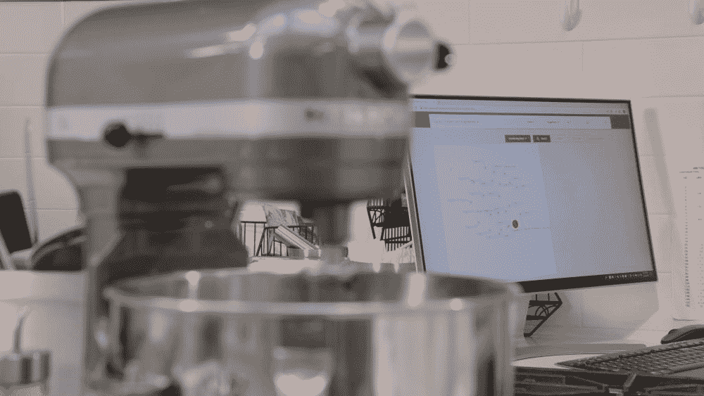

# 人工智能将如何帮助我们找到未来新的、创新的味道

> 原文：<https://thenewstack.io/how-ai-will-help-us-find-new-innovative-flavors-of-the-future/>

芥末味鱼子酱薄饼、意式烤鸡、木炭冰淇淋——这些听起来都像是极具创造力的人类厨师的美食发明，旨在将我们的味蕾带到意想不到的维度。但是，如果人工智能机器也能想出新的、创新的食物配方，并改进现有的烹饪和食品配方，那会怎么样呢？

随着人工智能越来越多地被用于医疗保健、T2 研究、T4 金融等领域，人工智能很有可能引领新的口味体验，正如科技跨国公司 IBM 和美国香料、腌料和调味品公司 McCormick 公司最近的合作所表明的那样。

最著名的是其人工智能系统 [Watson](https://www.ibm.com/watson) ，以及其最近对[人工智能辅助认证](https://thenewstack.io/ibm-combines-ai-and-blockchain-to-identify-counterfeits/)、[交互设计](https://thenewstack.io/ibm-ai-helps-designers-create-interactive-thinking-sculpture/)和[认知计算](https://thenewstack.io/project-intu-aims-inspire/)，IBM 与 McCormick 长达四年的合作旨在通过使用算法来简化增强和开发新食品的过程，这些算法可以快速合成大量可能的成分组合的可用数据——这些数据是经过数十年的研究和品尝测试筛选出来的——以产生新的口味和产品。

[https://www.youtube.com/embed/-M1hO_V04U8?feature=oembed](https://www.youtube.com/embed/-M1hO_V04U8?feature=oembed)

视频

## AI 调味助手

正如 IBM 在最近的一篇博客文章中指出的那样，设计一种新食品的传统过程非常耗时，有时需要几个月甚至几年才能从概念阶段发展到最终上市。首先，人类如何体验各种口味背后的科学是复杂的，并没有被完全理解。品尝美味食物的味道不仅仅发生在舌头上；它还涉及其他感官，如嗅觉和视觉欣赏它的外观。或者，味觉可以受基因影响，不一定局限于标准的甜味、酸味、咸味和苦味——例如，我们也可以察觉其他可能性，如肉和土豆的[咸味](https://health.howstuffworks.com/mental-health/human-nature/perception/taste2.htm)。

因此，很明显，开发新口味的过程涉及许多复杂的变量，而这正是 IBM 的系统可以帮助简化过程的地方。它通过检测从现有风味配方、原材料库存、消费者口味测试结果甚至销售数据中收集的模式，并从这些模式中学习以产生新的风味组合。

相比之下，当面对大量可能的成分和组合时，人类产品开发人员可能会无意中发现自己依赖于可靠的成分和风味特征来快速完成工作。这些专家通常以团队形式工作，利用厨师、化学家和其他食品专业人士的集体知识，反复数十次完善一个概念，直到它为市场做好准备。

此外，成本目标甚至产品销售地的文化背景也是关键因素。因此，拥有一个融合了这种集体专业知识的智能助理不仅可以简化流程，还可以帮助人类专家快速找到更好、更有创意和更具成本效益的解决方案，而不必仅仅因为他们过去工作过就依赖某些支柱。

## 人工智能产生的新奇感

此外，人工智能系统还可以建议成分替代，以及不同的成分比例，以及它们在现有产品中的使用频率。它甚至可以根据 IBM 所谓的“衍生距离函数”来衡量一种新口味的“新颖性”，该函数被描述为“一种口味配方与其最近邻居之间的距离越大，预计该口味配方越新颖。”

“构建一个人工智能系统是产品开发人员日常工作流程中的一个重要工具，其关键部分是支持不同程度的新颖性，”IBM 解释道。“一种尺寸不适合所有人。在某些情况下，我们的目标是通过调整来优化口味配方。例如，来自世界许多地方的不同香草豆有多种风味差异。什么是香草的最佳组合，以提供理想的风味体验？在其他情况下，目标是开发真正新颖的风味体验。在这里，成分之间的差异或距离(例如香草与草莓)可能比任何一个成分家族内的选择(例如香草)更重要。我们的系统学习并使用距离模型来建议所需的风味配方。”

不足为奇的是，这样一个数据驱动、模式检测、新奇生成的系统可以被“推广”并转化到其他领域，例如开发新的香水气味、化妆品、家用和工业产品，甚至建筑材料(希望是耐用和生态友好的那种)。

与此同时，如果一切顺利，两家公司计划到 2021 年在麦考密克全球所有的实验室中逐步部署这种新的人工智能辅助平台。就目前而言，我们至少可以期待在今年晚些时候看到人工智能改进版的托斯卡纳鸡肉、波旁猪里脊和新奥尔良式香肠，以及在不久的将来更令人惊叹的创新人工智能口味。

图片:Unsplash 上的 Ho HyouIBM 和麦考密克公司

<svg xmlns:xlink="http://www.w3.org/1999/xlink" viewBox="0 0 68 31" version="1.1"><title>Group</title> <desc>Created with Sketch.</desc></svg>